class: center, middle

# **Phonetics review**

## <span style="color:deeppink"><b>Vowels</b></span>

```{r, out.height="40%", out.width="40%", echo=FALSE}
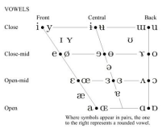
```

---

# Phonetics: vowels 

.pull-left[
<span style="color:green"><u><b>Describing vowels</b></u></span>: height, roundness, backness features <br><br>

- **<u>height</u>**: high, mid, low<br><br>

- **<u>roundedness</u>**: round, unrounded<br><br>

- **<u>backness</u>**: front, central, back<br><br>
]

.pull-right[
```{r, out.height="100%", out.width="100%", echo=FALSE}
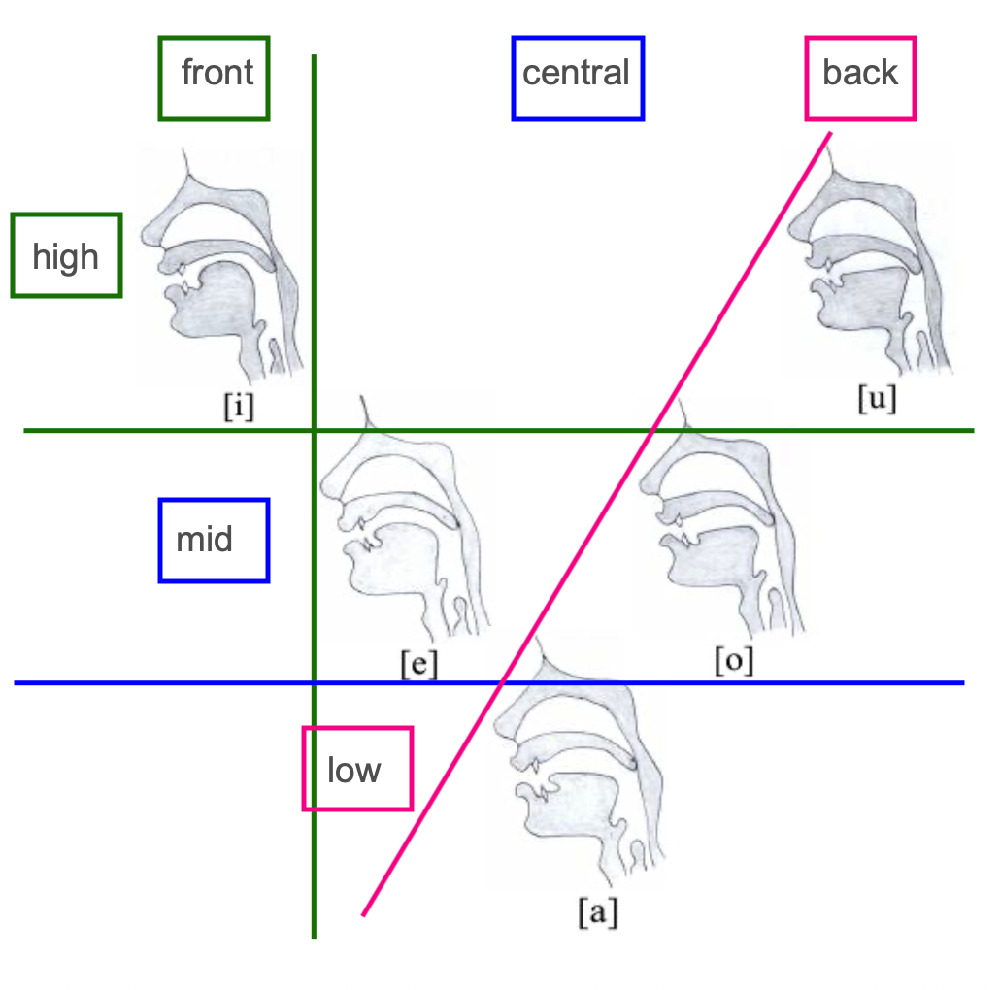
```
]

---

# Phonetics: vowels (<span style="color:red"><b>height</b></span>)

.pull-left[
```{r, out.height="80%", out.width="80%", echo=FALSE}
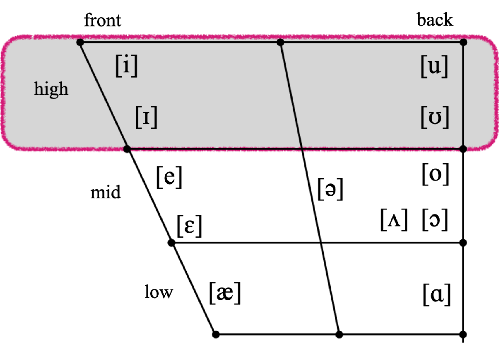
```
]

.pull-right[
```{r, out.height="80%", out.width="80%", echo=FALSE}
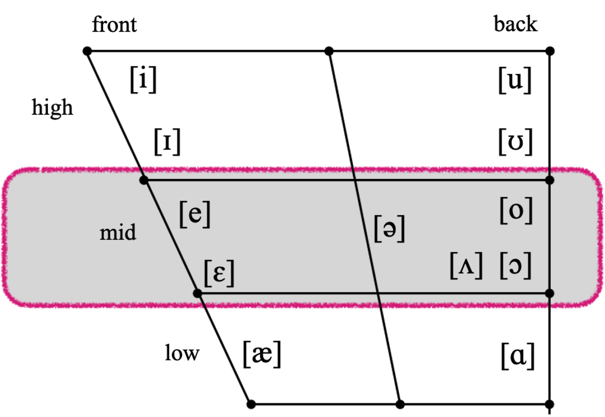
```

```{r, out.height="80%", out.width="80%", echo=FALSE}
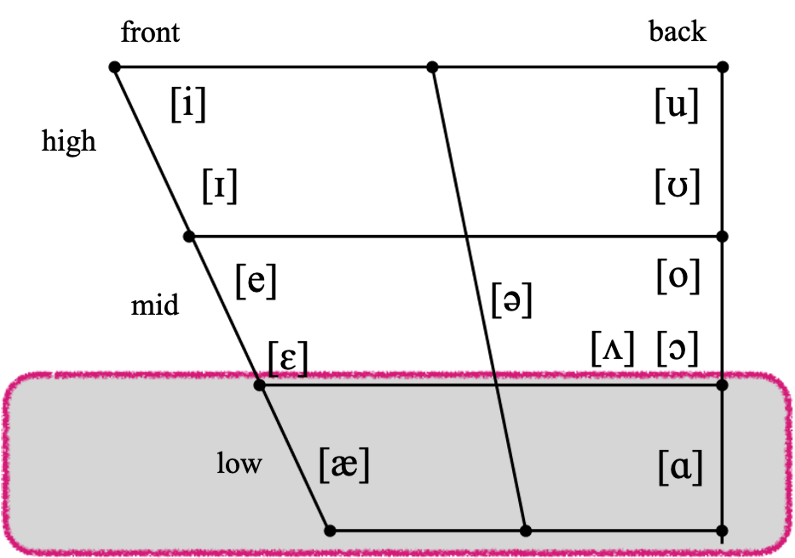
```
]

---

# Phonetics: vowels (<span style="color:deeppink"><b>roundedness</b></span>)

```{r, out.height="70%", out.width="70%", echo=FALSE}
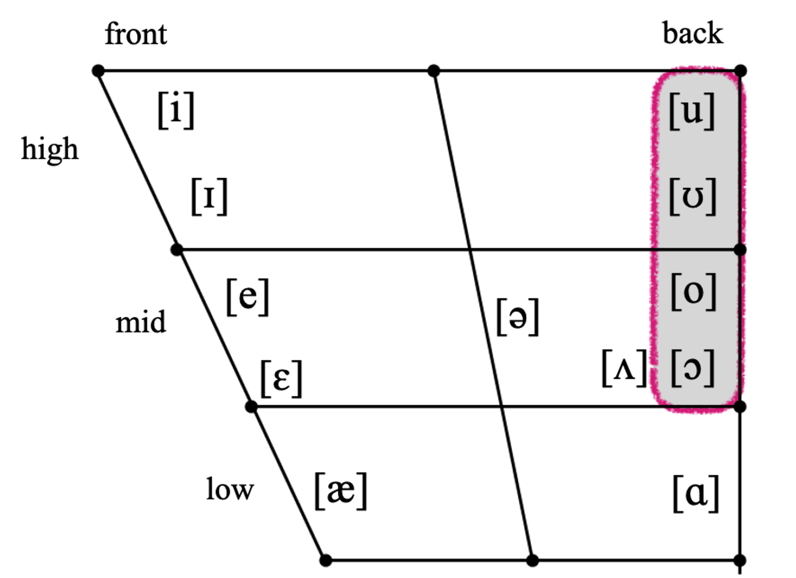
```

---

# Phonetics: vowels (<span style="color:green"><b>backness</b></span>)

.pull-left[
```{r, out.height="100%", out.width="100%", echo=FALSE}
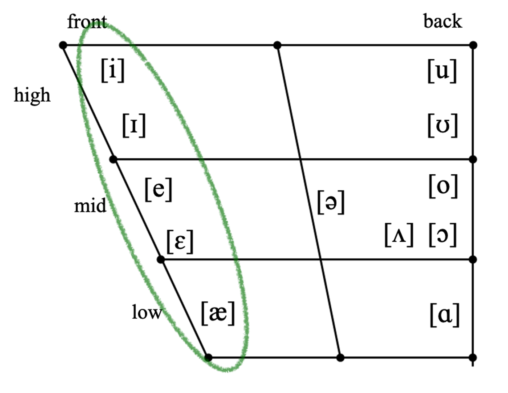
```
]

.pull-right[
```{r, out.height="75%", out.width="75%", echo=FALSE}
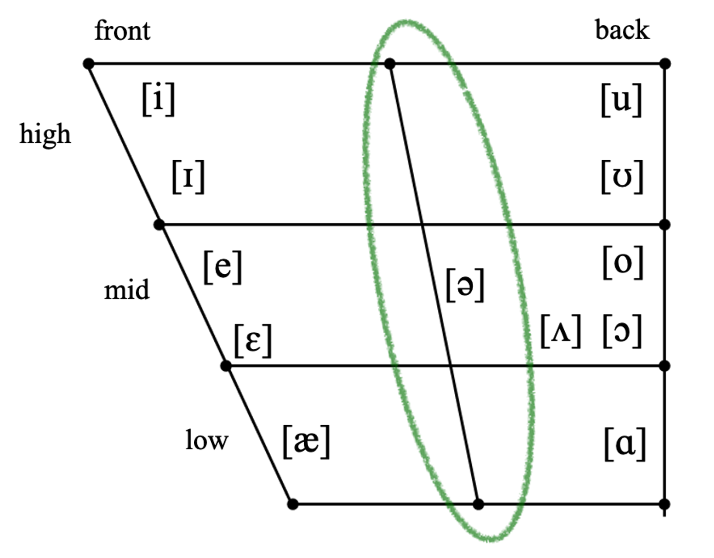
```

```{r, out.height="75%", out.width="75%", echo=FALSE}
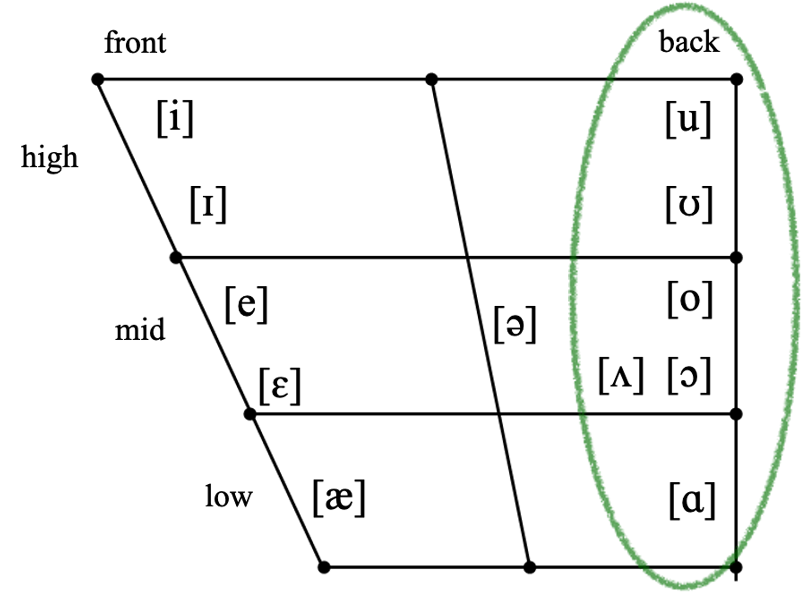
```
]

---

class: center, middle

# **Phonetics review**

## <span style="color:deeppink"><b>Consonants</b></span>

```{r, out.height="70%", out.width="70%", echo=FALSE}
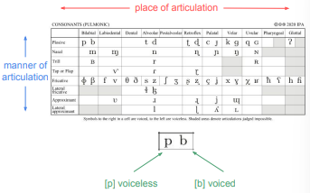
```

---

# Phonetics: consonants (overview)

<span style="color:green"><u><b>Describing consonants</b></u></span>: voicing, place, manner features

- **<u>voicing</u>**: voiced or unvoiced 

- **<u>place</u>**: bilabial, labio-dental, dental, alveolar, post-alveolar, palatal, labio-velar, velar, glottal

- **<u>manner</u>**: plosive, nasal, flap, fricative, approximant, lateral approximant ([l])

```{r, out.height="85%", out.width="85%", echo=FALSE}
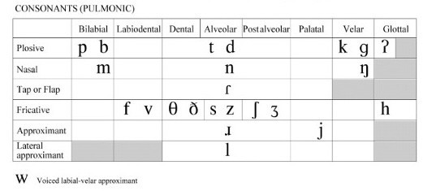
```


---

# Phonetics: consonants (<span style="color:green">manner</span>)

### **<span style="color:green">Manner of articulation</span>** – classes of consonants based on type of obstruction
<br>

--

- **Plosive** (stop) = complete obstruction, release with burst <span style="color:deeppink">[p, t, k, b, d, g]</span>

--

- **Fricative** = narrow obstruction, hissing sound <span style="color:deeppink">[f, v, θ, ð, s, z, ʃ, ʒ, h]</span>

--

- **Affricate** = complete obstruction, release to narrow obstruction <span style="color:deeppink">[t͡ ʃ, d͡ ʒ]</span>

--

- **Nasal** = complete obstruction in mouth, air flows through nose <span style="color:deeppink">[m, n, ŋ]</span>

--

- **Lateral** = obstruction on centerline of mouth, air flows on side(s) <span style="color:deeppink">[l]</span>

--

- **Approximant** = narrow obstruction, not narrow enough for hissing <span style="color:deeppink">[j, w, ɹ]</span>

--

- **Tap/flap/trill** = very brief obstruction, repeated for trills <span style="color:deeppink">[ɾ]</span>

---

# Phonetics: consonants (<span style="color:green">place</span>)

### **<span style="color:green">Place of articulation</span>** – where in the vocal tract obstruction is made
<br>

--

- **bilabials** = lips

--

- **labiodentals** = lips and teeth

--

- **dentals** = tongue tip and teeth

--

- **alveolars** = tongue tip/blade and alveolar ridge

--

- **postalveolars** = tongue blade and area behind alveolar ridge

--

- **palatals** = tongue blade and palate

--

- **velars** = tongue back and velum

--

- **uvulars** = tongue back and uvula

--

- **pharyngeals** = tongue root and pharyngeal wall

--

- **glottals** = glottis


---

# Phonetics: natural classes

### We can also group manners of articulation into several larger **<span style="color:deeppink">natural classes</span>**...<br><br>

--

- **Obstruent** = plosives, affricates, fricatives (consonants with greater constriction of airflow)<br><br>

--

- **Sonorant** = nasals, laterals, approximants (consonants with lesser constriction of airflow)<br><br>

--

- **Rhotics** = r-sounds, which can differ from language to language<br><br>

--

- **Liquids** = laterals + rhotics (l-sounds + r-sounds)


---

class: center, middle

# Phonetics practice

```{r, out.height="80%", out.width="80%", echo=FALSE}
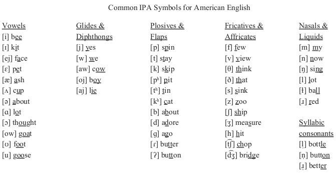
```

---

# Minimal pairs 

**Are these minimal pairs? If so, what are the two phonemes that are contrasted?**

1. trap ~ map

2. rough ~ tough 

3. prey ~ ray 

4. stint ~ lint 

5. plum ~ bum 

6. spot ~ slot 

7. teeth ~ teethe 

8. dent ~ sent


---

# Describing phones

**List the IPA symbol for the <u>first consonant</u> of each word, and describe it with its three features: voicing, place, manner.**

.pull-left[
<ol start="1">

<li> that</li><br> 

<li> pat</li><br> 

<li> stamp</li><br> 

<li> ship</li><br> 

<li> judge</li><br> 

<li> nap</li><br> 

<li> mint </li><br> 
</ol>
]

.pull-right[
<ol start="8">

<li> helmet</li><br>

<li> grab </li><br>

<li> crab</li><br>

<li> rat</li><br>

<li> fat</li><br>

<li> deal</li><br>

<li> vet</li><br>
</ol>

]

---

# Describing phones

**List the IPA symbol for the <u>first vowel</u> of each word, and describe it with its three features: rounding, height, and backness.**

.pull-left[
<ol start="1">

<li> mat </li><br> 

<li> bought </li><br> 

<li> guts</li><br> 

<li> bets </li><br> 

<li> till</li><br> 

<li> teal </li><br> 
</ol>
]

.pull-right[
<ol start="7">

<li> book</li><br> 

<li> lute </li><br> 

<li> about </li><br> 

<li> pay</li><br> 

<li> caught</li><br> 

<li> watch</li><br> 
</ol>
]


---

# Transcription: English to IPA

**Transcribe the following English words into IPA.** 

.pull-left[
<ol start="1">

<li> helmet</li><br>

<li> jam </li><br>

<li> shellfish </li><br>

<li> pepperjack</li><br>

<li> fishing</li><br>

<li> trustworthy </li><br>

<li> anchor</li><br>
</ol>
]

.pull-right[
<ol start="8">

<li> brisket </li><br>

<li> pilgrim </li><br>

<li> fever </li><br>

<li> buckle </li><br>

<li> daffodils</li><br>

<li> carrots</li><br>

<li> boxes</li><br>

<li> shoulder</li><br>
</ol>
]


---

# Transcription: IPA to English

**What English words do these IPA transcriptions correspond to?**

.pull-left[
<ol start="1">

<li>	[ˈelbəw]</li><br>

<li>	[vajəˈlɪn]</li><br>

<li>	[ˈajlənd]</li><br>

<li>	[ˈpiːpl]</li><br>

<li>	[ˈdʒʌmpəɹ]</li><br>

<li>	[ˈdendʒəɹəs]</li><br>

<li>	[ˈiːzi]</li><br>

<li>	[jʌŋ]</li><br>

<li>	[ɹajs]</li><br>
</ol>

]

.pull-right[
<ol start="10">

<li>	[ˈbɑːθɹuːm]</li><br>

<li>	[ˈʌŋkl]</li><br>

<li>	[ɹajt]</li><br>

<li>	[ˈejɹpɔɹt]</li><br>

<li>	[ɔːˈɡʌst]</li><br>

<li>	[jɪɹ]</li><br>

<li>	[ɡəˈɹɪlə]</li><br>

<li>	[ˈbʌtəɹflaj]</li><br>

<li>	[məˈskiːtəw]</li><br>
</ol>

]


---

class: center, middle

# Phonology review 

---

# Phonology review 

<br>

**<span style="color:green">Phoneme</span>** = the "meta sound"; a set of sounds that speakers of a language treat as being the <span style="color:deeppink">same sound</span>

<br>

**<span style="color:red">Allophone</span>** = each individual possible sound that a phoneme can surface as

<br>
--

**<span style="color:green">Contrastive distribution</span>** = when switching out one *phoneme* for another results in a different meaning

- these word pairs are called *minimal pairs*

- they detect which sounds are **<span style="color:green">phonemes</span>**

<br>

--

**<span style="color:red">Complementary distribution</span>** = when switching a sound out for another sound *does not* change the meaning

- <span style="color:deeppink">**allophones**</span> of the same phoneme


---

class: center, middle

# Writing phonological rules

---


## **Steps for phonological analysis**

.pull-left[
1. write the preceding and following segment (<span style="color:green"><b>environment</b></span>) for **the sound you're testing**<br><br>
2. do they occur in the same or different environments?
  - **same**: *contrastive* → separate phonemes
  - **different**: *complementary* → allophones<br><br>
3. consider the  <span style="color:blue"><b>commonality</b></span> of environments of allophones<br><br>
4. <span style="color:orange"><b>simplify</b></span> the environments (*V_V*, *#_C*, etc.) <br><br>
5. rewrite simplified environments as <span style="color:deeppink"><b>phonological rules</b></span>
]
.pull-right[<br>
<table style="width:70%; border-collapse: collapse; margin:auto; font-size:24px;">
  <tr>
    <th style="border: 1px solid #555; padding:10px; text-align:center;"><span style="color:orange"><b>d</b></span></th>
    <th style="border: 1px solid #555; padding:10px; text-align:center;"><span style="color:blue"><b>ð</b></span></th>
  </tr>
  <tr>
    <td style="border: 1px solid #555; padding:20px; text-align:center; vertical-align:top;">
      [#_a]<br>
      [#_e]<br>
      [#_a]<br>
      [#_u]<br>
      [#_e]<br>
      [#_e]<br>
    </td>
    <td style="border: 1px solid #555; padding:20px; text-align:center; vertical-align:top;">
      [o_o]<br>
      [i_a]<br>
      [o_o]<br>
      [u_a]<br>
      [a_o]<br>
      [e_o]<br>
    </td>
  </tr>
</table>
<br>
<div style="text-align:center">
<h3><b><span style="color:green">/ð/ → [d] / #__</span></b></h3>
<h3><b><span style="color:blue">/d/ → [ð] / V__V</span></b></h3>
</div>
]


---

# Phonological rules: **Underlying Form**
<br>

<div style="text-align:center; font-size:30px">
the allophone <u><b>that shows up in <span style="color:blue">elsewhere</span> conditions</b></u> is the <span style="color:blue"><b>phoneme</b></span><br><br>

<span style="color:grey">the allophone <u><b>whose context is hardest to pin down</b></u> is the <span style="color:#87CEFA"><b>phoneme</b></span></span><br><br>
<span style="color:grey">the allophone <u><b>with the most complex environments</b></u> is the <span style="color:#87CEFA"><b>phoneme</b></span></span><br><br>

<span style="color:grey">the allophone <u><b>with the most types of environments</b></u> is the <span style="color:#87CEFA"><b>phoneme</b></span></span><br><br>

<span style="color:black">the allophone <u><b>that shows up in <span style="color:green">specific</span> environments</b></u> is an <span style="color:green"><b>allophone</b></span></span><br><br>

</div>


---

## Writing a phonological rule

**phonological rules** provide a much more general way of describing phonological **patterns**
<br><br>
--

a <b><span style="color:#cc0033">phonological rule</span></b> looks like this: <u>A becomes B between C and D</u><br>
--

<div style="text-align:center">
<h3><b><span style="color:green">/A/</span> → <span style="color:blue">[B]</span> / <span style="color:deeppink">C__D</span></b></h3><br>
<b>for arctic foxes: <span style="color:blue"> → 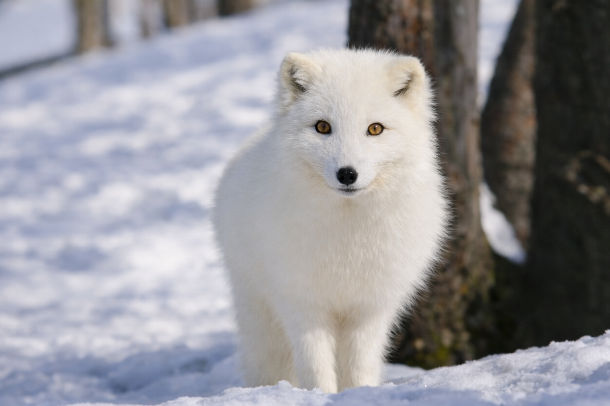 / in winter</span></b>
</div><br>

--

- <b><span style="color:blue">A: target</span></b>, the <b><span style="color:#cc0033"underlying</span></b> phoneme<br><br>
- <b><span style="color:green">B: change</span></b>, the allophone that is <b><span style="color:#cc0033">different</span></b> from the underlying form<br><br>
- <b><span style="color:deeppink">C\_\_D: context</span></b>, contextual description (e.g. <i><u>before [i]</u></i>, <i><u>in winter</u></i>)<br>
  - (<b><span style="color:deeppink">C</span></b> = <b><span style="color:#cc0033">preceding</span></b> segment, <b><span style="color:deeppink">D</span></b> = <b><span style="color:#cc0033">following</span></b> segment, <b><span style="color:deeppink">__contextual__</span></b> = where <b><span style="color:blue">A</span></b> shows up)


---


class: center, middle

# Phonological analysis


---

# Phonological analysis: **Icelandic** 

.pull-left[
Icelandic has four types of stops <br>

1. <span style="color:#cc0033"><b>plain</b></span> (such as <span style="color:#cc0033"><b>[t]</b></span>)
2. <span style="color:green"><b>post-aspirated</b></span> (such as <span style="color:green"><b>tʰ</b></span>)
3. <span style="color:blue"><b>pre-aspirated</b></span> (such as <span style="color:blue"><b>ʰt</b></span>), and
4. <span style="color:deeppink"><b>lengthened</b></span> (such as <span style="color:deeppink"><b>[t:]</b></span>)]

.pull-right[
are <span style="color:#cc0033"><b>plain</b></span>, <span style="color:green"><b>post-aspirated</b></span>, <span style="color:blue"><b>pre-aspirated</b></span>, and <span style="color:deeppink"><b>lengthened</b></span> stops contrastive in Icelandic?<br>

- <b>note</b>: the transcription has been simplified<br>
- ignore any IPA symbols you do not know since they are not relevant for this question
]<br><br>

<div style="text-align:center">
```{r, out.height="75%", out.width="75%", echo=FALSE}
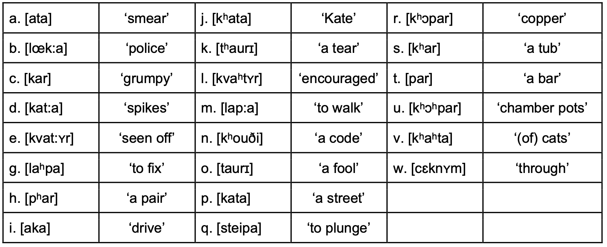
```
</div>

---

# Phonological analysis: **Kazakh**

- consider data from Kazakh and do phonemic analyses on: <span style="color:orange"><b>[k]</b></span>, <span style="color:purple"><b>[g]</b></span>, <span style="color:#cc0033"><b>[q]</b></span>, <span style="color:blue"><b>[ʁ]</b></span>, <span style="color:deeppink"><b>[ŋ]</b></span>, and <span style="color:green"><b>[ɴ]</b></span> in <span style="color:blue"><b>[ɑ]</b></span>-<span style="color:blue"><b>[æ]</b></span> environments<br>
- <span style="color:#cc0033"><b>notes</b></span>: there is no <span style="color:green"><b>[χ]</b></span> (uvular voiceless fricative) or <span style="color:green"><b>[ɢ]</b></span> (uvular voiced stop) in Kazakh consonant inventory<br>
- <span style="color:#cc0033"><b>hint</b></span>: at this point, the hardest step will be <span style="color:blue"><b>pairing sounds</b></span><br><br>


<table style="width:100%; text-align:center; border-right:solid 1px black; border-left:solid 1px black">
  <tr style="border-bottom:solid 1px black; border-top:solid 1px black">
    <td style="padding:5px"></td>
    <td><b>word</b></td>
    <td style="border-right:solid 1px black"><b>meaning</b></td>
    <td style="padding:5px"></td>
    <td><b>word</b></td>
    <td style="border-right:solid 1px black"><b>meaning</b></td>
    <td style="padding:5px"></td>
    <td><b>word</b></td>
    <td><b>meaning</b></td>
  </tr>
  <tr>
    <td><span style="color:white">-</span></td>
    <td></td>
    <td style="border-right:solid 1px black"></td>
    <td></td>
    <td></td>
    <td style="border-right:solid 1px black"></td>
    <td></td>
    <td></td>
    <td></td>
  </tr>
  <tr>
    <td style="text-align:right; padding:5px">(01)</td>
    <td>[qɑr]</td>
    <td style="border-right:solid 1px black">'snow'</td>
    <td style="padding:5px">(07)</td>
    <td>[kærɨ]</td>
    <td style="border-right:solid 1px black">'old'</td>
    <td style="padding:5px">(13)</td>
    <td>[ɑq]</td>
    <td>'snow'</td>
  </tr>
  <tr>
    <td style="text-align:right; padding:5px">(02)</td>
    <td>[zɑɴʁɑr]</td>
    <td style="border-right:solid 1px black">'towering'</td>
    <td style="padding:5px">(08)</td>
    <td>[ækelu]</td>
    <td style="border-right:solid 1px black">'to bring'</td>
    <td style="padding:5px">(14)</td>
    <td>[gæzet]</td>
    <td>'newspaper'</td>
  </tr>
  <tr>
    <td style="text-align:right; padding:5px">(03)</td>
    <td>[ɨŋkær]</td>
    <td style="border-right:solid 1px black">'anticipation'</td>
    <td style="padding:5px">(09)</td>
    <td>[ɑʁɑ]</td>
    <td style="border-right:solid 1px black">'elder brother'</td>
    <td style="padding:5px">(15)</td>
    <td>[mæŋgɨ]</td>
    <td>'forever'</td>
  </tr>
  <tr>
    <td style="text-align:right; padding:5px">(04)</td>
    <td>[ʁɑlɯm]</td>
    <td style="border-right:solid 1px black">'scholar'</td>
    <td style="padding:5px">(10)</td>
    <td>[gælon]</td>
    <td style="border-right:solid 1px black">'gallon'</td>
    <td style="padding:5px">(16)</td>
    <td>[qɑzɯ]</td>
    <td>'horse intestines'</td>
  </tr>
  <tr>
    <td style="text-align:right; padding:5px">(05)</td>
    <td>[æŋgɨme]</td>
    <td style="border-right:solid 1px black">'story'</td>
    <td style="padding:5px">(11)</td>
    <td>[ɑɴsɑu]</td>
    <td style="border-right:solid 1px black">'to aspire'</td>
    <td style="padding:5px">(17)</td>
    <td>[torʁɑj]</td>
    <td>'sparrow'</td>
  </tr>
  <tr>
    <td style="text-align:right; padding:5px">(06)</td>
    <td>[gæz]</td>
    <td style="border-right:solid 1px black">'gas'</td>
    <td style="padding:5px">(12)</td>
    <td>[tæŋerteŋ]</td>
    <td style="border-right:solid 1px black">'morning'</td>
    <td style="padding:5px">(18)</td>
    <td>[tɑɴ]</td>
    <td>'dusk'</td>
  </tr>
  <tr style="border-bottom:solid 1px black">
    <td><span style="color:white">-</span></td>
    <td></td>
    <td style="border-right:solid 1px black"></td>
    <td></td>
    <td></td>
    <td style="border-right:solid 1px black"></td>
    <td></td>
    <td></td>
    <td></td>
  </tr>
</table>


---

# Phonological analysis: **Hindi [b] and [bʱ]**

- list the **contexts** for <b><span style="color:deeppink">[b]</span></b> and <b><span style="color:blue">[bʱ]</span></b> in the following format:<br>
<div style="text-align:center">
<b>[one preceding segment] __ [one following segment]</b>
</div><br>

- decide if they are in <b><span style="color:#cc0033">contrastive</span></b> or <b><span style="color:green">complementary</span></b> distribution<br><br>

- decide if they are <b><span style="color:#cc0033">phonemes</span></b> or <b><span style="color:green">allophones</span></b><br><br>


<table style="width:100%; text-align:center; background:#efefef">
  <tr style="background:#fdee55">
    <td style="padding:10px"><b>word</b></td>
    <td><b>meaning</b></td>
    <td style="background:#fdee55"><b><span style="color:deeppink">[b]</span></b></td>
    <td><b>word</b></td>
    <td><b>meaning</b></td>
    <td style="background:#fdee55"><b><span style="color:blue">[bʱ]</span></b></td>
  </tr>

  <tr>
    <td style="padding:10px">[<b><span style="color:deeppink">b</span></b>ara]</td>
    <td>large</td>
    <td style="background:#f5f3d5"><span style="color:#f5f3d5">#_a</span></td>
    <td>[<b><span style="color:blue">bʱ</span></b>ir]</td>
    <td>crowd</td>
    <td style="background:#f5f3d5"><span style="color:#f5f3d5">#_i</span></td>
  </tr>
  
  <tr>
    <td style="padding:10px">[<b><span style="color:deeppink">b</span></b>ori]</td>
    <td>sackcloth</td>
    <td style="background:#f5f3d5"><span style="color:#f5f3d5">#_o</span></td>
    <td>[<b><span style="color:blue">bʱ</span></b>ari]</td>
    <td>heavy</td>
    <td style="background:#f5f3d5"><span style="color:#f5f3d5">#_a</span></td>
  </tr>
  
  <tr>
    <td style="padding:10px">[<b><span style="color:deeppink">b</span></b>ina]</td>
    <td>without</td>
    <td style="background:#f5f3d5"><span style="color:#f5f3d5">#_i</span></td>
    <td>[<b><span style="color:blue">bʱ</span></b>ɛd]</td>
    <td>disagreement</td>
    <td style="background:#f5f3d5"><span style="color:#f5f3d5">#_ɛ</span></td>
  </tr>

  <tr>
    <td style="padding:10px">[leɪ<b><span style="color:deeppink">b</span></b>ais]</td>
    <td>22</td>
    <td style="background:#f5f3d5"><span style="color:#f5f3d5">#_a</span></td>
    <td>[<b><span style="color:blue">bʱ</span></b>əs]</td>
    <td>buffalo</td>
    <td style="background:#f5f3d5"><span style="color:#f5f3d5">#_ə</span></td>
  </tr>
  
  <tr>
    <td style="padding:10px">[leɪ<b><span style="color:deeppink">b</span></b>ap]</td>
    <td>father</td>
    <td style="background:#f5f3d5"><span style="color:#f5f3d5">#_a</span></td>
    <td>[<b><span style="color:blue">bʱ</span></b>ag]</td>
    <td>part</td>
    <td style="background:#f5f3d5"><span style="color:#f5f3d5">#_a</span></td>
  </tr>
								
</table>

---

class: center, middle

# Phonological processes

---

# Phonological processes

Common sound changes that explain why we find particular <span style="color:deeppink">allophones</span> in particular contexts.

--

<span style="color:green">Assimilation</span> = when a sound segment changes to become *more phonetically similar* to an adjacent sound

<span style="color:deeppink">Dissimilation</span> = when a sound segment changes to become *less phonetically similar* to an adjacent sound

<br>

--

<span style="color:green">Insertion</span> = when a sound segment is *added* to a word

<span style="color:deeppink">Deletion</span> = when a sound segment is *removed* from a word 

<br>

--

<span style="color:green">Strengthening</span> = when a sound segment gets stronger (less vowel-like)

<span style="color:deeppink">weakening</span> = when a sound segment gets weaker (more vowel-like)

--

<table style="width:100%; border-collapse:collapse; font-size:22px; border:2px solid #999;">
  <!-- Top description row -->
  <tr style="background:#f2f2f2;">
    <td colspan="7" style="padding:12px; border-bottom:1px solid #999;">
      <div style="display:flex; justify-content:space-between;">
        
        <!-- Left side -->
        <div style="text-align:left;">
          &lt; <b>Higher sonority</b><br>
          &lt; More vowel-like<br>
          &lt; Less obstruction of airflow
        </div>

        <!-- Right side -->
        <div style="text-align:right;">
          <b>Lower sonority</b> &gt;<br>
          More consonant-like &gt;<br>
          Greater obstruction of airflow &gt;
        </div>

      </div>
    </td>
  </tr>

  <!-- Category row -->
  <tr style="background:#e6e6e6; text-align:center;">
    <td style="padding:10px; border:1px solid #999;">vowels</td>
    <td style="padding:10px; border:1px solid #999;">glides</td>
    <td style="padding:10px; border:1px solid #999;">liquids</td>
    <td style="padding:10px; border:1px solid #999;">nasals</td>
    <td style="padding:10px; border:1px solid #999;">fricatives</td>
    <td style="padding:10px; border:1px solid #999;">affricates</td>
    <td style="padding:10px; border:1px solid #999;">stops</td>
  </tr>

</table>

---

class: center, middle

# Phonological processes

## Practice

---

# Identifying phonological processes
<br>

.pull-left[

<span style="color:red"><b>English</b></span>

<ol start="1">

<li> [khæts] vs [dɔgz]<br></li>
  
  [bɔks] vs [bɔksɪz]<br><br>

<li>  /si ɪt/ → [sij ɪt] "see it"</li><br>

<li> /aˈbaʊt/ → [əˈbaʊt] "about"  </li><br>

<li>  "suppose" →  "'spose" </li><br>

<li>  /tɹu/ → [tʃɹu] "true" </li><br>

<li>   /kʌpbɔrd/ → [ˈkʌbərd] "cupboard" </li><br>

</ol>
]

.pull-right[
<ol start="7">

<li> <span style="color:red"><b>Portuguese</b></span> "good"</li>

  - [bõs ˈtẽpus] "good times"<br>
  
  - [bõz ˈdʒiɐ] "good days"<br>
  
  - [bõz aˈmiɡus] "good friends"<br><br>
  
<li> <span style="color:red"><b>Tashlhiyt</b></span> "consider a liar" (reciprocal)</li>

  - /m-kaddab/ → [n-kaddab]<br><br>
  
<li> <span style="color:red"><b>Arabic</b></span> (sun and moon letters)</li>

  - /al-ʃams/ → [aʃʃams] "the sun"<br>
  
  - /al-qamar/ → [alqamar] "the moon"<br><br>

<li> <span style="color:red"><b>Kazakh</b></span> (vowel hiatus)</li>

  - [sa.r<span style="color:blue">ɯ ɑ</span>r.ba] → [sa.r<span style="color:blue">ɑ</span>r.ba] <br>
  
  "yellow trolley"
  
</ol>
]

---


class: center, middle

# Anything to add to Friday for more practice?


---


# Coming up: **MORE REVIEW**

.pull-left[
### Reminders

- HW8 is due **May 3**

- ***Do the [survey](https://sirs.rutgers.edu/blue)!!!***

  - If everyone responds, I'll add 2 points extra credit to *everyone's* final.


```{r, out.height="50%", out.width="50%", echo=FALSE}

```

- My office hour is still Mondays 2-3pm in the Linguistics Department basement

]

.pull-right[

```{r, out.height="100%", out.width="100%", echo=FALSE}

```

The final exam is on **May 8** at **8-11am** in the classroom *(Scott Hall, Room 116)*
]


