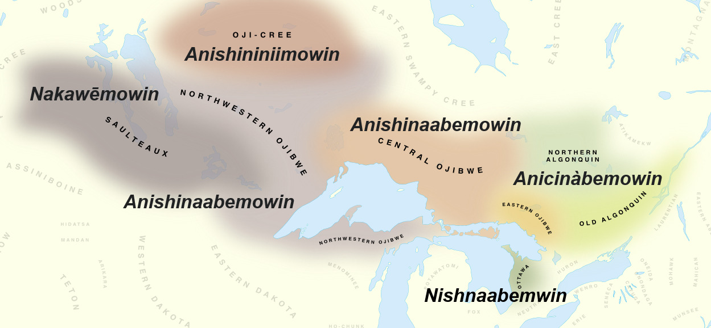

class: center, middle

# REVIEW 

---

# Review

**Language** is a *human communication system* we use for communicating ideas and socializing

--

- it's a systematic, rule-governed system 

- combines sounds (or signs) into words, and words into sentences to express complex ideas

--

**Mental grammar** is the rules we use to put together ideas into language when speaking and decode language into ideas when listening

--

- these rules of your mental grammar are probably different from the rules you learn in school 

- every speaker has a mental grammar, even if they're not fully aware of it, *no matter what language or dialect they speak*

- includes everything from how sounds are organized into words and how words are organized into sentences and then into conversations

---

# Review

**Linguistics** is the scientific study of language 

--

- a primary goal is to figure out what is in people's mental grammar (*figure out the rules that explains how language works*)

--

- we all learn our native languages as children and learn the rules of our grammars without thinking consciously about it

  - but, mental grammars are *extremely complex* 

--

- Grammatical rules are often **unconscious**, and we usually use them without being aware of it

- **Non-standard varieties** have grammatical rules too

- **Every speaker** of **every language** and **variety** has a mental grammar!!!

---

# Review

**Prescriptivism** is an approach to language that asserts that there is only one "correct" way to speak, and it tells people how they should or shouldn't speak

--

- we break most of these rules when we actually speak, so who cares?

--

**Descriptivism** is the alternative approach to language that seeks to *describe* how people actually talk in their daily lives

--

- this is what we do, as linguists!

--

- linguistics is a science and descriptivism helps maintain a neutral point of view

- it also respects the language patterns of every individual and community as completely legitimate and valid ways to talk!

---

# Review

### Avoid judgmental terms like "bad grammar" "incorrect language" or "broken English"... instead we will use more neutral terms like **standard** and **nonstandard language** 

--

- **standard language** is the variety taught in schools, and used in formal and official settings like the workplace, education, government, media, etc.

--

- **nonstandard language** is everything else! the "regular language" that people use in colloquial settings to talk to each other

--

  - the shandard variety is artificial and no one speaks that way all the time

  - people have different judgments sometimes about what counts as standard or non-standard

  - nonstandard language may be stigmatized in some cases, but it's just as legitimate and expressive as standard language...maybe even more expressive!
  
---

# Review 

- **Grammatical** = language that would be said and understood by a native speaker of a language

  - it would sound natural to a native speaker of the language 

--

- **Ungrammatical** = language that would *not* be said or understood by a native speaker. usually this is language that "does not sound right" 

--

  - **John has finishing his homework*

  - **This apples is delicious*

--

- Language can be **nonstandard** but **still grammatical** as long as its something that would sound natural to a native speaker

  - *I don't want none* - nonstandard but grammatical


---

class: middle, center

# **We are concerned with what people *really do*, not what they're supposed to do!!!**


---

class: center, middle

# Practice

---

# Standard/Non-standard and Grammatical/Ungrammatical

In groups, invent **at least three** English sentences:

  **1.** A grammatical, standard English sentence.

  **2.** A grammatical, non-standard English sentence.

  **3.** An ungrammatical English sentence.

**Pick one** of your group’s sentences to read aloud for the rest of the class. 

The rest of the class will have to figure out which one it is.

---

class: center, middle

# Variation 

---

# Variable rules

So far we've seen that:

- **Language follows rules of a mental grammar**, much of it below the level of awareness

--

- "Grammatical" and "ungrammatical" refer to whether something is in one's mental grammar

--

- Speakers of non-standard varieties also have rules and a mental grammar

--

Another important point: **the rules of language are often variable**

- Not everyone speaks the same, and not everyone has the same mental rules.

--

- Grammar often varies by region, community, and other social factors –but no matter where you're from, you still have a mental grammar!

- This also means that what you consider grammatical/ungrammatical can vary based on what region/community you're from.

---

class: center, middle

# Practice (variable rules)

---

# Practice (variable rules)

Each one of these sentences is used (considered grammatical) in one or more varieties of American English. 

**Which of them sound natural to you? Which do not? If not, how would you say it?**

1. She was standing on line for tickets.

2. It’s a quarter of three in the afternoon.

3. I thought you might could help me.

4. Do you want to come with?

5. He doesn’t have no time.

6. I'm finished my homework.

7. My shirt needs washed.

8. He had went to the store.

*(Visit the [Yale Grammatical Diversity Project](https://ygdp.yale.edu/) for more info about each of these grammatical phenomena.)*

---

class: center, middle

# **Answers** (variable rules)

---

# Answers 

.pull-left[

1. She was standing on line for tickets.

2. It’s a quarter of three in the afternoon.

3. I thought you might could help me.

4. Do you want to come with?

5. He doesn’t have no time.

6. I'm finished my homework.

7. My shirt needs washed.

8. He had went to the store.

]

--

.pull-right[

1. **NYC/North Jersey**

2. **Massachusetts**

3. **Southern US**

4. **Upper Midwest but perhaps spreading**

5. **Many varieties incl. African-American English**

6. **Philadelphia area, Canada**

7. **Ohio, Indiana, and surrounding area**

8. **Many varieties**

]

---

class: center, middle

# **Linguistics as a science**

---

# Subfields of Linguistics

.pull-left[

For linguists, grammar exists on many levels of language, each of which is its own subfield of Linguistics:

- **Phonetics** – physical attributes of speech sounds

- **Phonology** – speech sounds considered as a system

- **Morphology** – structure of words

- **Syntax** – structure of sentences

- **Semantics** – literal meaning

- **Pragmatics** – implied meaning
]

.pull-right[
**Other subfields:**

- Sociolinguistics

- Linguistic Anthropology

- Historical Linguistics

- Psycholinguistics

- Neurolinguistics

- Language Acquisition

- Second Language Acquisition

- Computational Linguistics/
Natural Language Processing

- Forensic Linguistics

]

---

# Linguistics ***IS*** a science

**Linguistics is the scientific study of language**

- When I say *language* here, I mean the human, cognitive ability to communicate through sounds/signs, not a specific language like English, Mandarin, Spanish, Arabic, etc….

--

One of the goals of linguistics is to understand speakers' mental grammars

**But what does it mean to say that it's a science? What is a science?**

---

# Linguistics as a science

Science uses the **scientific method** to test hypotheses about how natural phenomena (in our case, language) work:

1. Develop a **hypothesis** grounded in personal observations, theory, and previous research.

--

2. **Design an experiment** to collect real-world (empirical) data to test your hypothesis.

--

3. Run your experiment, **collect your data**.

--

4. **Analyze** your data – is your hypothesis true or false?

--

5. Based on your results, **update your theories**, develop a new hypothesis, and **repeat**!


---

class: center, middle

# Practice (Linguistics as a science)

---

# Practice (linguistics and scientific method)

### **Come up with your own experiment!**

.pull-left[

- Most English permits only 1 modal/clause:

  *I might eat. I could eat.*

- Southern American English permits 2:

  *I might could eat.*
]

--

.pull-right[

1. Come up with a **hypothesis** – a statement that could be true or false – about English modals.

  - *(Ideas: Where specifically? What about other modals: can, may, should, oughta? Does anyone use more than 2?)*

2. What kind of data could you collect to prove or disprove your hypothesis? 

3. How could you design an experiment to collect that data?

]

---


class: center, middle

# Sociolinguistics 

## (added for fun!)

---

# Sociolinguistics 

.pull-left[

**Discussion:**

1. What is a dialect?

2. What is slang?

3. What is an accent?

]

--

.pull-right[

1. **A neutral label to refer to a language variety shared by a group of speakers**

2. **Associated with extra connotations, NOT the same as dialect, usually only associated with the "vocabulary" level of language, use is often short-lived**

3. **only reflects pronunciation features**

]

---

# Sociolinguistics

## **Why do we have dialect variation?**

1. **Socio-historical patterns**

  - settlement patterns
  
  - migration routes (rural areas to cities, for example)
  
  - geography/topography (travel routes, land barriers, communication routes)

--

2. **Language contact**

  - loanwords from any other group in contact (Indigenous languages, for example)

--

3. **Economic ecology**

  - Smith Island crabbing vocabulary
  
  - economics affect rate and direction of human movement
  
---

# Sociolinguistics 

## **Why do we have dialect variation?**

4. **Social stratification**

  - social distance and difference 
  
  - middle class is often most innovative (more reasons to interact with each other, more types of communication networks)
  
  - women also tend to be most innovative 
  
  - Websters book of American words and spelling was the reason we disassociated from many British spellings

--

5. **Group and personal identity**

  - Often leads to retaining features in spite of other socio-historical processes occurring 


---

# Sociolinguistics

**Creole:** a language borne from a contact situation, resulting in the formation of a new language 

--

**Pidgin:** a contact situation resulting in some very basic language features becoming shared

- linguistically, not "different enough" to be considered a new language 

--

It's really not clear "how much difference" results in a new dialect versus a new language


- Dialect continuums...

---

# Sociolinguistics (dialect continuum)

```{r, out.width="100%", out.height="auto", echo=FALSE}

```

---

# Sociolinguistics (dialect continuum)

```{r, out.width="auto", out.height="auto", echo=FALSE}

```


---

class: center, middle

# Summary

---

# **Summary**

- Language follows rules of a **mental grammar**

- All speakers of all languages have a mental grammar

--

  - **Grammatical/ungrammatical** refers to whether a construction is in your mental grammar

--

  - **Non-standard varieties** also have rules and a mental grammar
  
  - The exact rules/mental grammar of a language varies by place and community

--

- **Grammar exists on multiple levels**, and each of these levels is a subfield of Linguistics

--

- **Linguistics is a science**. it uses empirical data and the scientific method to test hypotheses about how a natural phenomenon (language) works


---

# Coming up

### **Reading**

- Read *Anderson, Ch1*, if you haven't yet!


