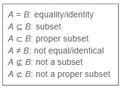
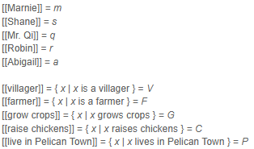

class: middle, center

# Review!

---
# Review from lecture 

## Different levels of meaning in language 

**Literal meaning**

- <u>semantics</u> studies literal meaning in language 

**Implied meaning**

- <u>pragmatics</u> studies implied meaning in language 

**Social meaning**

- <u>sociolinguistics</u> and <u>linguistic anthropology</u> study social meaning 


---

# Review from lecture 

### Discuss in small-ish groups.

- lexical semantics vs. compositional semantics

- sense vs. reference

  - <u>sense:</u> a mental concept of a words meaning 
  
  - <u>reference:</u> the set of things in the world that the word refers to; useful for categorizing new items we come across
  
--

- possible worlds

- truth values

--

- synonym vs. antonym

- hypernym vs. hyponym


---

class: middle, center

# Semantic relations (review still)

---

# Semantic relations 

- **synonym:** words that have the same reference / refer to the same set of things in the world 

  - *drinks* and *beverages*

- **hypernym:** words whose reference is a _superset_ of another words reference

- **hyponym:** words whose reference is a _subset_ of another words reference

  - *gecko* (hyponym) vs. *lizard* (hypernym)
  
- **antonym:** words that have opposite meanings

  - *subtypes on next slide....*

---

# Semantic relations

**antonym:** words that have opposite meanings

--

- <u>Complementary pairs:</u> items that can't be in both categories 

  - *alive* vs. *dead*
  
- <u>Gradable pairs:</u> opposite ends of a scale 

  - *young* vs. *old*
  
- <u>Reverses:</u> opposite directions 

  - *up* vs. *down*
  
- <u>Converses:</u> same action, different perspective 

  - *buy* vs. *sell*

---

# Semantic relations 

Are the following word pairs *synonyms, antonyms,* or a *hypernym-hyponym* pair?

1. bird - avian 

2. bird - sparrow 

3. bird - animal

4. rodent - rat

5. good - evil

6. to clean - to mess up/dirty

--

7. ***more??***

---

class: middle, center

# ENTAILMENT

## sentence **p** entails sentence **q** if and only if **q** is *true* whenever **p** is *true*

### "whenever" there is a possible world where the sentence **p** is *true*, while **q** is *false*

---

class: middle, center

# ENTAILMENT: example

--

### <u>Quartz is a linguistics student</u>

# entails  

### <u>Quartz is a student</u>. 

--

### if Quartz is **NOT** a <u>student</u>, then it's impossible for Quartz to be a <u>linguistics student</u>

---

class: middle, center

# Practice: entailment 

---

# Practice: entailment 

For each pair of sentences, does the first sentence **(a)** entail the second sentence **(b)**? 

--

**a.** Charles III is the King of the United Kingdom.

**b.** Queen Elizabeth II was Charles's mother.

-  ***No.*** The truth of (b) is not dependent on the truth of (a).

--

**a.** I am very very very very very tired.

**b.** I am tired.

- **Yes, entailment.** There is no universe where one is not tired when one is very(×7) tired.

--

**a.** Chicken Little believes the sky is falling.

**b.** The sky is falling.

- ***No.*** Even if the sky is not falling, Chicken Little might still believe it.

---

# Practice: entailment (Gible)

**a.** Gible is a silly tabby cat.

**b.** Gible is a cat.

- **Yes, entailment.**

--

.pull-left[
```{r, out.height="75%", out.width="75%", echo=FALSE}
knitr::include_graphics("./images/gible.jpg")
```
]


.pull-right[
- **obviously, this guy is silly**
]

---

# Practice: entailment

For each pair of sentences, does the first sentence **(a)** entail the second sentence **(b)**?

**a.** Bob and Linda live above a restaurant on Ocean Avenue.

**b.** Bob lives above a restaurant on Ocean Avenue.

- **Yes, entailment.**

--

**a.** The kids trick-or-treated on Halloween.

**b.** The kids trick-or-treated in scary costumes on Halloween.

-  ***No.*** If (a.) is true, then the costumes need not be scary.

--

**a.** Jake stopped smoking.

**b.** Jake used to smoke.

- **Yes, entailment.**

---

# Practice: entailment

**a.** Keng's car still has Wisconsin license plates on it.

**b.** Keng has a car.

- **Yes, entailment.**


---

# Practice: entailment 

**Think of three sentences that are entailed by each of these sentences:**

1. The spotted lanternfly is an insect that has spread invasively to New Jersey and can cause damage to forests and fruit crops.

  - *The spotted lanternfly has spread to New Jersey; The spotted lanternfly is an insect; The spotted lanternfly can cause damage to fruit crops; etc*
  
--

2. The starship Enterprise explored strange new worlds, sought out new life and new civilizations, and boldly went where no one had gone before.

  - *Enterprise is a starship; Enterprise explored some worlds; Enterprise sought out new life; etc*
  
  
---

# Practice: entailment

**Think of three sentences that are entailed by each of these sentences:**

3. Controversially, DeLa chose to eliminate herself from the competition after winning the lip-sync battle, which allowed Trixie, Kennedy, and Shangela to all stay in the competition.

  - *DeLa won the lip-sinc battle; Trixie stayed in the competition; DeLa eliminating herself was controversial; etc.*
  
--
  
4. Mario defeated Bowser, but then all he found in the dungeon was Toad, who told him that the princess was in another castle.

  - *The princess was not in the dungeon; Mario defeated Bowser; Toad said that the princess was in another castle; etc.*

---

class: middle, center

# Mutual entailment 

### **p** entails **q** <u>AND</u> **q** entails **p**.

---

# Mutual entailment 

## Examples

**p:** Merlin is immortal.

**q:** Merlin is incapable of dying.

--

**p:** He is a bachelor.

**q:** He is an unmarried man.


class: middle, center

# Set theory (formal review)

---


# Set theory (formal review)

## Set: a collection of items

- order doesn't matter 

- items can be repeated, but they don't "count" as separate items 
  
  - {a,e,i,o,u} = {a,a,e,e,i,o,o,u}

**Member**

- an item in a set is also called a member of that set

---

# Set theory (formal review)

## List vs. predicate notation

- **List notation:** specifies a set by listing its members between {brackets}

  - *R* = { Gouda, Soup, Falafel, Beef, Butter, Sesame }
  
  
- **Predicate notation:** defines what is in the set without listing everything 

  - *R* = { *x* | *x* is a rodent }

  - "*R* equals the set of elements *x*, such that *x* is a rodent" 
  
  - normal words: "the set of all rodents"
  
  - "such that" ( | )
  

---

# Set theory (formal review)

## Set relations

**subset (⊆):** 

- *A* is a subset of *B* if every element of *A* is also an element of *B*

**proper subset (⊂):** 

- *A* is a proper subset of *B* if *A* is a subset of *B* and they are not identical

**identity (=):** 

- two sets are identical/equal if they have exactly the same elements

---

# Set theory (formal review)

## Set operations

**union (∪)**

- produces a new set which contains all elements that belong to both sets (including elements in both sets)


**intersection (∩)**

- produces a new set that only contains all elements that belong to BOTH sets


---

# Set theory (formal review)

## Set operations

**difference (-)** 

- the difference of *A* and *B* is a new set which contains all elements that belong to *A*, but NOT *B*


**complement (')**

- produces a new set which contains all elements in the relevant universe that are NOT in the set


---

# Set theory (formal review)

## Cardinality: the number of elements in a set 

- **singleton set:** a set with cardinality = 1
  
- **null set/empty set:** a set with cardinality = 0 

  - {} = Ø "empty set"
  

### Other notational things

- when talking about the  *meaning* of a word, and not its structure, use [[double brackets]]


---

class: middle, center

# Set theory: back to language !

--

## Lexical semantics


---

# Set theory: back to language !

## How parts of speech are defined

**Proper Nouns**

- [[Gible]] (*Gible is an element*)

**Common Nouns**

- [[rodent]] = { *x* | *x* is a rodent}

**Adjectives**

- [[happy]] = { *x* | *x* is happy }

**Verbs**

- [[meow]] = { *x* | *x* meows }

---


# Set theory: back to language !

**Define the reference of nouns, adjectives, and verbs in terms of sets**

*Answers are in* ***red***.

.pull-left[
1. fast 

  - **[[fast]] = {x | x is fast}**

2. scream

  - **[[scream]] = {x | x screams}**

3. baby 

  - **[[baby]] = {x | x is a baby}**

4. write 

  - **[[write]] = {x | x writes}**

5. fluffy 

  - **[[fluffy]] = {x | x is fluffy}**
]
.pull-right[
6. play 

  - **[[play]] = {x | x plays}**

7. loud

  - **[[loud]] = {x | x is loud}**

8. random

  - **[[random]] = {x | x is random}**
]
---

class: middle, center

# Set theory: back to language !

--

## Compositional semantics


---

# Set theory: back to language !

## Sentence types (Name subjects)

.pull-left[
**"name is NOUN"** 

- [[name]] ∈ [[NOUN]]

- "Gible is a Pokemon" 

  - = [[Gible]] ∈  [[Pokemon]] 

**"name is ADJ"** 

- [[name]] ∈ [[ADJ]]

- "Gible is fat" 

  - = [[Gible]]  ∈ [[fat]]
]


.pull-right[
**"name is VERB"**

- [[name]] ∈ [[VERB]]

- "Gible is running" 

  - = [[Gible]]  ∈ [[run]]
]

---

# Set theory: back to language !

## Sentence types (NOUN subjects)

.pull-left[
**"NOUNs are NOUNs"** 

- [[NOUN]] ⊆ [[NOUN]]

- "Hamsters are rodents" 

  - = [[hamster]] ⊆ [[rodent]]

**"NOUNs are ADJ"**

- [[NOUN]] ⊆ [[ADJ]]

- "Hamsters are small"

  - = [[hamster]] ⊆ [[small]]
]

.pull-right[
**"NOUNs are VERB"**

- [[NOUN]] ⊆ [[VERB]]

- "Rats squeak" 

  - = [[rat]] ⊆ [[squeak]]
]

---

# Set theory: back to language !

## Complex sentences

**"NAME is ADJ NOUN"**

- "Gible is a tabby cat."

- [[Gible]] ∈ [[tabby]] ∩ [[cat]]

**"ADJ NOUNs are ADJ"**

- "Small rodents are cute"

- [[small]] ∩ [[rodent]] ⊆ [[cute]]

---

# Set theory: back to language !

**Translate sentences into set theory expressions.** (answers are in **red**)


1. Butter is a fast rat. **[[Butter]] ∈ [[fast]] ∩ [[rat]]**

2. Fable and Gible are young cats. **[[F&B]] ∈ [[young]] ∩ [[cat]]**

  - **OR ???**


3. Beef and Butter are curly-haired rats.

4. Rats are ticklish.

5. Linguistics is fun.

6. Keng is not Chinese.

7. Fish swim.

8. Big dogs are friendly.


---

class: middle, center

# More practice !!! 

--

## Mario universe

---

# Practice with sets 

### List and predicate notation

**Define the following sets using both list notation and predicate notation.**

.pull-left[
  a. *M*, the set of characters with mustaches
  
  b. *P*, the set of characters who are/wear pink
  
  c. *C*, the set of characters with crowns 
  
  d. *G*, the set of characters who are ghosts
]

.pull-right[
```{r, out.height="100%", out.width="100%", echo=FALSE}
knitr::include_graphics("./images/mario_characters.png")
```
]

---

# Practice with sets 

**True or False? Why?**

.pull-left[
a. Mario ∈ *M* 

b. Peach ∉ *C*

c. | *C* | = 3

d. {Daisy, Birdo, Luigi} = {Luigi, Daisy, Birdo}

e. | { x | x has a name that starts with 'W' } | = {Wario, Waluigi}
]

.pull-right[
```{r, out.height="100%", out.width="100%", echo=FALSE}
knitr::include_graphics("./images/mario_characters.png")
```
]

---

# Practice with sets 

## Are any of the sets defined in question 1 singletons? Which one(s)?

```{r, out.height="60%", out.width="60%", echo=FALSE}
knitr::include_graphics("./images/mario_characters.png")
```

---

# Practice (set relations)

**Using the sets defined on the lower right, determine if each of these expressions is true or false.**

.pull-left[
1. M ⊂ H

2. R ⊆ F

3. H = N

4. N ⊆ M

5. R ⊄ N

6. F ⊈ M

```{r, out.height="50%", out.width="50%", echo=FALSE}

```

]

.pull-right[
```{r, out.height="100%", out.width="100%", echo=FALSE}
knitr::include_graphics("./images/mario_universe.png")
```

]

---

class: middle, center

# Practice: Lion King universe

---

# Practice (predicate notation)

**Write out the lexical meaning of these words using predicate notation. You can assign them variable names like *L, W, B, M, S, F.***

.pull-left[
1. lion	[[lion]] = *L* 

  = {x | x is lion}

2. warthog [[scary]] = *K* 

  = {x | x is scary}

3. brown [[eat]] = *E* = {x | x eats}

4. meerkat	

5. smile

6. ferocious
]

.pull-right[
```{r, out.height="75%", out.width="75%", echo=FALSE}
knitr::include_graphics("./images/lion_king.png")
```
]

---

# Practice

### Compositional meanings

**Write out the compositional meaning of these sentences using set theory. Are they true or false?**

.pull-left[
1. Timon is a warthog. 				

2. Simba is brown.

3. Meerkats are ferocious.

4. Pumbaa smiles.

5. Lions are not meerkats.
]

.pull-right[
```{r, out.height="75%", out.width="75%", echo=FALSE}
knitr::include_graphics("./images/lion_king.png")
```
]

---

class: middle, center

# Practice: Mario universe

---

# Practice with sets (calculate)

**Given these sets, calculate the following and describe the resulting set in words.**

.pull-left[
1. C ∪ P 

  = {Peach, Daisy, King Boo, Birdo, Toadette}

2. H ∩ O

3. H – M

4. P ′

5. C ∩ S

```{r, out.height="50%", out.width="50%", echo=FALSE}
knitr::include_graphics("./images/sets.png")
```

]

.pull-right[

```{r, out.height="100%", out.width="100%", echo=FALSE}
knitr::include_graphics("./images/mario_characters.png")
```

```{r, out.height="100%", out.width="100%", echo=FALSE}
knitr::include_graphics("./images/mario_sets.png")
```
]

---

# Practice with sets (calculate)

**Given these sets, calculate the following and describe the resulting set in words.**

.pull-left[
6. | F ∪ S |

7. | C ∩ P |

8. O – H

9. ( C ∩ F ) ∪ M

10. ( F ∪ H )′

```{r, out.height="50%", out.width="50%", echo=FALSE}
knitr::include_graphics("./images/sets.png")
```

]

.pull-right[

```{r, out.height="100%", out.width="100%", echo=FALSE}
knitr::include_graphics("./images/mario_characters.png")
```

```{r, out.height="100%", out.width="100%", echo=FALSE}
knitr::include_graphics("./images/mario_sets.png")
```
]

---
# Practice with sets (calculate)

**Given these sets, calculate the following and describe the resulting set in words.**

.pull-left[
11. True or False: F ∩ S = S ∩ F

12. True or False: F – S = S – F

```{r, out.height="50%", out.width="50%", echo=FALSE}
knitr::include_graphics("./images/sets.png")
```

]

.pull-right[

```{r, out.height="100%", out.width="100%", echo=FALSE}
knitr::include_graphics("./images/mario_characters.png")
```

```{r, out.height="100%", out.width="100%", echo=FALSE}
knitr::include_graphics("./images/mario_sets.png")
```
]

---

class: middle, center

# Practice: Lion King universe

---

# Practice 

### Translate language to set notation 

**Use set notation to specify the meaning of each of the following sentences.**

.pull-left[
1. Simba is a cute lion.

2. Lions are ferocious creatures.

3. Pumbaa is smelly.

4. Adult lions roar.
]


.pull-right[
```{r, out.height="75%", out.width="75%", echo=FALSE}
knitr::include_graphics("./images/lion_king.png")
```
]

---

# Practice

### Translate language to set notation

**Use set notation to specify the meaning of each of the following sentences.**

.pull-left[
5. Young lions are adorable animals.

6. Pumbaa is not a sarcastic meerkat.
(how do you do negation?)

7. Timon and Pumbaa are friendly.
(how do you define a set of two elements?)

8. Lions and warthogs are ferocious.
(what set operator would you use?)
]

.pull-right[
```{r, out.height="75%", out.width="75%", echo=FALSE}
knitr::include_graphics("./images/lion_king.png")
```
]

---

class: center, middle

# Stardew Valley universe

---

# Practice 

### Translate language into set notation

**Given the definitions to the right, express the meaning of the following sentences using set theory.**

.pull-left[
1. Abigail is a villager.

2. Mr. Qi does not live in Pelican Town.

3. Every farmer grows crops.

4. Some villagers raise chickens.
]

.pull-right[
```{r, out.height="100%", out.width="100%", echo=FALSE}

```
]

---

# Practice 

### Translate language into set notation

**Given the definitions to the right, express the meaning of the following sentences using set theory.**

.pull-left[
5. Only one farmer lives in Pelican Town.

6. Most villagers live in Pelican Town.

7. Marnie and Shane both raise chickens.

8. Neither Robin nor Abigail grow crops.
]

.pull-right[
```{r, out.height="100%", out.width="100%", echo=FALSE}

```
]


---

class: middle, center

# Congrats! You lived through semantics!

```{r, out.height="60%", out.width="60%", echo=FALSE}
knitr::include_graphics("./images/you_lived.jpg")
```

