# What we've learned so far

We started the semester talking about words and their parts, and since then we've been moving to
larger and larger elements of language:

--

- Morphology – study of the structure of words (words)

- Syntax – study of the structure of sentences (sentences)

- Semantics – study of the literal meaning language (sentences + meaning)

- Pragmatics – study of the implied/contextual meaning of language (discourse + meaning)

--

Now we're going to jump back and look at the smallest element of language: sounds

- Phonetics & Phonology – study of the sounds of language

---

class: center, middle

# Branches of "sound" 

---

# Phonetics and Phonology

We traditionally divide the study of the sounds of language into two fields:

--

- **Phonetics:** study of speech sounds as a physical phenomenon

  - How do we use our vocal tract to produce sound?

  - What are the properties of sound waves?

  - How do we use our auditory system to perceive sound?

--

- **Phonology:** study of how languages organize speech sounds into a system

  - How do we organize sounds into words?

  - What pairs of sounds contrast in language, such that replacing one with another will create a new word?

  - How do sounds change in certain contexts and over time?


---

# Transmitting ideas through sound

| Speaker (articulation) | Air (acoustics) | Listener (Perception) |
|:--------|:--------|:--------|
| - has idea | -sound waves travel through air | - Uses auditory system to hear sounds: perception |
| - encodes idea in sounds, words, sentence structure | - acoustics is the study of physical properties of sound waves | - decodes sounds into words, sentence structure |
| - articulation: uses vocal tract to produce sounds | | - forms idea

---

# Articulation: How do we make speech sounds? 

.pull-left[
**Articulation:** moving parts of body to produce speech sounds.

Steps in articulation:

1. Speaker exhales, pushing air out of lungs and up the trachea (windpipe).

2. Air passes through larynx (voicebox), which contains vocal folds (cords), primary source of speech sounds.

3. Air passes through upper vocal tract, including oral cavity (mouth) and nasal cavity and leaves body.

4. Within the vocal tract, articulators such as the tongue, lips, teeth, and soft palate move to modify the sound coming from the larynx and produce additional sounds. 

]

.pull-right[
```{r, out.height="90%", out.width="90%", echo=FALSE}
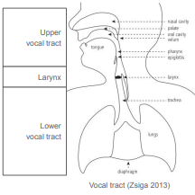
```
]

---

# Acoustics: What is sound?

.pull-left[
**Sound** is essentially a **vibration** in the air – a disturbance of **air pressure** that we can detect with our ears.

Air consists of molecules. As we speak:

- Our articulators push and pull on surrounding air molecules, **compressing** and **rarefying** (pulling them apart)

- These air molecules push and pull on their neighbors, which push and pull on their neighbors, and so on...

- So we have waves of air pressure changes that spread outward from speaker at ~700 mph in all directions.

- Note that it’s the **waves** that travel from speaker to listener. Individual air molecules vibrate in place, but do not travel.
]


.pull-right[
```{r, out.height="80%", out.width="80%", echo=FALSE}

```
]

---

# Perception: How do we hear sounds?

.pull-left[
Sound waves are channeled by the outer ear through the ear canal to the **eardrum**, causing it to vibrate.

These vibrations are transmitted by the ossicles and tympanic cavity to the **inner ear**.

The **inner ear** is full of fluid and regulates balance as well as being essential to hearing.

In the inner ear, vibrations pass through the fluid into the spiral-shaped **cochlea**, where they cause movements in a series of **tiny hairs** – different hairs for different pitches.

The hairs connect to **nerves**, which send neural impulses to the **brain**, where sounds are decoded into language.

**Perception** therefore involves **both ear and brain.**
]

.pull-right[
```{r, out.height="90%", out.width="90%", echo=FALSE}
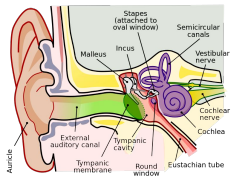
```
]

---

# Branches of phonetics

Because the transmission of speech sounds involves these three physical processes, we can split phonetics into three branches:

--

- **Articulatory phonetics:** study of how we move our vocal tract to produce speech sounds

--

- **Acoustic phonetics:** study of the physical properties of sound waves

--

- **Perceptual phonetics:** study of how we perceive speech sounds using our auditory system
and brain

--

We can also talk about the **phonetics of signed languages** – they follow the same processes, but with articulation of visual gestures, optical transmission, and visual perception.

- I'll talk more about sign language phonetics in one of our phonetics meetings!

--

In this class, we'll focus on **articulatory phonetics**, but if you'd like to know more about acoustics or
perception, take a phonetics class!

---

class: center, middle

# Segments

---

# Segments and suprasegmentals

The sounds represented by IPA symbols called **segments** or **phones**

--

- **Segment:** discrete, individual unit of sound, for example a consonant, vowel, or glide

--

- We can divide the speech stream cleanly into segments: *cats* = [k], [æ], [t], [s]

--

But some sounds occur above the level of the segment, affecting multiple segments at once.

--

- We call these **prosodic** sounds or **suprasegmentals**

- For example, stress. (Say out loud: *fantastic!* Which is the stressed syllable?)

--

  - *fanTAStic* – stressed syllables tend to be louder, longer, more clearly enunciated, and pronounced with a change in pitch – which affects *all* of the sounds in the syllable

--

  - Stress is a **prosodic** or **suprasegmental** phenomenon: it affects multiple segments

---

# Segments

We'll focus on sound **segments** in this class.

--

Say these words out loud and try breaking them down into segments. What segments do they have, and how many does each word have? What letters do they correspond to? Does one letter always correspond to one sound?

- *banana*

- *ship*

- *peak*

- *knock*

- *rough*

---

class: center, middle 

# Vowels, glides, consonants

---

# Vowels and consonants

We can divide segments into the following major categories:

--

- **Vowels** like [a, e, i, o, u...]

- **Consonants** like [p, t, k, b, d, g, m, n, f, s, v, z, r...]

- **Glides** like the *y* in *yes* (phonetic symbol: [j]) and the [w] in *wait* form an intermediate category

--

  - they resemble vowels in some ways and consonants in other ways

---

# Vowels and consonants

The way we **articulate** vowels and consonants differs in two important ways.

--

- **Airflow:** when we speak, we exhale, forcing air to flow outward through our vocal tract

  - With consonants, we block this airflow completely or partially. With vowels, we don't

--

- **Voicing:** when we cause our vocal cords to vibrate during speech.

  - Vowels are usually voiced. Consonants may be voiced or voiceless.

--

| | Vowels | Consonants |
|:--------|:--------|:--------|
| Obstruction of airflow | no obstruction in vocal tract; air flows freely | total or partial obstruction in vocal tract, blocking or restricting airflow | 
| Voicing | Usually voiced | May or may not be voiced | 

---

class: center, middle

# Larynx and voicing 

---

# Voicing and the larynx

.pull-left[
**Larynx** is the **primary source** of speech sounds.

It contains:

- **vocal folds** (vocal cords): two sheets of muscle that can be brought together or pulled apart

- **glottis:** opening between the vocal folds
through which air passes

- other structures of muscle, cartilage, and
ligament that support and move the vocal folds
]

.pull-right[
```{r, out.height="80%", out.width="80%", echo=FALSE}
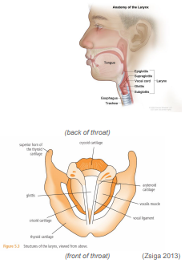
```
]


---

# Voicing and the larynx

By moving the vocal folds in different ways, we
can produce different speech sounds.

--

If we bring them close together and breathe out,
they’ll start **vibrating** due to Bernoulli’s effect (anyone play a reed instrument??)

--

- This vibration is called **voicing** and is used
in vowels [a, e, i, o, u] and certain
consonants like [z, v, b, d, g, m, n, l, r]

--

If we move them apart, they’ll stop vibrating:

- This is called **voicelessness**; voiceless
consonants include [s, f, p, t, k, h]


---

class: center, middle 

# Vowel articulation 

---

# Vowel articulation 

We've seen that vowels are articulated with:

- **Constant airflow** (no obstruction)

--

- **Voicing** (vibration of vocal folds)

--

Let’s explore **vowels** a bit more and see how they’re **articulated** – how the vocal tract moves to produce them.

We’ll come back to consonants next week!

---

# Cardinal vowels 

.pull-left[
When discussing vowels, it’s useful to establish a few simple vowels – cardinal vowels – and build up from there.

We’ll start with the 5 cardinal vowels on the chart:

- These are the 5 vowels of Spanish, and many other languages have a similar 5-vowel system.

- I’ve given English key words to show roughly how these vowels sound.

Note that the International Phonetic Alphabet’s
symbols for vowels don’t always match our English
names for them.
]

.pull-right[
```{r, out.height="90%", out.width="90%", echo=FALSE}
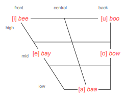
```
]

---

# Vowel Features

.pull-left[
Different vowel qualities can be primarily be distinguished based on three features:

- **Tongue height:**
How high is the tongue in the mouth?

- **Tongue backness:**
Is tongue further forward or back in mouth?

- **Lip roundedness:**
Are the lips rounded or unrounded?
]

.pull-right[
```{r, out.height="90%", out.width="90%", echo=FALSE}
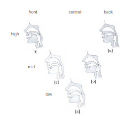
```
]

---

# Vowels in real-time imaging 

.pull-left[
This [video](http://www.youtube.com/watch?v=jaIquq_4560) is produced by an MRI (magnetic resonance imaging) scanner, a machine used to see inside the body.

Watch how the tongue and lips move as these
people sing [a, e, i, o, u].

Also, [this video](https://www.youtube.com/watch?v=wj7iM0BCWMQ) is awesome.

]

.pull-right[
```{r, out.height="90%", out.width="90%", echo=FALSE}
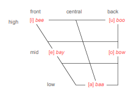
```

]

---

# Vowel features

.pull-left[
In different vowel qualities, we can distinguish various levels of **tongue height:**

- **High, mid, low**

And we can distinguish various levels of **tongue backness:**

- **Front, central, back**

Arranging them by tongue position, they form a triangle, so you often see vowels arranged in a **vowel triangle/trapezoid**
]

.pull-right[
```{r, out.height="90%", out.width="90%", echo=FALSE}

```
]

---

# Lip rounding

.pull-left[
The third vowel feature is **lip rounding:**

- **rounded** vs. **unrounded** (spread)

Here are our five vowels as pronounced
by a speaker of Italian.

How does his mouth shape change for each
vowel? Which ones are rounded/unrounded?

Note that he's exaggerating a bit for the
purposes of demonstration since in the video
he’s trying to teach Italian pronunciation.
]

.pull-right[
```{r, out.height="90%", out.width="90%", echo=FALSE}
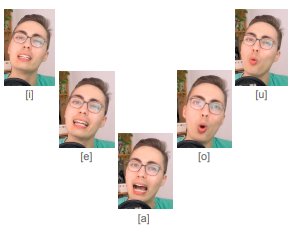
```
]

---

# Lip rounding 

.pull-left[
[o, u] are **rounded**; [i, e, a] are **unrounded**

This follows a crosslinguistic tendency:

- Back vowels tend to be rounded

- Front and low vowels tend to be unrounded

Front rounded vowels exist but are less common:

- German *schön* [ʃøːn] 'beautiful'

- French *tu* [ty] 'you'

As are back unrounded vowels:

- Japanese *kuzu* [kɯzɯ] 'kudzu vine'
]

.pull-right[
```{r, out.height="90%", out.width="90%", echo=FALSE}

```
]

---

# Vowel features

.pull-left[
So these are the three articulatory features we use to distinguish different vowel qualities:

- **Tongue height:**
How high is the tongue in the mouth?

- **Tongue backness:**
Is tongue further forward or back in mouth?

- **Lip roundedness:**
Are the lips rounded or unrounded?
]

.pull-right[
```{r, out.height="100%", out.width="100%", echo=FALSE}
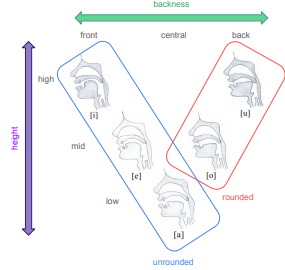
```
]

---

# Vowel features

.pull-left[
When we describe vowels, we typically do so in
terms of *height - backness - roundedness:*

- [i] = high front unrounded vowel

- [e] = mid front unrounded vowel

- [a] = low central unrounded vowel

- [o] = mid back rounded vowel

- [u] = high back rounded vowel
]


.pull-right[
```{r, out.height="100%", out.width="100%", echo=FALSE}

```
]


---

class: center, middle

# American English vowels

---

# Beyond the cardinal vowels

Of course, there are more than five vowels.

--

IPA chart uses 28 cardinal vowels to try to represent all of the world's languages – though no language uses them all.

--

.pull-left[
Note that:

- IPA chart uses terms close/open instead of high/low, but most phoneticians use terms high/low

- IPA chart distinguishes 4 levels of height instead of 3

- IPA chart includes some vowels between these levels. We can use terms like near high, near front, etc.

- [ə] *schwa* is in the center of the chart and is the mid central vowel 
]

.pull-right[

```{r, out.height="100%", out.width="100%", echo=FALSE}
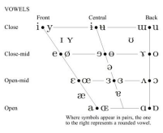
```
]

---

# Beyond the cardinal vowels

.pull-left[
How do we figure out what sound these symbols represent?

We use our five cardinal vowels as a starting point:

- How do we pronounce [y]?

  - Start with [i] and make it rounded.

- How do we pronounce [ɛ]?

  - Tongue about halfway between [e] and [a].

- How do we pronounce [ɨ]?

  - Tongue about halfway between [i] and [u]
]


.pull-right[
```{r, out.height="100%", out.width="100%", echo=FALSE}

```
]

---

# American English vowels

.pull-left[
American English has around 12-14 vowels.

Exact number and pronunciation varies by region – English accents tend to differ in terms of vowels.

A few notes about American English vowels:

- There is a 5-way height contrast

- Speakers tend to diphthongize some of these vowels, especially the bait and boat vowels, but also to a certain degree beet and boot

- Some American English speakers don't
differentiate [ə] and [ʌ], and some don’t
differentiate [ɑ] and [ɔ].
]

.pull-right[
```{r, out.height="100%", out.width="100%", echo=FALSE}
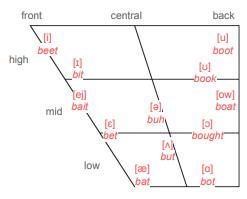
```
]

---

# Tense and lax vowels

.pull-left[
5 height differences is a bit unwieldy.

A common solution is to divide the vowels into:

- **Tense vowels:** [i], [u], [eɪ̯ ], [oʊ̯ ]
a bit higher and more peripheral,
tend to be diphthongized in American Eng.

- **Lax vowels:** the rest
tongue a bit more relaxed,
cannot end a word in American Eng.

]

.pull-right[
```{r, out.height="100%", out.width="100%", echo=FALSE}
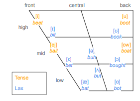
```
]

---

# Diphthongs and glides

.pull-left[
A **diphthong** is two vowel sounds that are combined into a single sound.

A diphthong consists of:

- **vowel + glide** or **glide + vowel**

A glide (semi-vowel) is a vowel-like sound produced
by moving your tongue while saying a vowel.

By combining a glide with a vowel, we get a **diphthong**.

There also exist **triphthongs:** glide + vowel + glide

- For example, *yay, wow, way*
]


.pull-right[
```{r, out.height="100%", out.width="100%", echo=FALSE}
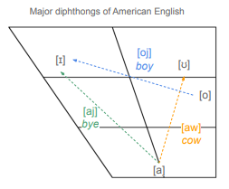
```
]

---

class: center, middle

# Vowels beyond English 

---

# Vowel features beyond English

.pull-left[
Across languages, vowels always differ by height, backness, and rounding – but they can also differ by other features

Some languages feature **nasal vowels** in addition to the **oral vowels** we've been talking about so far:

- **Nasal vowels** are articulated by lowering the **velum** (soft palate) at the back of the mouth, allowing air to flow through both the nose and the mouth.

- Portuguese *bom* [bõ] 'good', *bem* [bẽ] 'well', *um* [ũ] 'one'

Some languages contrast **long** and **short vowels**:

- Japanese [obasan] 'aunt' vs. [obaːsan] 'grandmother'
]

.pull-right[

```{r, out.height="80%", out.width="80%", echo=FALSE}
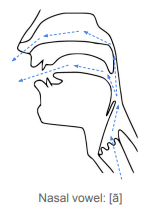
```
]

---

# Vowel features beyond English

In **tone languages** like Mandarin, Cantonese, Vietnamese, Hmong, Thai, Igbo, Yoruba, and Punjabi, vowels are distinguished by differences in pitch:

- Mandarin distinguishes four tones + neutral. All of these are considered to be different words:

  - Tone 1 (high level): mā 'mother'

  - Tone 2 (rising): má 'hemp'

  - Tone 3 (falling-rising): mǎ 'horse'

  - Tone 4 (falling): mà 'scold'

  - Neutral tone: ma (question marker)

---

# Summary 

In these slides, we learned about the **larynx** and **vowels**

--

The **larynx** is an organ in the throat:

--

- It contains the **vocal folds** and the **glottis** (opening between the vocal folds)

- When the vocal folds *vibrate*, it is called **voicing**

--

Vowels are a type of sound segment characterized by **unobstructed airflow** and **voicing**.

--

Different vowel qualities can be described using the following three **features:**

- **tongue height** (high/close, mid, low/open)

- **tongue backness** (front, central, back)

- **lip rounding** (rounded, unrounded)


---

# Coming up: More Phonetics!

### Reading 

- read the **phonetics chapter** on Canvas, if you haven't yet!

### Homework

- HW6 will be posted by April 5


