# Review

Now we're looking at the smallest element of language: **sounds**!

--

- **Phonetics & phonology:** study of the sounds of language

--

**Phonetics:** study of speech sounds as a physical phenomenon

--

**Phonology:** study of how languages organize speech sounds into a system

--

- organization into words, in certain contexts, which sounds are contrastive... etc.


---

class: middle, center

# Sound =/= Spelling 

---

# Sound vs. Spelling 

- no language has a writing system (orthography) that perfectly represents its speech sounds, and there are reasons for this

--

  - pronunciation **changes over time**! writing doesn't always reflect these changes, though (examples: *knight, gnat*)

--

  - pronunciation **varies by place and social group**! writing doesn't usually reflect this variation (examples: *pecan, caramel, cot/caught, Mary/marry/merry, bag*)

--

  - **loanwords** often have spellings that reflect the pronunciation in the source language, not target language (examples: *buffet, zucchini*)
    
--

- but it becomes a problem when we want to talk precisely about **phonetics**

**So, how do we accurately represent the pronunciation of a word?**

--

- **A:** Phonetic description of phonemes' features; transcribed with International Phonetic Alphabet

---

class: middle, center

# Vowel articulatory features

---

# Vowel articulatory features (the big 3)

- **Tongue height:** how high is the tongue in the mouth?

--

  - high, mid, low
  
  - can be further divided into tense vs. lax vowels (**lax:** re*lax*ed tongue)

--

- **Tongue backness:** is the tongue further forward or back in the mouth?

--

  - front, central, back

--

- **Lip roundedness:** are the lips rounded or unrounded?

--

  - rounded, unrounded
  
  
---

# Vowel articulatory features

**Articulation:** how the vocal tract moves to produce sounds

.pull-left[
```{r, out.height="100%", out.width="100%", echo=FALSE}
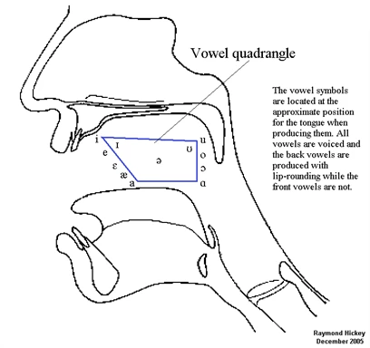
```
]


.pull-right[
```{r, out.height="100%", out.width="100%", echo=FALSE}
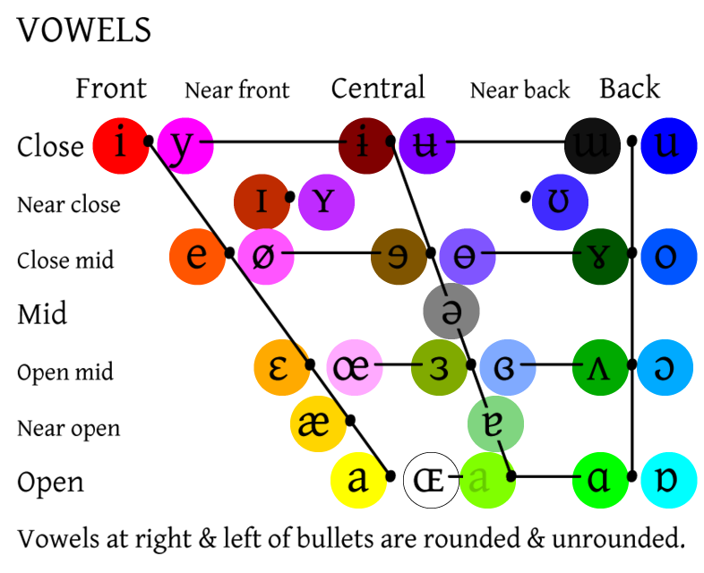
```
]


---

# Other vowel features!

- **Nasalization:** articulated by lowering the velum/soft palate, so that air flows through both the nose and mouth

--

  - Portuguese *pão* means "bread" but the non-nasal *pao* means "stick" or.....something else inappropriate.

--

  - since adding or removing the nasality feature changes the meaning completely, we can say that nasalization is **contrastive** in Portuguese

--

- **Length:** long vowels contrast with short vowels

--

  - Ojibwe (Algonquian) *nipim* "to live" vs. *niipim* "to be cold"

--

- **Pitch:** tonal languages contrast pitch 

--

  - White Hmong (Hmong-Mien) *kuv* "I" vs. *kuj* "also"

--

  - **Note** in this writing system (RPA), the tone is indicated by the final *written* letter of the word. v = mid-rising tone; j = high falling tone


---

class: middle, center

# International Phonetic Alphabet (IPA)

## Interactive chart [here](https://www.ipachart.com/)! :)

---

# IPA... NOT A BEER!

.pull-left[
```{r, out.height="120%", out.width="120%", echo=FALSE}
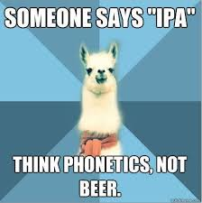
```
]

.pull-right[
```{r, out.height="100%", out.width="100%", echo=FALSE}
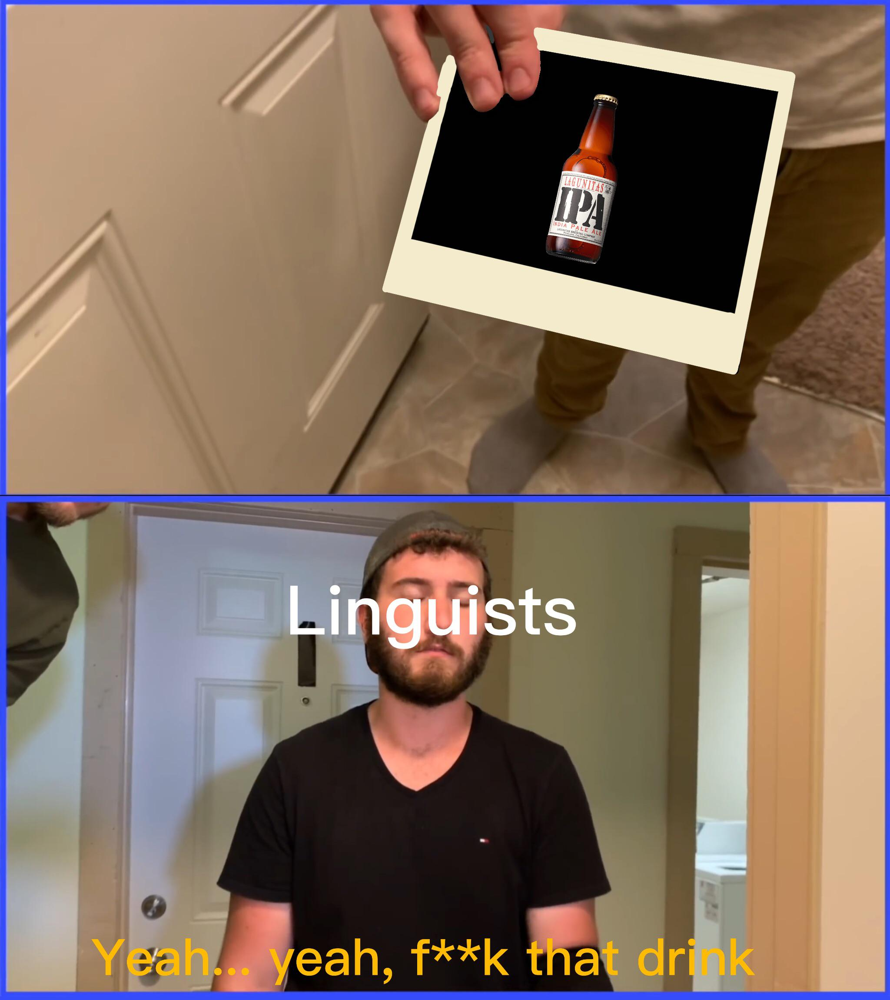
```
]

---

# International Phonetic Alphabet

To accurately represent speech sounds, we use the **International Phonetic Alphabet (IPA)**

--

- one symbol = one sound

  - these "one sound"s are called **phonemes**

--

- uses the same symbols for all spoken languages 

- all spoken languages use some subset of the symbols on the full IPA chart 

---

# International Phonetic Alphabet

- many IPA symbols represent roughly the same sounds as the corresponding English letter

  - [p, t, k, b, d, g, f, v, s, z, h, m, n, l]

--

- **but,** some IPA symbols do not

  - IPA [ j ] = English *<*y*>* 
  
  - *yes* = [jɛs]

  - [c, q, x] and most vowels **don't** correspond to English letters!
  
---

# International Phonetic Alphabet

IPA is used for **phonetic transcription:** writing the exact sounds of a speech sample

--

**Some conventions:**

- phonetic transcriptions are written between **[square brackets]**

  - [bə.ˈnæ.nə]

--

- orthpgraphy/spelling is written in ***italics*** or in **< angle brackets >**

  - *banana* or *<* banana *>*

--

- **all sounds and only sounds** are written:

  - *phone* [ˈfown] (don't write silent letters, *ph* = one sound [f])
  
--
  
- a dot **(.)** indicates **syllable** divisions: *pronunciation* [prə.ˌnʌn.si.ˈej.ʃən]

- primary and secondary **stress** are indicated with **(ˈ)** and **(ˌ) before** the stressed syllable

---

# Steps for transcription

1. say the word out loud 

2. which IPA symbols match **what you're saying**? 

  - its all about what you're saying, and NOT about how the word is written
  
  - you can either describe it based on where you think your tongue is **OR** find the symbol on the interactive chart that sounds closest to what you're saying
  
  - either way, you should get the same result


---

class: middle, center

# Practice! 


---

# Identifying vowels

**(1) Identify which vowels are in the following words, (2) give the IPA symbol for them, and (3) define them using the big three features.**

1. cat 

2. thrift 

3. red 

4. reed

5. hard 

6. boot 

7. cut 

8. pet 

9. pot 

10. fork 

---

class: middle, center

# What about signed languages!?

--

## I added this section for fun :)

---

# Signed languages 

## Myths

1. signed language is not one universal language (different countries have different sign languages, and sign languages have dialects too!)

2. knowing ASL means you know English (they are two distinct languages)

3. signed languages don't only use the hands as articulators (non-manual articulation exists: eyebrow raising and eye gaze for example)

## Facts

1. there are >200 signed languages 

2. ASL is related most closely to French Sign Language (Francosign is the language family)


---

# Signed languages

**Sign phonemes** are smaller units of the sign

--

They're categorized into five **parameters** which are *further* categorized into **primes**

--

**Parameters:**

- handshape

- palm orientation 

- movement 

- location 

- non-manual signals

---

# Signed languages: Parameters

**Palm orientation**
  
- palms facing up or down, facing the signer, away from the signer, etc.

**Movement** 

- upwards, downwards, diagonally, zigzag, etc.
  
**Location** 

- in the signing space

**Non-manual signals** 

- facial expressions, eyebrow raising/lowering, eye gaze...

- <u>Note</u>: *"manual" = with hands*

---

# Signed languages

## Handshape examples

.pull-left[
***school***
```{r, out.height="120%", out.width="120%", echo=FALSE}
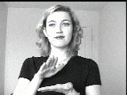
```
]

.pull-right[
***impossible***
```{r, out.height="120%", out.width="120%", echo=FALSE}
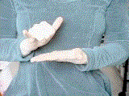
```
]


---

# Signed languages

## Location examples

.pull-left[
***apple***
```{r, out.height="120%", out.width="120%", echo=FALSE}
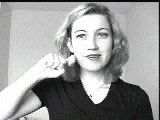
```
]

.pull-right[
***onion***
```{r, out.height="120%", out.width="120%", echo=FALSE}
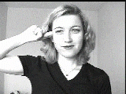
```
]

---

# Signed languages 

## Movement examples

.pull-left[
***airplane***
```{r, out.height="120%", out.width="120%", echo=FALSE}
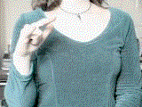
```
]

.pull-right[
***fly***
```{r, out.height="120%", out.width="120%", echo=FALSE}
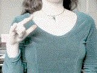
```
]

---

# Signed languages 

## Palm orientation examples

.pull-left[
***balance***
```{r, out.height="120%", out.width="120%", echo=FALSE}
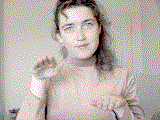
```
]

.pull-right[
***maybe***
```{r, out.height="120%", out.width="120%", echo=FALSE}
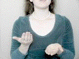
```
]

---

# Signed language

## Non-manual signals 


**Statements** have neutral facial expressions 

**Yes/no questions** (polar questions) have eyebrows raised

**Wh-questions** have eyebrows lowered

---

background-image: url("./images/ipa_heart.jpg")
background-size: 100% 100%
background-position: center
background-repeat: no-repeat

class: center, middle

## .

## <span style="color: blue;">Never EVER</span>

## <span style="color: green;">be frightened by</span>

## <span style="color: red;">phonetics</span>

## <span style="color: blue;">!!!!!</span>


---

# Coming up: Phonetics! (consonants)

### Reading 

- read the **phonetics chapter** if you haven't already!

### Homework 

- HW6 is due April 12

