# Last week

.pull-left[
We focused on **vowels** 

Vowels can be described in terms of three main features

- tongue height

- tongue backness

- lip roundedness
]

.pull-right[
```{r, out.height="100%", out.width="100%", echo=FALSE}
knitr::include_graphics("./images/vowel-features.png")
```
]

--

We also learned about how vowels and consonants differ in articulation:

- **Airflow** – when we speak, we exhale, forcing air to flow outward through our vocal tract

  - With consonants, we block this airflow completely or partially. With vowels, we don't

- **Voicing** – when we cause our vocal cords to vibrate during speech.

  - Vowels are usually voiced. Consonants may be voiced or voiceless.

---

class: center, middle

# Consonants!

---

# Consonants

All consonants are produced by restricting or obstructing the airflow in some way – whether partially or totally.

But the nature of the obstruction varies from consonant to consonant.

We describe consonants in terms of three **features** – which all serve to describe that obstruction:

- **Manner of articulation** – what is the nature of the obstruction? is it partial or complete?

- **Place of articulation** – where in the vocal tract is the obstruction made.

- **Voicing** – are the vocal folds vibrating throughout this
period of obstruction?

---

# Consonants

The IPA consonant chart is arranged by these three features: **voicing, place, manner**

And we use these features to describe consonants:

- [f] is a *voiceless labiodental fricative*

--

Once you understand this terminology, you can use it to understand how to pronounce any consonant on this chart!

```{r, out.height="60%", out.width="60%", echo=FALSE}
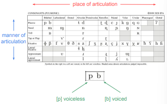
```

---

# Consonants

You may notice that some cells are empty and some are grayed out.

Cells that are grayed out are judged impossible to pronounce based on the anatomy of the vocal tract.

Cells that are empty but not gray are possible but unattested:

- We have not found a language that uses them as part of words.

- If we did, we would add a new symbol to the chart.


```{r, out.height="60%", out.width="60%", echo=FALSE}

```

---

class: center, middle

# Voicing 

---

# Voicing

.pull-left[
Difference between [s] and [z] is voicing:

- [s] is voiceless

- [z] is voiced

Many other consonants differ in voicing:

- [p, b], [t, d], [k, g], [f, v], [θ, ð], [ʃ, ʒ]

On the consonant chart, this is indicated by the alignment of the symbol in the cell:

- left = voiceless

- right = voiced
]

.pull-right[
```{r, out.height="100%", out.width="100%", echo=FALSE}

```
]

---

class: center, middle

# Manner of articulation

---

# Manner of articulation 

As we’ve seen, all consonants are
produced with some obstruction.

**Manner of articulation** indicates the *type of obstruction:*

- Is there a complete blockage of
airflow?

- Is there a partial blockage?

- Is the airflow blocked in one part of the vocal tract but allowed to flow through a different part?

```{r, out.height="60%", out.width="60%", echo=FALSE}

```

---

# Manner of articulation: Plosives/Stops

Say the sounds *papapapa* and *tatatatata*. What is your mouth doing to restrict the flow of air?

--

**Plosives** (aka stops or oral stops) are articulated with a complete closure somewhere in the vocal tract.

After you make the closure, you continue exhaling, so air pressure builds up behind the closure.

Then you release the closure, causing a small burst or
explosion of pressurized air – hence "plosive"

```{r, out.height="100%", out.width="100%", echo=FALSE}
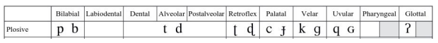
```

---

# Manner of articulation: Plosives/Stops

English stops include:

- **Voiceless stops** [p, t, k]:
*spin* [spɪn], *stop* [stɑp], *scar* [skɑɹ]

- **Voiced stops** [b, d, g]:
*about* [əbawt], *adore* [ədɔɹ], *ago* [əgow]

- English voiceless stops are often **aspirated** –
pronounced with a short [h] sound after the release:
*tip* [tʰɪp], *pen* [pʰɛn], *cat* [kʰæt]

```{r, out.height="100%", out.width="100%", echo=FALSE}

```

---

# Manner of articulation: Fricatives

Say the words *see* and *tea*. Your tongue will move to a similar but not identical position for both consonants. With which word does your tongue touch the upper part of your mouth?

**Fricatives** are produced with an **incomplete obstruction**:

- You bring two articulators close together but don't quite let them touch, creating a narrow opening for air to flow through.

- Forcing air through a narrow opening produces a turbulent airstream that makes a hissing sound, like air escaping a tire.

```{r, out.height="100%", out.width="100%", echo=FALSE}
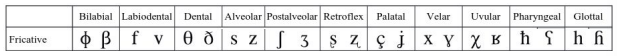
```

---

# Manner of articulation: Fricatives

English fricatives include (which of these are voiced/voiceless?):

- [f] and [v]: *fit* [ˈfɪt], *vet* [ˈvɛt]

- [θ] and [ð]: *think* [ˈθɪŋk], *that* [ˈðæt]

- [s] and [z]: *see* [ˈsi], *zoo* [ˈzu]

- [ʃ] and [ʒ]: *ship* [ˈʃɪp], *measure* [ˈmɛʒəɹ]

- [h]: heat [ˈhit]

[s, z, ʃ, ʒ] are a special class of fricatives known as **sibilants** because they produce a louder, more strident sound than the other fricatives

```{r, out.height="100%", out.width="100%", echo=FALSE}

```

---

# Manner of articulation: affricates


Say the words ***tie, shy, chai***. With which words does your tongue touch the upper part of your mouth? Which words produce a hissing sound?

--

**Affricates** are a sort of combination between stops and fricatives:

- A complete closure is made, building up pressure.

- When it is released, the articulators are kept close together enough to produce the hissing sound characteristic of fricatives.

We consider affricates one sound, but with two phases, and we write them with two IPA symbols joined with a tie bar: *check* [t͡ ʃɛk]

English affricates include:

- [t͡ ʃ]: *choose* [t͡ ʃuz]

- [d͡ ʒ]: *judge* [d͡ ʒʌd͡ ʒ]

--

Other languages may have other affricates:

- Japanese *tsuru* [ˈt͡ sɯɾɯ] 'crane (bird)'

- German *Salz und Pfeffer* [zalt͡ s ʊnt p͡ fefɐ] 'salt and pepper'

- Italian *zero* [d͡ zɛːɾo] 'zero'

---

# Manner of articulation: Nasals

Try saying [m] while pinching your nose. Can u do it?

We produce most consonants by breathing out our mouth.
But with **nasal** consonants, we’re actually breathing our our nose.

We do this by making a complete obstruction in the mouth,
and lowering our **velum** or soft palate,
allowing air to pass through the velar port into the **nasal cavity**.

English nasals: [m, n, ŋ]:
*mat* [mæt], *nine* [najn], *sing* [sɪŋ]

```{r, out.height="100%", out.width="100%", echo=FALSE}
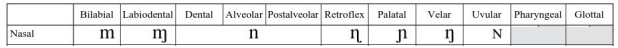
```

---

# Manner of articulation: Approximants

.pull-left[
**Approximants** – like fricatives – feature a partial closure.

But the articulators are held slightly further apart so the
airstream isn't turbulent and there's no hissing.

Glides like [j] *yes* and [w] *we* are technically approximants.

As is American English r [ɹ], which can be pronounced as:

- “bunched r”: tongue back is arched in back of mouth

- “retroflex r”: tongue tip is curled backward
]

.pull-right[
```{r, out.height="100%", out.width="100%", echo=FALSE}
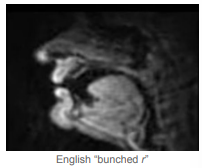
```
]

```{r, out.height="100%", out.width="100%", echo=FALSE}
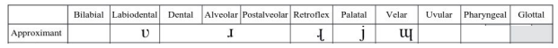
```


---

# Manner of articulation: Laterals

Say the following word: ***light***. What is your mouth doing when you say the [l]? Is there a complete obstruction of airflow?

--

.pull-left[
**Laterals** are produced with an obstruction in the center of the vocal tract, but air flows past the tongue on one or both sides.

- **Lateral fricative:** the airstream is restricted enough to make a hissing sound: Welsh Llwyd [ɬʊɨd] 'Lloyd'

- **Lateral approximant:** the airstream is not as restricted, no hissing sound: English *lose* [luz]
]

.pull-right[
```{r, out.height="100%", out.width="100%", echo=FALSE}
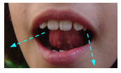
```
]

```{r, out.height="100%", out.width="100%", echo=FALSE}
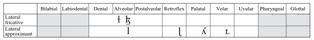
```


---

# Manner of articulation: Trills, taps, and flaps

Say the words ***ladder*** and ***adore***. Are you pronouncing the d the same in both words?

In English, the sounds spelled <t> and <d> are often pronounced as a **flap** [ɾ] before unstressed vowels: *ladder, water, meadow, little, battle, city, ready*


Flaps and the similar **taps** (Spanish *para* [pa.ɾa] 'for') block air completely like stops but don't hold the closure long enough to build up pressure, so there's no burst.

**Trills** are like flaps and taps, but feature repeated closures: Spanish *rojo* [ro.xo] 'red'


```{r, out.height="100%", out.width="100%", echo=FALSE}
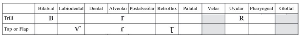
```

---

# Manner of articulation 

This gives us our **manners of articulation** – classes of consonants based on type of obstruction:

- **Plosive** (stop) – complete obstruction, release with burst [p, t, k, b, d, g]

- **Fricative** – narrow obstruction, hissing sound [f, v, θ, ð, s, z, ʃ, ʒ, h]

- **Affricate** – complete obstruction, release to narrow obstruction [t͡ ʃ, d͡ ʒ]

- **Nasal** – complete obstruction in mouth, air flows through nose [m, n, ŋ]

- **Lateral** – obstruction on centerline of mouth, air flows on side(s) [l]

- **Approximant** – narrow obstruction, not narrow enough for hissing [j, w, ɹ]

- **Tap/flap/trill** – very brief obstruction, repeated for trills [ɾ]

---

class: center, middle

# Natural classes

---

# Natural classes

We can also group manners of articulation into several larger **natural classes**:

- **Obstruent** = plosives, affricates, fricatives (consonants with greater constriction of airflow)

- **Sonorant** = nasals, laterals, approximants (consonants with lesser constriction of airflow)

- **Rhotics** = r-sounds, which can differ from language to language

- **Liquids** = laterals + rhotics (l-sounds + r-sounds)

---

class: center, middle

# Place of articulation

---

# Place of articulation

.pull-left[
We’ve seen manner of articulation:

- Type of obstruction

- Rows on the consonant chart

Let’s move on to place of articulation:

- Location of obstruction
in vocal tract

- Columns on the consonant chart
]

.pull-right[
```{r, out.height="100%", out.width="100%", echo=FALSE}

```
]

---

class: center, middle

# First, anatomy!

---

# Anatomy of the vocal tract

.pull-left[
Before we talk about place of articulation, we have to
discuss a bit of anatomy.

As we exhale:

- Air flows up from our lungs via he trachea.

- Through the larynx (source of voicing).

- Through the pharynx
(open space behind tongue).

- Through the oral cavity (mouth) and/or nasal cavity (nasal sinuses).

- And out of the body.
]

.pull-right[
```{r, out.height="100%", out.width="100%", echo=FALSE}
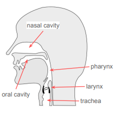
```
]

---

# Anatomy of the vocal tract

.pull-left[
To make a consonant, we obstruct the airflow.

We do this by moving an active articulator toward a
passive articulator to restrict airflow.

Active articulators are:

- Lips

- Tongue: tongue tip, blade, back, root
]

.pull-right[
```{r, out.height="100%", out.width="100%", echo=FALSE}
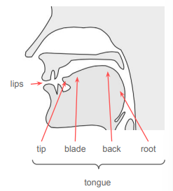
```
]

---

# Anatomy of the vocal tract

.pull-left[
Passive articulators are:

- teeth

- alveolar ridge

- (hard) palate

- velum (soft palate)

- uvula

- pharyngeal wall
]

.pull-right[
```{r, out.height="100%", out.width="100%", echo=FALSE}
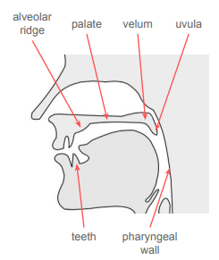
```
]

---

# Place of articulation: Labials

Say the following words: **pa, fee**. What two articulators touch when you pronounce the first consonant in each word?

**Labials** are articulated with your lips. These include:

- **Bilabials** – both lips: *bee* [ˈbi], *ma* [ˈmɑ], Japanese *tōfu* [toːɸɯ] 'tofu'

- **Labiodentals** – lower lip and upper teeth: *fin [fɪn], vote [vowt]

```{r, out.height="100%", out.width="100%", echo=FALSE}
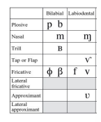
```

```{r, out.height="100%", out.width="100%", echo=FALSE}
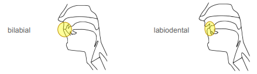
```

---

# Place of articulation: Coronals

Say the following words: **too, now**. Where does your tongue tip
touch when you say the first consonant?

```{r, out.height="100%", out.width="100%", echo=FALSE}
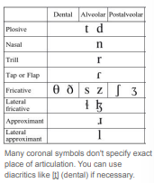
```

```{r, out.height="100%", out.width="100%", echo=FALSE}
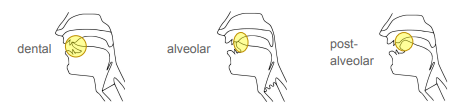
```


---

# Place of articulation: Coronals

**Coronals** have constriction in the front part of mouth:

- **Dentals** – tongue tip and teeth [θ] *think*, [ð] *that*

- **Alveolars** – tongue tip/blade and alveolar ridge
[t] *tea*, [d] *day*, [n] *night*, [l] *late*

- **Postalveolars** – tongue blade and area behind alveolar ridge [ʃ] *shake*, [ʒ] *vision*, [t͡ ʃ]* check*, [d͡ ʒ] *jay*

```{r, out.height="100%", out.width="100%", echo=FALSE}

```

```{r, out.height="100%", out.width="100%", echo=FALSE}

```

---

# Place of articulation: Retroflexes

**Retroflexes** are articulated with the tongue tip arched
backward.

American English *r* may be pronounced as retroflex, but
it depends on the speaker.

Other languages with retroflexes:

- Hindi/Urdu [ʈaːl ʈʰaːl ɖaːl ɖʱaːl]

  'postpone, wood shop, branch, shield'

- [ɖ] – Swedish *nord* [nuːɖ] 'north'

- [ɻ] – Portuguese (São Paulo state) *carta* [ˈkaɻtɐ] 'letter

```{r, out.height="100%", out.width="100%", echo=FALSE}
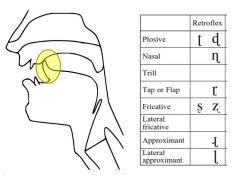
```


---

# Place of articulation: Palatals

**Palatals** are produced with the tongue body raised against
the hard palate

English [j] *yes* is considered a palatal approximant.

Palatals in other languages:

- Spanish *niño* [niɲo] 'child'

- Portuguese *velho* [vɛʎu] 'old'

```{r, out.height="100%", out.width="100%", echo=FALSE}
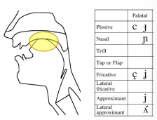
```

---

# Place of articulation: Velars

Say the following words: ***car, go***. Where does your tongue
touch when you pronounce the first consonant of each word?

**Velars** are articulated with the back of the tongue against the **velum** (soft palate).

English velars:

- [k] *cat* [kʰæt], [g] *goat* [gowt], [ŋ] *song* [sɑŋ]

Other velars:

- [x] Mexican Spanish *jefe* [xefe] 'boss'

- [ɣ] Spanish *hago* [aɣo] 'I do'

```{r, out.height="100%", out.width="100%", echo=FALSE}
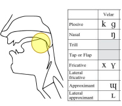
```


---

# Place of articulation: Gutturals

Guttural consonants are pronounced in the back of the mouth:

- **Uvulars**: back of tongue against the uvula:
Madrid Spanish *jefe* [χefe], Quechua *qusa* [qosa] 'husband'

- **Pharyngeals**: root of tongue obstructing the pharynx:
Arabic [ħar] 'heat', [ʕajn] 'eye'

- **Glottals**: vocal folds obstructing the glottis:
[h] *hold* [howld], [ʔ] *uh-oh* [ʌʔow], Caribbean Spanish *jefe* [hefe]

```{r, out.height="100%", out.width="100%", echo=FALSE}
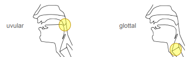
```


```{r, out.height="100%", out.width="100%", echo=FALSE}
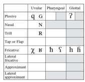
```


---

# Place of articulation

This gives us our **place of articulation** – where in the vocal tract obstruction is made:

- **bilabials** – lips

- **labiodentals** – lips and teeth

- **dentals** – tongue tip and teeth

- **alveolars** – tongue tip/blade and alveolar ridge

- **postalveolars** – tongue blade and area behind alveolar ridge

- **palatals** – tongue blade and palate

- **velars** – tongue back and velum

- **uvulars** – tongue back and uvula

- **pharyngeals** – tongue root and pharyngeal wall

- **glottals** – glottis

---

class: center, middle

# Describing consonants


---

# Describing consonants

Consonants are sounds that feature
some **obstruction of airflow**.

We describe this obstruction using three
features:

- voicing
is there voicing?

- place of articulation
where is the obstruction?

- manner of articulation
what kind of obstruction is it?

```{r, out.height="100%", out.width="100%", echo=FALSE}

```


---

# Describing consonants

With these three features:

- voicing

- place of articulation

- manner of articulation

We can now fully describe consonants:

- [p] voiceless bilabial plosive

- [l] voiced alveolar lateral

- [ŋ] voiced velar nasal

- [h] voiceless glottal fricative


```{r, out.height="100%", out.width="100%", echo=FALSE}

```

---

# Coming up! One more phonetics class :(

???


