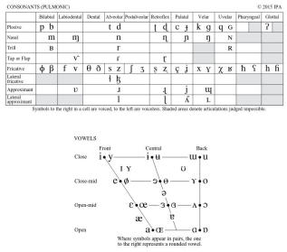
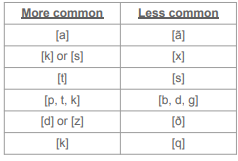
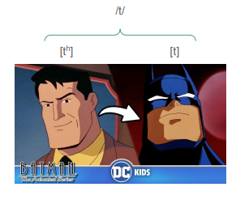
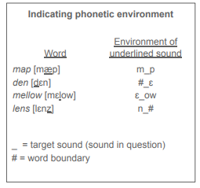

# Phonetics vs. Phonology

So far we've focused on sounds as a **physical phenomenon** – **phonetics**

- Specifically, we're seen how the **vocal tract** moves to **articulate** speech sounds

--

Now we're going to shift to **phonology** – the study of speech sounds as a mental and linguistic system. Phonology studies, among other things:

- How we organize sounds in our mental grammar (phonemes and allophones)

- Rules for how sounds change in particular contexts

- Rules for how sounds change over time and in borrowings from other languages

- Rules for how we to combine sounds to form words (phonotactics)

---

class: center, middle

# Sounds of the world's languages

---

# Phonological inventories 

.pull-left[
One way we can view sounds as a system is considering the **phonological inventories** of languages.

Different languages contrast different sounds:

- English contrasts /t/-/d/, Quechua doesn’t

- Quechua contrasts /k/-/q/, English doesn’t

Or consider all the different rhotic sounds in the world’s languages:

- English *red*, Spanish *rojo*, Italian *rosso*, French *rouge*, Danish *rød*, Portuguese *roxo*

]

.pull-right[
```{r, out.height="100%", out.width="100%", echo=FALSE}

```
]

---

# Sounds of the world's languages

.pull-left[
Despite the wide diversity of sounds in the world's languages, there are common trends.

Some sounds are more or less common cross-linguistically

- English [ɹ] and [θ] are quite uncommon sounds cross-linguistically, though they may be familiar to us.

- It’s more common for languages to have the sounds in the left column of this table than the ones in the right.

- And there’s a tendency that, if languages have one of the less common sounds, they will usually also have the corresponding more common sounds.
]


.pull-right[
```{r, out.height="100%", out.width="100%", echo=FALSE}

```
]

---

# Phonotactics

Beyond having different sounds, different languages have different **rules for putting sounds together** into words: ***phonotactics***

--

As a simple example, English allows words to start with *t-, tr-,* or *st-,* but not all languages do.

- Note what Spanish and Japanese do to adapt such structures in borrowed words

| <div style="padding-right:20px;">Language</div> | *t-* | *tr-* | *st-* |
|:--------|:--------|:--------|:--------|
| English | <span style="color:green">*time*</span> | <span style="color:green">*trend*</span> | <span style="color:green">*stress*</span> | 
| Spanish | <span style="color:green">*tarde* </span>| <span style="color:green">*tres*</span> | ***estrés*** | 
| Japanese | <div style="padding-right:20px;"><span style="color:green">*tomodachi*</span> 'friend'</div> | <div style="padding-right:10px;">***torendo*** 'trend'</div> | ***sutoresu*** 'stress' |

--

So again:

- **Phonetics** studies language sounds as a **physical** phenomenon

- **Phonology** studies language sounds as a **system**


---

class: center, middle

# Phonemes and allophones

---

# What sound does /t/ make?

Say the words below out loud. In each
word, what sound does the /t/ represent,
if any?

Is it the same sound in each word? Is it
different, and if so, how?

When you speak, do you notice these
differences or do you just think of all of
these sounds as a /t/?

- *time*

- *stay*

- *pet*

- *water*

- *football*

- *center*


---

# What sound does /t/ make?

Speakers of American English tend to pronounce the /t/ differently in each of these words.

We can describe these differences in phonetic terms.

But when we speak, we don't tend to notice these differences, and we just think of all of these sounds as a /t/.

How can this be? How can two sounds be
different but also somehow the same?

.pull-left[
- *time*

- *stay* 

- *pet* 

- *water*

- *football*

- *center* 
]

.pull-right[

- aspirated [tʰ]

- unaspirated [t]

- unreleased [t̚ ]

- flap [ɾ]

- glottal stop [ʔ]

- elided/deleted Ø
]

---

# Phonemes and allophones

To explain this, we need to introduce the concept of **phonemes** and **allophones**:

- A **phoneme** is a set of sounds that speakers of a language treat as being the same.

- **Allophones** are each individual sound that’s part of a phoneme.

Applying this to our previous example:

- [tʰ], [t], [t̚ ], [ɾ], [ʔ], [Ø] are all sounds that English speakers treat as a **/t/** – technically different sounds, but we treat them as if they’re all the same:

  - This group of sounds taken together is the **phoneme /t/** (we write phonemes in / /)

- Each of those individual sounds is an **allophone** of the phoneme /t/:

  - **[tʰ], [t], [t̚ ], [ɾ], [ʔ], [Ø] ** are all allophones of /t/ (we write allophones in [ ])

---

# Phonemes and allophones

.pull-left[
One way to think about phonemes and allophones is as superheroes:

- Batman and Bruce Wayne look different

- But they’re the same person

- And **they never appear in the same place**

Similarly:

- [tʰ] and [t] sound different

- But they’re allophones of the same phoneme

- As we’ll see, they never appear in the same place
]

.pull-right[

```{r, out.height="100%", out.width="100%", echo=FALSE}

```
]

---

# Phonemic contrast

One way to differentiate phonemes and allophones is **phonemic contrast**.

--

Speakers consider different phonemes to be different sounds, so we can differentiate linguistic expressions simply by switching one phoneme for another – that is, **phonemes contrast**.

- *time – dime, tie – die, too – do* are all different words that rely on the /t/-/d/ contrast

--

Speakers don’t consider allophones of the same phoneme to be different sounds, so we cannot differentiate expressions by switching one allophone for another – **allophones do not contrast**.

--

- There are no English words that differ by [t] and [tʰ]

- And if we switch one for another in an English word, it will often just sound odd: s[t]op → s[tʰ]op

---

# Minimal pairs

Since **phonemes contrast** and **allophones of the same phoneme do not**, one way to test whether two sounds are phonemes is to look for a **minimal pair**.

--

A **minimal pair** is a pair of words that differs by only one sound:

- *time – dime, tie – die, too – do*

--

- **Spelling doesn’t matter**, only sounds: *toe – dough, tie – dye, two – do* are minimal pairs

- The sounds can be anywhere in the word: *bit – bid, mitt – mid* are minimal pairs

--

If you **can** find a minimal pair, that suggests **the two sounds are separate phonemes**, since speakers are relying on the contrast between them to differentiate words.

If you **cannot**, they might be **allophones** – but it might also be a quirk of the vocabulary: English /h/ and /ŋ/ are different phonemes, but they have no minimal pairs.

---

class: center, middle

# Practice: minimal pairs

---

# Practice: Minimal pairs

.pull-left[
Are the following pairs of words minimal pairs? If they are, what phonemic contrast do they illustrate? Focus on the sounds, not the spelling.

1. park, part

2. waste, waist

3. grease, greet

4. shared, cared

5. steak, sneak

6. baked, brake
]

.pull-right[
Find a minimal pair to illustrate the following contrasts (the phonemes do not need to be at the beginning of the word):

1. /f/ – /v/

2. /b/ – /g/

3. /θ/ – /ð/

4. /n/ – /ŋ/

5. /i/ – /u/

6. /ʃ/ – /t͡ ʃ/
]

---

class: center, middle

# Distribution in languages

---

# Phonemes and allophones crosslinguistically 

Whether two sounds are considered phonemes or allophones depends in part on the language:

--

- In English **/t/** and **/d/** are considered separate phonemes: *time* and *dime* are a minimal pair

  - In Quechua they’re not – *tanta* means ‘together’, and if you said *danta*, listeners would just interpret it as an alternate pronunciation, not an entirely new word.

--

- In English, [t] and [tʰ] are two **allophones** of /t/: [t] in *stop* and [tʰ] in *top*

  - In Quechua, they’re considered two different **phonemes**: *tanta* /tanta/ ‘together’ and *thanta* [tʰanta] ‘old’ are a minimal pair

--

- Though across languages, there’s a tendency for allophones of the same phoneme to be phonetically related: [tʰ] and [t] are both voiceless alveolar stops, for example

---

# Distribution

Phonemes and allophones also differ by their **distribution** – where they occur in the word:

--

- **Phonemes** are in **contrastive distribution**

- **Allophones** of the same phoneme are in **complementary distribution**

- **Variants** are in **variation**

---

# Phonological distribution

.pull-left[
**Distribution** refers to what **phonetic environment** a sound segment can occur in.

This includes information like:

- What is the preceding sound segment?

- What is the following sound segment?

- What is the sound's position in the syllable and word?

  - Is it at the beginning/middle/end of a syllable?

  - Is it in a stressed or unstressed syllable?

  - Is it word-initial, word-medial, or word-final? 
]

.pull-right[

```{r, out.height="100%", out.width="100%", echo=FALSE}

```
]

---

# Contrastive distribution

**Phonemes** occur in **contrastive distribution**.

--

- Two different phonemes can occur in the same phonetic environment, and if you replace one phoneme with another in that same environment, it will result in a **contrast**.

--

This is why we find phonemes in minimal pairs: *so* /sow/ vs. *foe* /fow/

- /s/ and /f/ are both phonemes.

- They can occur in the same phonological context. Here this is: at the beginning of the word/syllable, in a stressed syllable, with a following /ow/ sound.

--

- When you replace one with the other in the same phonological context, it creates a **phonemic contrast** and **forms a new word**.

---

# Complementary distribution

**Allophones occur in complementary distribution.**

--

- Each allophone of a phoneme occurs in a **different phonetic environment**. Because they occur in different environment, you can't replace one with the other in that context.

--

- As we’ve seen, two allphones of English /t/ are [tʰ] and [ɾ]

  - [tʰ] occurs at the beginning of words: *time, top, tip, tango*

  - [ɾ] occurs in the middle of words before an unstressed vowel: *water, city, motto*

--

  - Each has its own phonetic environment and it would sound weird to place one in the environment where another belongs.

  - You never see Bruce Wayne and Batman in the same place.

---

class: center, middle

# Phonemic analysis

---

# Phonemic analysis

We can use distribution in **phonemic analysis** – to test whether two sounds are phonemes or allophones.

--

If we find they’re in **contrastive** distribution (**same** phonetic environment), they’re likely **phonemes**.

--

If we find they’re in **complementary** distribution (each has own phonetic environment), they’re likely **allophones** of the same phoneme.


---

# Phonemic analysis

.pull-left[
Consider Spanish [d] and [ð] here. Do they occur in the same or different phonetic environments?

- Our first step is to write out the phonetic environment in which each sound occurs.

- Note that [d] appears word-initially.

- And [ð] appears word-medially between vowels.

- Different environments > **complementary** distribution > [d] and [ð] are two allophones of the same phoneme in Spanish

Again, this is language-specific: /d/ and /ð/ are different phonemes in English: *day* and *they* is a minimal pair.
]


.pull-right[
| [d] | [ð] |
|:--------|:--------|
| [dar] ‘give’ | [toðo] ‘all’ |
| [desir] ‘say’ | [biða] ‘life’ |
| [dama] ‘lady’ | [koðo] ‘elbow’ |
| [duða] ‘doubt’ | [duða] ‘doubt’ |
| <div style="padding-right:20px;">[deretʃo] ‘right’</div> | [asaðo] ‘roast’ |
| [deðo] ‘finger’ | [deðo] ‘finger |

]


---

class: center, middle

# A note on variation

---

# Variation

Sometimes there are multiple ways to pronounce a phone in the same context, but these different pronunciations don't form a new word:

--

- wa[ɾ]er – usual American English pronunciation

- wa[ʔ]er – some British English pronunciations

--

This distribution is called **variation** – that is, the pronunciation **varies** between communities.

--

- The different pronunciations aren't phonemes because replacing one with another doesn't make a new word. They're also not allophones in the traditional sense because they're not in complementary distribution (1 context = 1 sound)

--

- Instead, the different pronunciations are called **variants**. Using one or another doesn't make a new word, but may signal social information about the speaker like where they're from

---

class: center, middle

# Wrap-up

---

# Summary 

**Phonology** is the study of speech sounds as a **system**

--

- Different languages have different **phonological inventories** and **different phonotactics** – and this is part of their linguistic system or grammar.

--

A key concept in phonology is **phonemes** verses **allophones**:

--

- **Phonemes** are considered by speakers as separate sounds, contrast to make **minimal pairs**, and occur in **contrastive distribution**

--

- **Allophones** are different ways to say the same phoneme, they are not considered separate sounds, they do not make minimal pairs, and they occur in **complementary distribution**

---

# Coming up!

***???***


