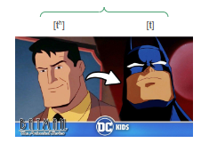
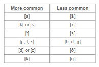
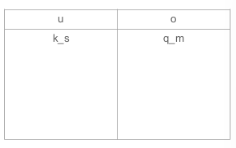

class: middle, center

# Review

---

# Review 

**Phoneme:** a set of sounds that speakers of a language treat as being the same

- written in **/slashes/**

--

**Allophone:** each individual possible sound that a phoneme could surface as

--

```{r, out.height="50%", out.width="50%", echo=FALSE}

```


---

# Review

**Contrastive distribution:** when switching out one *phoneme* for another results in a different meaning

--

- these word pairs are called *minimal pairs*

- they detect which sounds are **phonemes**

- *that vs. mat*

--

**Complementary distribution:** when switching a sound out for another sound *does not* change the meaning

--

- allophones of the same phoneme

- *example. [t] versus [tʰ] in English*

--

- different environments cause the sound to change, but in the minds of speakers its still considered one sound

--

**Phonotactics:** rules for how we combine sounds to form words

- English doesn't allow the velar nasal at the beginning of a word, but Cook Islands Māori does


---

# Review

Different languages contrast different sounds, **but,** there are some common trends.

--

```{r, out.height="50%", out.width="50%", echo=FALSE}

```

--

If a language has the sounds on the right of each row, then it will also have the corresponding sound on the left.

---

class: center, middle

# Phoneme vs Allophone?


---

# Phoneme vs allophone?


**How to determine whether a sound is a phoneme or allophone:**

.pull-left[
1. for each word, write the preceding and following segment for the sound you're testing 

2. write down each different environment (again, looking at both the preceding and following sounds)

4. see if there are any common environments that both potential phonemes share
]


.pull-right[
```{r, out.height="100%", out.width="100%", echo=FALSE}

```
]

---

# Phoneme vs allophone?

We use **minimal pairs** (contrastive distribution) to find evidence that two sounds are *phonemes*.

--

**Notes:**

- \# means word boundary (beginning or end of the word) is on that side

- _ represents the sound you're testing. it's like a placeholder

.pull-center[
```{r, out.height="50%", out.width="50%", echo=FALSE}

```
]

---

class: center, middle

# Phonemic analysis

---

# Phonemic analysis

We can use distribution in **phonemic analysis** – to test whether two sounds are phonemes or allophones.

--

If we find they’re in **contrastive** distribution (**same** phonetic environment), they’re likely **phonemes**.

--

If we find they’re in **complementary** distribution (each has own phonetic environment), they’re likely **allophones** of the same phoneme.

---

# Phonemic analysis


.pull-left[
Consider Spanish [d] and [ð] here. Do they occur in the same or different phonetic environments?

- Our first step is to write out the phonetic environment in which each sound occurs.

- Note that [d] appears word-initially.

- And [ð] appears word-medially between vowels.

- Different environments > **complementary** distribution > [d] and [ð] are two allophones of the same phoneme in Spanish

Again, this is language-specific: /d/ and /ð/ are different phonemes in English: *day* and *they* is a minimal pair.
]


.pull-right[
| [d] | [ð] |
|:--------|:--------|
| [dar] ‘give’ | [toðo] ‘all’ |
| [desir] ‘say’ | [biða] ‘life’ |
| [dama] ‘lady’ | [koðo] ‘elbow’ |
| [duða] ‘doubt’ | [duða] ‘doubt’ |
| <div style="padding-right:20px;">[deretʃo] ‘right’</div> | [asaðo] ‘roast’ |
| [deðo] ‘finger’ | [deðo] ‘finger |

]


---

class: center, middle

# A note on variation and variants

---

# Variation

Sometimes there are multiple ways to pronounce a phone in the same context, but these different pronunciations don't form a new word:

--

- wa[ɾ]er – usual American English pronunciation

- wa[ʔ]er – some British English pronunciations

--

This distribution is called **variation** – that is, the pronunciation **varies** between communities.

--

- The different pronunciations <u>aren't phonemes because replacing one with another doesn't make a new word</u>. They're also not allophones in the traditional sense because they're not in complementary distribution (1 context = 1 sound)

--

- Instead, the different pronunciations are called **variants**. Using one or another doesn't make a new word, but may signal social information about the speaker like where they're from


---

class: center, middle

# Practice: Sindhi data

---

# Practice: Sindhi data

*Examine the distribution of the sounds [p], [pʰ], [b] in these words from Sindhi, an Indo-European language spoken in Pakistan and India. Do you notice any minimal pairs?* 

*If so, what does that mean for these sounds - are they in contrastive or complementary distribution? Are they separate phonemes or are they allophones of the same phoneme?*

.pull-left[
1. [pənu] "leaf"

2. [vədʒu] "opportunity"

3. [ʃeki] "suspicious"

4. [gədo] "dull"

5. [dəru] "door"

6. [pʰənu] "hood of a snake"
]

.pull-right[
7. [təru] "bottom"

8. [kʰəto] "sour"

9. [bədʒu] "run"

10. [bənu] "forest"

11. [bətʃu] "be safe"

12. [dʒədʒu] "judge"
]

---

class: center, middle

# Practice: Quechua

---

# Practice: Quechua

*Examine the sounds [u] and [o] in this data from Quechua. Write down all environments in which each sound occurs. Do you notice any patterns? Does the pattern suggest that the sounds are in contrastive or complementary distribution? Are they separate phonemes or allophones of the same phoneme?*

- [q] = voiceless uvular plosive

- [ʎ] = voiced palatal lateral

.pull-left[
1. [kusa] "nice"

2. [qomer] "green"

3. [tiŋku] "meeting"

4. [puka] "red"

5. [qosa] "husband"
]

.pull-right[
6. [puŋku] "door"

7. [aʎqo] "dog"

8. [suwa] "thief"

9. [qosqo] "Cusco (city)"

10. [qotʃa] "lake"
]


---

# Summary


**Phonology** is the study of speech sounds as a **system**

--

- Different languages have different **phonological inventories** and **different phonotactics** – and this is part of their linguistic system or grammar.

--

**Concept groups:**

- Minimal pairs, phonemes, contrastive distribution

- complementary distribution, allophones

--

**Phonemes** verses **allophones**:

**Phonemes:** one sound in the minds of speakers

**Allophones:** different realizations of one sound (speakers can't always tell the difference between them)


---

# Coming up: Phonology II !

### Reading 

- read **O’Grady et al., Ch. 3** for phonology, if you haven't yet!

### Homework 

- HW7 is due Sunday

- I will post HW8 (the last homework!) by April 26

### Reminders

- My office hour is Mondays 2-3pm in the Linguistics Department basement

- Or on Zoom at the same time!

- I'm also available by appointment!
