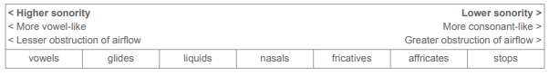
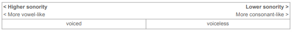
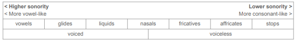

class: center, middle

# Review

---

# Phonology: Phonemes and Allophones

.pull-left[

**Phonology:** study of language sounds as a system

We discussed the **phonemes** and **allophones**:

- A **phoneme** is a family of sounds that are all
treated as the same by speakers.

- Each individual sound within a phoneme is an **allophone**.

- Example: English phoneme /t/ is pronounced with
the allophone [th] in *top* and [t] in *stop*.

- Slightly different sounds, but speakers treat them
as different versions of the same sound: /t/.

]


.pull-right[

```{r, out.height="100%", out.width="100%", echo=FALSE}
knitr::include_graphics("./images/batman.png")
```
]

---

# Phonology: Phonemes and Allophones

.pull-left[

Phonemes occur in **contrastive distribution**:

- Two different phonemes can occur in the same environment, and switching one for the other will cause a change in meaning.

- For example, **minimal pairs**.

Allophones occur in **complementary distribution**:

- Each allophone occurs in its own context,
(just like superheroes).

]

.pull-right[

```{r, out.height="100%", out.width="100%", echo=FALSE}
knitr::include_graphics("./images/batman.png")
```
]

---

# Phonemic analysis

We also learned about **phonemic analysis** – how to
determine whether two sounds are separate phonemes or
allophones of the same phoneme in a language.

Our first step in doing this is to determine the **phonetic
environment** in which each sound occurs.

Phonetic environment involves:

- What sounds come before/after target sound.

- Is target sound at beginning/middle/end of word?

- Is target sound at beginning/middle/end of syllable?

- Is target sound in stressed/unstressed syllable?

---

# Phonemic analysis

.pull-left[
Writing out phonetic environments is fairly simple.

We’ll use the Spanish dataset we saw last lecture to illustrate this.

For each token of target sound in dataset, write [x_y],
where:

- x = sound preceding target sound

- _ = target sound

- y = sound following target sound

- use # to indicate word boundary
]


.pull-right[

| [d] | [ð] |
|:--------|:--------|
| [dar] ‘give’ | [toðo] ‘all’ |
| [desir] ‘say’ | [biða] ‘life’ |
| [dama] ‘lady’ | [koðo] ‘elbow’ |
| [duða] ‘doubt’ | [duða] ‘doubt’ |
| <div style="padding-right:20px;">[deretʃo] ‘right’</div> | [asaðo] ‘roast’ |
| [deðo] ‘finger’ | [deðo] ‘finger |


]

---

# Phonemic analysis

.pull-left[

Take the first row for example. [ð] occurs in [toðo].

- Preceding sound is [o], following sound is [o].

- We write phonetic environment as: [o_o].

[d] occurs in [dar]:

- No preceding sound, beginning of word.

- Following sound is [a].

- We write phonetic environment as [#_a].

]

.pull-right[

| [d] | [ð] |
|:--------|:--------|
| [dar] ‘give’ | [toðo] ‘all’ |
| [desir] ‘say’ | [biða] ‘life’ |
| [dama] ‘lady’ | [koðo] ‘elbow’ |
| [duða] ‘doubt’ | [duða] ‘doubt’ |
| <div style="padding-right:20px;">[deretʃo] ‘right’</div> | [asaðo] ‘roast’ |
| [deðo] ‘finger’ | [deðo] ‘finger |

]

---

# Phonemic analysis 

.pull-left[
Writing out the rest of the environments, we get:

| [d] | [ð] |
|:--------|:--------|
| <div style="padding-right:20px;">[#_a]</div> | [o_o] |
| [#_e] | [i_a] |
| [#_a] | [o_o] |
| [#_u] | [u_a] |
| [#_e] | [a_o] |
| [#_e] | [e_o] |

]

.pull-right[

| [d] | [ð] |
|:--------|:--------|
| [dar] ‘give’ | [toðo] ‘all’ |
| [desir] ‘say’ | [biða] ‘life’ |
| [dama] ‘lady’ | [koðo] ‘elbow’ |
| [duða] ‘doubt’ | [duða] ‘doubt’ |
| <div style="padding-right:20px;">[deretʃo] ‘right’</div> | [asaðo] ‘roast’ |
| [deðo] ‘finger’ | [deðo] ‘finger |

]

---

# Phonemic analysis

.pull-left[
Our next step: determine whether [d] and [ð] are in
contrastive or complementary distribution.

Do they occur in the same or different environments?

- Same → contrastive → separate phonemes

- Different → complementary → allophones

These sounds occur in different environments:
[d] at the start of words, [ð] between two vowels.

- So they’re in complementary distribution

- In Spanish, [d] and [ð] are two allophones of the
same phoneme, /d/
]


.pull-right[

| <div style="padding-right:20px;">[d]</div> | [ð] |
|:--------|:--------|
| [#_a] | [o_o] |
| [#_e] | [i_a] |
| [#_a] | [o_o] |
| <div style="padding-right:20px;">[#_u]</div> | [u_a] |
| [#_e] | [a_o] |
| [#_e] | [e_o] |

]

---

# Simplifying phonetic environments

.pull-left[

We can also rewrite these phonetic environments in a simpler format to help us find patterns.

What do the environments of [d] have in common?

- They’re all word-initial

- We can generalize this as: [#_ ]

What do the environments of [ð] have in common?

- They’re all intervocalic (between two vowels)

- We can generalize this as [V_V]

- (In phonology, V = vowel, C = consonant)
]


.pull-right[

| <div style="padding-right:20px;">[d]</div> | [ð] |
|:--------|:--------|
| [#_a] | [o_o] |
| [#_e] | [i_a] |
| <div style="padding-right:20px;">[#_a]</div> | [o_o] |
| [#_u] | [u_a] |
| [#_e] | [a_o] |
| [#_e] | [e_o] |

]

---

# Phonological rules

.pull-left[

With these simplified environments, we can rewrite our allophonic
pattern as a **phonological rule**.

- <u>Format</u>: *original sound -> changed sound / environment*

/d/ becomes [d] (no change) at beginning of word:

- d -> d / #_

/d/ becomes [ð] between two vowels:

- d -> ð / V_V

]


.pull-right[

| <div style="padding-right:20px;">[d]</span> | [ð] |
|:--------|:--------|
| [#_a] | [o_o] |
| [#_e] | [i_a] |
| <div style="padding-right:20px;">[#_a]</div> | [o_o] |
| [#_u] | [u_a] |
| [#_e] | [a_o] |
| [#_e] | [e_o] |

]

---

class: center, middle

# Phonological rules and processes


---

# Phonological rules and processes

As we write out phonological rules, it’s important to note that they aren’t completely random.

For example, the allophones of a particular phoneme tend to be similar in various ways:

- For Spanish /d/, its allophones [d] and [ð] are both voiced dental sounds

- For English /t/, its allophones [tʰ, t, t̚ , ɾ, ʔ] all share some of the features voiceless, alveolar,
and plosive

So when one sound changes to another in a phonological rule, these changes tend to fit into a few different categories of change – which we call **phonological processes**.

---

# Phonological processes

**Phonological processes**: typical changes that speech sounds undergo

- Phonological processes explain why we find particular allophones in particular contexts.

- They explain **morphological alternations** like *magic > magician*

- They also explain many of the historical **sound changes** by which pronunciation has changed
over time in the world's languages, like *knight* [knixt] > [najt]

--

We're going to be focusing on six important phonological processes in this class, though there are others we won’t have time for:

--

- **Assimilation** and **Dissimilation**

- **Insertion** and **Deletion** (aka Epenthesis and Elision)

- **Strengthening** and **Weakening** (aka Fortition and Lenition)

---

# Assimilation

Recall our discussion of how plural *-s* has multiple pronunciations: [s] in *caps* vs. [z] in *cabs*

Fill in the features for each sound segment in the tables below.

- When [s] changes to [z], what feature changes?

- Does that change make the [z] match more or fewer of the features of the preceding [b]?

.pull-left[

  - *caps* [khæps]

| <div style="padding-right:20px;">Feature</div> | <div style="padding-right:20px;">[p]</div> | <div style="padding-right:20px;">[s]</div> |
|:--------|:--------|:--------|
| Voicing | | | 
| Place | | | 
| Manner | | | 
]

.pull-right[

  - *cabs* [khæbz]

| <div style="padding-right:20px;">Feature</div> | <div style="padding-right:20px;">[b]</div> | <div style="padding-right:20px;">[z]</div> |
|:--------|:--------|:--------|
| Voicing | | | 
| Place | | | 
| Manner | | |

]

---

# Assimilation 

Recall our discussion of how plural *-s* has multiple pronunciations: [s] in *caps* vs. [z] in *cabs*

Fill in the features for each sound segment in the tables below.

- When [s] changes to [z], what feature changes?

- Does that change make the [z] match more or fewer of the features of the preceding [b]?

.pull-left[

  - *caps* [khæps]

| <div style="padding-right:20px;">Feature</div> | <div style="padding-right:20px;">[p]</div> | <div style="padding-right:20px;">[s]</div> |
|:--------|:--------|:--------|
| <div style="padding-right:20px;">Voicing</span> | <div style="padding-right:20px;">voiceless</span> | <div style="padding-right:20px;">voiceless</span> | 
| Place | bilabial | alveolar | 
| Manner | plosive | fricative | 
]

.pull-right[

  - *cabs* [khæbz]

| <div style="padding-right:20px;">Feature</div> | <div style="padding-right:20px;">[b]</div> | <div style="padding-right:20px;">[z]</div> |
|:--------|:--------|:--------|
| <div style="padding-right:20px;">Voicing</span> | voiced | voiced | 
| Place | <div style="padding-right:20px;">bilabial</span> | <div style="padding-right:20px;">alveolar</span> | 
| Manner | plosive | fricative |

]


---

# Assimilation 

Plural *-s* **changes** its **voicing feature** to match that of the preceding consonant.

- In *caps*, it is voiceless to match [p], and in *cabs* it is voiced to match [z].

This type of change is called **assimilation** – when a sound segment changes to become more similar to another nearby sound segment, which we can measure in terms of their features.

- Here, the plural *-s* morpheme undergoes **voicing assimilation**: in other words, it assimilates to the voicing of the preceding consonant [p] or [b]


.pull-left[

  - *caps* [khæps]

| <div style="padding-right:20px;">Feature</div> | <div style="padding-right:20px;">[p]</div> | <div style="padding-right:20px;">[s]</div> |
|:--------|:--------|:--------|
| <div style="padding-right:20px;">Voicing</span> | <div style="padding-right:20px;"><span style="color:green">voiceless</span></div> | <div style="padding-right:20px;"><span style="color:green">voiceless</span></div> | 
| Place | bilabial | alveolar | 
| Manner | plosive | fricative | 
]

.pull-right[

  - *cabs* [khæbz]

| <div style="padding-right:20px;">Feature</div> | <div style="padding-right:20px;">[b]</div> | <div style="padding-right:20px;">[z]</div> |
|:--------|:--------|:--------|
| <div style="padding-right:20px;">Voicing</span> | **voiced** | **voiced** | 
| Place | <div style="padding-right:20px;">bilabial</span> | <div style="padding-right:20px;">alveolar</span> | 
| Manner | plosive | fricative |

]
---

# Dissimilation

The opposite of assimilation is **dissimilation**: when a sound changes to become **less similar** to another consonant. Some well-known examples involve the dissimilation of liquids (*l* and *r* sounds):

- Latin *pe<span style="color:green">r</span>eg<span style="color:red">r</span>inu* > Eng. *pi<span style="color:green">l</span>g<span style="color:red">r</span>im* (compare *pe<span style="color:green">r</span>eg<span style="color:red">r</span>ine falcon, San Pe<span style="color:green">ll</span>eg<span style="color:red">r</span>ino*)

--

  - The first *r* **dissimilates** to an *l* to become less like the second *r*.

- Old Italian *co<span style="color:green">l</span>one<span style="color:red">ll</span>o* > Middle French *co<span style="color:green">r</span>onne<span style="color:red">l</span* > Modern English *co<span style="color:green">l</span>one<span style="color:red">l</span>* [kɜ<span style="color:green">r</span>nə<span style="color:red">l</span>]

  - In Modern English, we pronounce it *with* dissimilation and spell it *without* dissimilation.

  - Compare Modern French *co<span style="color:green">l</span>one<span style="color:red">l</span>*, 
  Spanish *co<span style="color:green">r</span>one<span style="color:red">l</span>*, both pronounced as spelled.

--

In Modern English, we often delete *r* in words with *r* repetition for purposes of dissimilation:

- *su(r)prise, pa(r)ticular, gove(r)nor, be(r)serk, Feb(r)uary, inf(r)astructure*

---

# Insertion

How would you pronounce these words in English? As written, or do you add a vowel somewhere?

.pull-left[
- *Gdansk*

- *Tbilisi*

- *Ksenia*
]

.pull-right[

(a city in Poland)

(capital of the republic of Georgia)

(a Slavic first name) 
]

--

**Insertion** or **epenthesis** is when a sound segment is **added** to a word

---

# Insertion

This often happens in loanwords that have sound combinations that violate the phonology of
the target language:

- *Gdansk, Tbilisi, Ksenia* all start with consonant clusters not allowed in English, so
English speakers adapt them by **inserting** a schwa vowel [ə] to break them up:

  - G[ə]dansk, T[ə]bilisi, K[ə]senia

--

- English allows word-initial consonant clusters like *str*- that are not allowed in some
languages. These languages can **insert** vowels to break up such clusters in loanwords:

  - English *stress* > Spanish <b><u>e</b></u>*s.trés*

  - English *stress* > Japanese s<b><u>u</b></u>.*t*<b><u>o</b</u>.*re.su*

---

# Insertion 

In examples like *estrés* 'stress', insertion happened to fit the language's **syllable structure**. Another reason insertion can happen is due to **coarticulation** – overlap between sound segments.

--

If you say [mʃ], but keep your lips closed a little too long, the [m]-[ʃ] overlap sounds like [p], which combines features of both:

- [p] is <span style="color:blue">voiceless</span> like [ʃ]

- [p] is <span style="color:green">bilabial</span> like [m]

- [p] is a <span style="color:red">plosive</span> – oral closure from the nasal + raised velum from the fricative 


.pull-left[

  - *I'm sure* 

| Feature | [m] | [ʃ] |
|:--------|:--------|:--------|
| <div style="padding-right:20px;">Voicing</div> | voiced | voiceless |
| Place | <div style="padding-right:20px;">bilabial</div> | <div style="padding-right:20px;">postalveolar</div> |
| Manner | nasal | fricative |
]


.pull-right[
  - *I'm*[p]*sure* 

| <div style="padding-right:20px;">Feature</div> | [m] | [p] | [ʃ] |
|:--------|:--------|:--------|
| Voicing | voiced | <div style="padding-right:20px;"><span style="color:blue">voiceless</span></div> | <div style="padding-right:20px;"><span style="color:blue">voiceless</span></div> |
| Place | <div style="padding-right:20px;"><span style="color:green">bilabial</span></div> | <span style="color:green">bilabial</span> | postalveolar |
| Manner | nasal | <span style="color:red">plosive</span> | fricative |
]

---

# Insertion

Similar coarticulatory effects can occur in words like *sen*[t]*se*, *prin*[t]*ce*

If the overlapping sound is interpreted as a new segment, we have **insertion**.

--

English words *tender* and *ensemble* show this type of insertion in their histories:

- Latin *te<span style="color:blue">n</span>e<span style="color:red">r</span>u > te<span style="color:blue">n</span><span style="color:red">r</span>u* > French *te<span style="color:blue">n</span><span style="color:green">d</span><span style="color:red">r</span>e* > English *te<span style="color:blue">n</span><span style="color:green">d</span>e<span style="color:red">r</span>*

- Latin in *se<span style="color:blue">m</span>e<span style="color:red">l</span>* 'together' > *inse<span style="color:blue">m</span><span style="color:red">l</span>e* > French *ense<span style="color:blue">m</span><span style="color:green">b</span><span style="color:red">l</span>e* > English *ense<span style="color:blue">m</span><span style="color:green">b</span><span style="color:red">l</span>e*

So insertion is the addition of a sound segment to a word, which can occur for various reasons.

---

# Deletion

How do you pronounce *and* in these phrases? Do you pronounce all the letters?

- *rock and roll*

- *Barnes and Noble*

- *Fast and Furious*

--

The opposite of insertion is **deletion** or **elision**: when a sound is removed from a word.

- rock [n] roll

- English "silent letters" are often historical instances where a sound was deleted but they never
updated the spelling: *house, knee, write, right, knight*

- Sometimes we adapt loanwords with complex sound sequences through deletion:
*(p)sychology, (m)nemonic, (p)neumatic, xylophone* (Greek [ks] -> English [z])

---

# Strengthening and Weakening

Strengthening and weakening are processes by which sound segments get "stronger" or "weaker".

“Stronger” and “weaker” can be vague terms, so one way to think about this is in terms of **sonority**.

What is the difference between vowels and consonants?

- Vowels = no obstruction of airflow Consonants = obstruction of airflow

- Vowels = voiced Consonants = voiced or voiceless

Based on this, what is the most "un-vowel-like" of the following sounds: [n], [l], [w], [s], [t]

- Most "un-vowel-like" = greatest obstruction + voiceless

  - [t] = air completely blocked (stop) + voiceless, most "un-vowel-like"

---

# Strengthening and Weakening

Using this logic, we can arrange speech sounds on a scale from **most vowel-like** (most sonority) to **least vowel-like** (least sonority). We call this the **sonority scale** or **sonority hierarchy**:

```{r, out.height="100%", out.width="100%", echo=FALSE}

```

Voiced sounds are also considered **higher sonority** than voiceless sounds

```{r, out.height="100%", out.width="100%", echo=FALSE}

```

---

# Strengthening and weakening 

```{r, out.height="100%", out.width="100%", echo=FALSE}

```


If a consonant changes to **decrease in sonority**, it is called **strengthening** or **fortition**, because
the consonant is becoming more consonant-like:

- *th*-stopping in some American English varieties: *with* [wɪt], *them* [dɛm] (fricative → stop)

If a consonant changes to **increase in sonority**, it is called **weakening** or **lenition**, because the
consonant is becoming less consonant-like:

- /t/ → [ɾ] in *butter, better, water* (/t/ becomes voiced and is no longer a stop)

For vowels, opposite is true: more sonority = vowel strengthening, less sonority = vowel weakening

---

class: center, middle

# Practice

---

# Practice: strengthening and weakening 

```{r, out.height="100%", out.width="100%", echo=FALSE}

```

.pull-left[
Spanish /d/ is pronounced with allophone [ð]
after a vowel:

1. *<b>d</b>os* [<b>d</b>os] 'two'

2. mita<b>d</b> [mita<b>ð</b>] 'half'

3. asa<b>d</b>o [asa<b>ð</b>o] 'roast'

Is /d/ → [ð] an example of strengthening or
weakening?

]

.pull-right[
German /d/ is pronounced with allophone [t] at
the end of a word:

1. *<b>d</b>er* [<b>d</b>ɛɐ̯ ] 'the'

2. *Ba<b>d</b>* [baː<b>t</b>] 'bath'

3. *Wal<b>d</b>* [val<b>t</b>] 'forest'

Is /d/ → [t] an example of strengthening or
weakening?


]

---

# Practice: strengthening and weakening

```{r, out.height="100%", out.width="100%", echo=FALSE}

```

.pull-left[
Spanish /d/ is pronounced with allophone [ð]
after a vowel:

1. *<b>d</b>os* [<b>d</b>os] 'two'

2. mita<b>d</b> [mita<b>ð</b>] 'half'

3. asa<b>d</b>o [asa<b>ð</b>o] 'roast'

Is /d/ → [ð] an example of strengthening or
weakening?

**Weakening: [d] = stop, [ð] = fricative**

**stop → fricative = increase in sonority = weaker**


]

.pull-right[
German /d/ is pronounced with allophone [t] at
the end of a word:

1. *<b>d</b>er* [<b>d</b>ɛɐ̯ ] 'the'

2. *Ba<b>d</b>* [baː<b>t</b>] 'bath'

3. *Wal<b>d</b>* [val<b>t</b>] 'forest'

Is /d/ → [t] an example of strengthening or
weakening?

**Strengthening: [d] = voiced, [t] = voiceless**

**voiced → voiceless = decrease in sonority = stronger**
]


---

class: center, middle

# Phonological processes and sound change

---

# Phonological processes and allophones

We've seen six phonological processes: **assimilation/dissimilation, insertion/deletion, weakening/strengthening**

These processes can explain why we use particular **allophones** for a given **phoneme**:

- When we aspirate /t/ → [tʰ] as in *top*, it's **strengthening**.

- When flap /t/ → [ɾ] as in *water*, it's **weakening**.

- When we delete /t/ → Ø as in *center*, it's **deletion**.

- All of these allophones are the result of the application of some phonological process.

---

# Phonological processes and sound change

Phonological processes also explain **sound change**.

- Languages are **constantly changing** on all linguistic levels: morphology, syntax, semantics,
pragmatics, and also phonetics/phonology.

- **Sound change** involves processes like the ones we've seen, and over time, words can exhibit
multiple different changes over time:

.pull-left[
  - Latin 'man, person'
  
  - Deletion of [h]
  
  - Deletion of [m]
  
  - Deletion of [h]
  
  - Dissimilation of [mn] -> [mr]
  
  - Insertion of [b] 
  
  - Spanish 'man' (*h* is silent)
]

.pull-right[

*hominem*

[ominem]

[omine]

[omne]

[omre]

[ombre]

*hombre* 

]

---

class: center, middle

# Wrap-up

---

# Summary

**Phonological processes** are sound changes that follow some systematic pattern. These include
(but are not limited to):

- Assimilation and dissimilation

- Insertion and deletion (epenthesis and elision)

- Strengthening and weakening (fortition and lenition)

Phonological processes often explain why we see particular allophones in particular contexts

They also explain many sound changes that have taken place over the history of languages


---

# Coming up!

***????***


