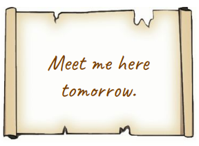
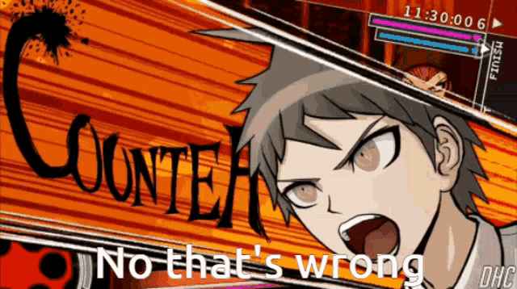

# Mysterious note...

- Imagine you're walking down the street and you find this note.

- What information does this note provide?

- What information is missing that you would need to know to fully understand the note?


```{r, out.height="50%", out.width="50%", echo=FALSE}

```

---

# Mysterious note

.pull-left[
Missing information:

- **Who is "me"?** Who is writing?

- **Who is the implied "you"?** Who are they writing to?

- **Where is "here"?** Where are they when they're writing?

- **When is "tomorrow"?**

  - That is, when are they writing and when's the day after that?
]


.pull-right[
```{r, out.height="100%", out.width="100%", echo=FALSE}

```
]

---

# Pragmatics

When we speak, we don't do so in a vacuum.

--

We speak in a particular **context**:

--

- In a particular *time*

- In a particular *place*

- In a particular *situation*

--

- With particular people that we have a particular relationship with (or don't)

- Within an ongoing conversation (discourse)

--

**Pragmatics** is the study of **language in context**.

- It studies how context affects the meaning and usage of language.

--

In Pragmatics, we typically talk about **utterances** rather than sentences:

--

- A **sentence** is language used in a vacuum *without reference to context* – the examples of language we've been studying so far this semester

--

- An **utterance** is language spoken *in a particular context*, which informs its meaning – which will be important to keep in mind as we study Pragmatics

---

# Pragmatics vs. Semantics

Because context affects meaning, Pragmatics – like Semantics – studies meaning.

But Pragmatics and Semantics study different aspects of meaning.

--

Recall our example conversation from the other week:

- <u>Person A</u>: Do you want to go out tonight?

- <u>Person B</u>: I have an exam in the morning.

--

What is person B *literally* saying?

What is person B *implying* that they haven't literally said?


---

# Pragmatics vs. Semantics

Semantics and Pragmatics both study meaning, but:

--

- Semantics studies literal meaning in language

--

  - Meanings that can be defined with truth values

  - Meanings that can be calculated with set theory expressions

  - Literal meaning: *Person B has an exam*

--

- **Pragmatics** studies **implied meaning** in language:

--

  - Meanings that rely on **context** for interpretation

  - Implied meaning: *Person B can't or doesn't want to go out*


---

# Pragmatics: Speech Acts

Pragmatics studies many aspects of language in context

--

For example, **speech acts**:

- Most language communicates an idea, asks a question, gives a command...

--

- A speech act is language that **does something** – where you take an action simply by saying something

.pull-left[
<u>Examples</u>:

- Umpire: *Yer out!*

- Officiant: *I now pronounce you married.*

- Game show host: *You are the weakest link!*

]

.pull-right[
```{r, out.height="100%", out.width="100%", echo=FALSE}

```
]

---

class: center, middle

# Politeness strategies


---

# Pragmatics: politeness

Another aspect of language in context that Pragmatics studies is **politeness strategies.**

--

Different languages have different politeness strategies

--

- Spanish has two words for 'you': familiar *tú* and polite *usted*

  - Part of knowing Spanish is knowing when to use which pronoun

  - But this also varies by country: *tú* is more common in Spain, *usted* in Costa Rica

--

- East Asian languages often change which **honorifics**, *lexical items*, and even *verb morphology* are used depending on the social relationship between speaker and listener

--

  - A Japanese person named *Kentaro Tanaka* might be called *Ken-chan, Tanaka-san, Tanaka-sama, Tanaka-sensei,* etc. depending on his relationship to the speaker
  
---

# Pragmatics: politeness

- Some South Asian languages use an honorific **suffix**

  - in Telugu, for example, there's a traditional honorific suffix -*garu* that comes after a person's name

--

- Some African languages may use a separate honorific **word** to refer to respected people

  - in Swahili, for example, younger speakers may refer to an elder as *mzee*, employers and other authority figures as *mukubwa*

--

- Some Polynesian languages may use a **kinship word** to refer to respected people in the community

  - in Cook Islands Māori, * mama* is used for both "grandmother" and other respected older women in the culture

--

- Politeness in English is not as obvious, but you still don't say *'Sup!* to your professors

--

  - But, in Arkansas (and probably other southern rural areas) they still enforce children calling their teachers and other adults *sir* and *ma'am* because its more respectful


---

class: center, middle

# Implied meaning


---

# Pragmatics: Implied meaning

So Pragmatics studies **language in context**, and there are many aspects of this study:

- Implied meaning, speech acts, politeness strategies...

--

In this class, we're going to focus on **implied meaning** in Pragmatics

--

We'll discuss two different types of implied meaning:

- Today: **Presuppositions**

  - Background information that is taken for granted when saying an utterance

--

- Friday: **Conversational implicatures**

  - Implied meaning that arises when speakers follow (or ignore) the common rules of conversation

---

class: center, middle

# Presuppositions

---

# The King of England

Let’s talk about presuppositions.

When we say a declarative sentence, we're typically stating some proposition (making some **claim**):

- *The King of England had lunch.*

--

This sentence:

- Mentions a person (the **topic**): *the King of England*

- Mentions an action (the **comment**): *had lunch*

--

- States a proposition involving the person and the action: 

  - [[King of England]] ∈ [[had lunch]]

---

# The King of New Jersey

How about this sentence? What claim is it asserting?

- *The King of New Jersey had lunch.*

--

This sentence:

- Still mentions a person: *King of New Jersey*

- Still mentions an action: *had lunch*

--

- Still states a proposition involving the person and the action: 

  - [[King of NJ]] ∈ [[had lunch]]

--

- But the sentence isn't quite right:

  - There is no person known as *King of New Jersey*

  - How can you make sense of the proposition if it involves someone who doesn't exist?

---

# Presuppositions

These sentences introduce a concept called **presupposition**.

a. *The King of England had lunch.* 

b. *The King of New Jersey had lunch.*

--

In order to make sense of them, we have to **assume** the person they refer to **exists**

--

That is:

- *The King of England had lunch* **presupposes** that someone exists called *King of England* – not a problem since we know that to be true

--

- *The King of NJ had lunch* **presupposes** that someone exists called *King of NJ* – this a problem since we know that to be false, and it's what makes this sentence odd

---

# Presuppositions 

.pull-left[
A **presupposition** is information that must be **assumed** in order to make sense of an **utterance**.

- To understand the utterance *Clefable is a cat*, we have to assume that someone/something named *Clefable* exists.

- That is, *Clefable is a cat* presupposes the existence of *Clefable*

- And we can't make sense of that utterance without making that assumption

]

.pull-right[

```{r, out.height="80%", out.width="80%", echo=FALSE}

```
]

---

# Presuppositions (do not = entailment)

Presuppositions are *similar* to **entailments**

--

- Entailments are propositions that must be true in order for some other proposition to be true

--

.pull-left[

But they're not the same, because entailments rely on **truth values**, and presuppositions are about making sense of an utterance.

- (a) *Apollo is a husky* entails (b) *Apollo is a dog*.

  - (b) must be true in order for (a) to be true.

Notice that if I **negate** that sentence: 

- *Apollo is not a husky*

  - It no longer entails *Apollo is a dog* – truth values have changed.

  - But, it still presupposes *Apollo exists* – presuppositions don't rely on truth values.
]

.pull-right[

```{r, out.height="50%", out.width="50%", echo=FALSE}

```
]


---

# Presuppositions

.pull-left[

What if I said *Apollo is a husky* and you said *That's wrong!*

What are you denying?

- That Apollo is a husky?

- That Apollo exists?

]

.pull-right[
```{r, out.height="60%", out.width="60%", echo=FALSE}

```
]

--

When you refute a utterance, you're challenging its explicit **truth values**.

--

But presuppositions are part of an utterance's implied meaning, so you can't refute them by simply contradicting the utterance.

--

To refute the presupposition, you'd have to directly challenge it:

- *Actually, there is no one named Apollo.*

---

class: center, middle

# Family of sentences

## Presupposition tests


---

# Family of sentences

Because **presuppositions hold under negation and questioning**, this gives us a way to test whether a given idea is a presupposition or part of a sentence's truth value.

--

If we take a declarative sentence and **negate** or **question** it (the *family of sentences*):

--

- Any presuppositions will hold up – we still have to assume them to make sense

- Any propositions (ideas that are part of the sentence's truth value) will not

| Sentence | example | <div style="padding-right:10px;">Proposition: *he had lunch*</div> | <div style="padding-right: 10px;">Presupposition: *king of NJ exists*</div>
|:----------|:--------|:--------|:--------|
| <div style="padding-right: 10px;">Declarative</div> | *The King of NJ ate lunch* | asserted | assumed |
| Negation | <div style="padding-right: 10px;">*The King of NJ didn't eat lunch*</div> | denied | assumed | 
| Question | *Did the King of NJ eat lunch?* | questioned | assumed |

---

class: center, middle

# Common ground

---

# Common ground

Presuppositions interact with a pragmatic concept known as the **common ground**.

--

**Common ground**: information shared by all participants in a conversation. 

--

<u>Includes</u>:

- Basic info about the current situation – who is talking, where are we, when is it, what's around us, what's happening around us?

--

- Information being discussed in the conversation.

--

- Previous experience shared by participants. *Speaker B: Last night was fun!*

--

- General information about the world. *England has a king.*

--

- Essentially, all the information *I know and you know and I know that you know* as participants in a conversation.


---

# Common ground

We are constantly **updating the common ground** with new information as we talk. Imagine someone tells you a story – as they tell the story, each thing they tell you is added to the common ground.


| <u>Conversation</u> | <u>Common ground</u>
|:----------|:--------|
| "I have a friend named Ben." | Ben |
| "Ben has a dog." | Ben, Ben's dog |
| "Last night Ben ordered a pizza." | Ben, Ben's dog, pizza | 
| "Ben went into the kitchen to get a drink" | Ben, Ben's dog, pizza, Ben went to kitchen |
| <div style="padding-right: 30px;">"When he came back, his dog had eaten the whole pizza!"</div> | *Utterance makes sense because it relies on all of the info in the common ground.* |

---

# Common ground 

Once information is in the common ground, we can refer back to it.

--

But if we try to reference new information as if it's in the common ground, we will probably confuse
other participants in the conversation.

--

Imagine the first speaker just started the conversation with this by saying

- *"When he came back, his dog had eaten the whole pizza!*

- **Wait, what?**

---

# Presuppositions and the common ground

So what presuppositions do is not just **assume** information –
they **assume that information is in the common ground**.

--

If I say:

- *The king of England took a nap.*

- This presupposes that the King of England exists and that both speaker and listener are aware
he exists – which is true, so we can accept the sentence as meaningful.

--

But if I say:

- *The king of New Jersey took a nap.*

- This presupposes that the King of New Jersey exists and that both speaker and listener are aware he exists – which is not true, so we cannot accept the sentence as meaningful.

---

# Presupposition triggers

Certain expressions trigger presuppositions: definite expressions, iteratives, change-of-state verbs, factive verbs, clefts

Definite expressions are expressions that presuppose that something exists and is in our common ground (they raise existence presuppositions). This includes:

| Expression | Example sentence | Presupposition |
|:----------|:--------|:--------|
| Definite article: *the* | <div style="padding-right: 10px;">*I saw a cat*. **The cat** *was fuzzy*.</div> | a unique cat exists | 
| <div style="padding-right: 10px;">Definite pronouns: I, you, we, he, she, they, it</div> | **He** *is a good student*. | a unique masculine person exists | 
| Demonstratives: *this, that* | *Pass me* **that bottle**. | a unique bottle exists |
| Possessives: *my, our, their, Jane's* | **Jane's dog** *is friendly*. | Jane has a dog | 
| Proper nouns: *Peter, Jane, Snoopy* | **Peter** *called yesterday*. | a unique person named Peter exists |

---

# Presupposition triggers 

**Iterative expressions** presuppose the repetition of some action or state

  *(again, too, either, return, come back, restore, more, less)*

| Example | Presupposition |
|:--------|:--------| 
| <div style="padding-right: 10px;">Sally baked a cake **again**</div> | Sally has previously baked a cake |
| John **returned** | John was previously there. |
| I want **more** cake | I previously had some cake | 
| Sam **restored** the watch | The watch was previously in good repair |

--

**Change-of-state verbs** presuppose that an action was ongoing (or not ongoing) prior to the moment in question (stop, start, begin, continue, keep)


| Example | Presupposition |
|:--------|:--------| 
| <div style="padding-right: 20px;">Sally **stopped** baking</div> | Sally was previously baking |
| I **started** singing | I was not previously singing |
| Peter **kept** working | Peter was previously working |

---

# Presupposition triggers

**Factive verbs** are verbs that refer to someone's knowledge of or opinion about some fact

  *(know, realize, regret, be aware of, be glad that, be sorry that)*

--

- They introduce a <span style="color:green">dependent clause</span> containing the information the subject knows or has an
opinion about. This information is <span style="color:green">presupposed</span>, since you can't know something if it's false.

| Sample sentence | <div style="padding-right: 10px;">Presupposition (Dependent clause)</div> | Proposition | 
|:--------|:--------|:--------|
| I **know that** <span style="color:green">you studied.</span> | you studied | I know it. |
| <div style="padding-right: 30px;">Sally **is happy** <span style="color:green">that she bought a book</span></div> | Sally bought a book | Sally is happy about it |
| Linda **regrets** <span style="color:green">sending that letter</span> | Linda sent that letter | Linda regrets it |
| Yun **realized** <span style="color:green">that it was late</span> | It was late | Yun realized it |

--

- We can test this with the **family of sentences**: *Linda doesn't regret sending the letter, Does Linda regret sending the letter?* – in both cases, we still assume *she sent the letter*.
The claim being refuted and questioned is what's in the main clause: *Linda regrets it.*

---

# Presupposition triggers

<b>Clefts</b> are complex sentences that are formed by taking a simple sentence and putting part of it into a <span style="color:green">dependent clause</span>: 

- *X Y'ed ➔ It was X that Y'ed. What Y'ed was X. X was who Y'ed.*

--

- In these sentences too, the **main clause** indicates the sentence's **claim**, and the information that has been moved to the <span style="color:green">dependent clause</span> is now <span style="color:green">presupposed</span>.

--

| Simple sentence | Cleft sentence | Presupposition | Proposition (main clause) |
|:--------|:--------|:--------|:--------|
| John ate the pie | **It was John** <span style="color:green">that ate the pie</span>. | Someone ate the pie | That person was John | 
| <div style="padding-right: 10px;">Sally bought a souvenir</div> | <div style="padding-right: 10px;"><span style="color:green">What Sally bought</span> **was a souvenir**.</div> | <div style="padding-right: 10px;">Sally bought something</div> | That thing was a souvenir | 
| I saw Alice | **Alice was** <span style="color:green">who I saw</span>. | I saw someone | That person was Alice | 

--

- Again, we can test this with the **family of sentences**: *What Sally bought wasn't a souvenir, Is what Sally bought a souvenir* – in both cases, we still assume *Sally bought something*.
The claim being refuted and questioned is what's in the main clause: *It was a souvenir.*

---

class: center, middle

# Practice 

---

# Practice

For each sentence: 

- Identify any **definite expressions** and state the existence presuppositions they raise

- Identify any **other presupposition triggers** (iterative, change of state, factice, cleft) and state the presuppositions they raise. A sentence may contain multiple triggers and presuppositions.

--

1. I took my dog for a walk again.

2. It was Keng that ate the leftover pizza.

3. Jake learned that Mia had returned.

4. Eli wants more popcorn.

5. The elephant will continue to be endangered until we stop destroying its natural habitat.


---

class: center, middle

# Accommodation and failure

---

# Presupposition accommodation and failure 

We have seen that presuppositions **assume that something is in the common ground**:

- *The King of England took a nap.*

- Presupposes *England has a King*, it's in our common ground, makes sense ✓

--

But what if a presupposition assumes something that **isn't** actually in our common ground?

- *The King of New Jersey took a nap.*

- Presupposes *New Jersey has a King*, which is not in our common ground, so now what do we do???

--

We have two options:

- **Presupposition Accommodation**

- **Presupposition Failure**

---

# Presupposition accommodation

**Accommodating a presupposition**: assuming that a presupposition is true (or at least pretending it's true) in order to make sense out of the utterance.

- *My sister is going to international school.*

- This presupposes: *I have a sister.*

--

- If that's not in the common ground, you can **accommodate** it and assume I do have a sister, which is reasonable since it's not unusual and doesn't conflict with your knowledge of the world.

--

- Note that when you accommodate a presupposition, you're allowing it to be added to the common ground:

--

  - Now I can say *I'm going to visit her for Spring Break* and you know who I'm talking about, because you've allowed *my sister* to be added to the common ground.

---

# Presupposition failure

But sometimes a presupposition is harder to accommodate. Suppose I said:

- *The elephant in our classroom is going to give a presentation about event semantics.*

--

- This presupposes: *There is an elephant in our classroom.*

--

- This is a lot harder to accommodate, since we know it's not true. If we can't accommodate it, it leads to **presupposition failure**, and the result is the **utterance doesn't make sense**.

--

- It's not that the sentence is **true or false**, it's just **nonsensical** – a sentence's truth value is based on its claim, and the claim here is *someone is going to give a presentation.*

--

- If I say *you're lying* or *that's false*, I'm denying the claim, not the presupposition. 

  - I'd have to say something like *There's no elephant in the classroom* to deny the presupposition.

---

# Presuppositions and misleading language

Because presupposition failure leads to a breakdown in communication, **we have a tendency to accommodate to presuppositions**, and some types of language take can take advantage of that to get people to accept propositions they would normally not want to accept.

--

A common example is in courtroom dramas. Suppose a lawyer asks a defendant:

- *Have you stopped embezzling money? Yes or no?*

What is the lawyer presupposing? Can the defendant answer without looking guilty? Why or why not?

---

# Presuppositions and misleading language 

.pull-left[

Clickbait headlines, advertisements, and other persuasive
language sometimes uses presuppositions to influence
people:

*What local dad found will surprise you!*

- Proposition: *X will surprise you*

- Presuppositions: *local dad is a real person, local dad found something (worth knowing about)*

The author's goal here is to get the reader to accept the presupposition by accommodating it without questioning it directly.

**In each clickbait headline to the right, identify at least one
presupposition and its trigger.**

]

--

.pull-right[

- Why You Should Create a Vision Board for 2024

- Why You Should Ditch the ‘Diet’ and Go Keto Instead

- You Won’t Believe This Dog’s Dance Moves!

- Did You Know HOW Healthy Mushrooms Are for Your Brain?

- This is How Designers Can Make More Money With Fewer Clients

- This Is Why Business Owners are Investing in Bitcoin

]

---

# Summary 

**Pragmatics** – the study of how context contributes to the meaning of language:

- **implied meaning** vs. literal meaning

Sentences vs. **Utterances**

**Presuppositions** – information that is assumed to be in the common ground in order to make sense out of an utterance

**Common ground**

**Presupposition accommodation** vs. **failure**


---

# Coming Up! **Pragmatics:** implicatures

### Readings

- Read *Griffin & Cummins, Ch. 8*

### Homework

- HW5 is due March 29

### Reminders

- I will be available for questions over email during the break


