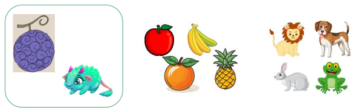

# So far...

We've focused on the form and structure of language

--

- **Morphology:** study of structures of words

  - morphemes, morphological processes, morphological trees

--

- **Syntax:** study of structures of sentences

  - parts of speech, constituents, phase structure rules, syntax trees

--

But, language isn't just structure – **language has meaning** – and we've mentioned meaning on several occasions:

--

.pull-left[

**Morphology**

- Morphemes are the smallest linguistic unit with *meaning*

- Derivation changes a word's core *meaning*

- Order of affixation reflects a word's *meaning*
]

--

.pull-right[

**Syntax**

- Parts of speech can be defined based on their *meaning*

- Ambiguous sentences like "The girl saw the bear with the telescope" show us that syntactic structures contribute to the *meaning* of sentences

]

---

# Meaning in language

In this and the next unit, we're going to focus on meaning more specifically.

--

We can differentiate three types of linguistic meaning:

- **Literal meaning** (Semantics)

- **Implied meaning** (Pragmatics)

- **Social meaning** (Sociolinguistics, Linguistic Anthropology)

---

# Literal and implied meaning 

As a system for **communicating ideas**, language must have meaning.

But, meaning in language often goes *beyond the literal* meaning.

--

- Imagine the following conversation:
  
  - <u>Person A</u>: Do you want to go out tonight?

  - <u>Person B</u>: I have an exam in the morning.

--

**[Q1.]** What has B literally said?

**[Q2.]** What has B implied that they have not said explicitly?

--

As in this example, much of what we say has different levels of **literal** and **implied** meaning.


---

# Social meaning 

Language also has **social meaning**, since it's a tool for **social interaction**:

- We use small talk to establish and reinforce social bonds with others.

--

- The way we speak can indicate our attitude toward others (friendliness, solidarity, irritation...)

--

- We can actively **choose** to speak a particular way to convey a particular social identity:

  - You can say "good morning" to a professor and "'sup" to a friend, but what about the other way around?

--

- We often unconsciously accommodate to the speech of people we like, adopting phrases and speech patterns from them without even noticing it.

  - Have you noticed your speech changing since you came to college?

---

# Social meaning

.pull-left[

Language varies by region, community, and other social factors.

So the way we speak often conveys information like where we're from, our age, gender, etc.

We often strongly identify with the language and dialect we grew up speaking.

And we can actively use language to signal our membership in certain communities.

Consider these signs. Would it make sense if the
Brooklyn sign said *Y'all come back now*?
]

.pull-right[

```{r, out.height="60%", out.width="60%", echo=FALSE}


```

]

---

# Meaning in language

So language has meaning on several **different levels**, and each of these levels is studied in a different branch of linguistics.

- **Semantics** studies literal meaning in language (which we'll study this unit)

- **Pragmatics** studies implied meaning in language (which we'll study next unit)

- **Social meaning** is studied in Sociolinguistics and Linguistic Anthropology (which unfortunately we won't have time to cover this semester, but consider taking a class!)

---

class: middle, center

# **Semantics!**

---

# Semantics

In this unit, we'll focus on **Semantics – the literal meaning of language**

--

We can identify two levels of semantics: **lexical semantics** and **compositional semantics**

--

- **Lexical semantics** – the meaning of words

  - <span style="color:blue">Lexicon</span> refers to a speaker's *mental vocabulary;* <span style="color:blue">words</span> are known as <span style="color:blue">lexical items</span>, but lexical items can also include common multi-word expressions

--

- **Compositional semantics** – the meaning of sentences

  - Recall that "A girl saw a bear with a telescope" has two different meanings, and these meanings depend on syntax.

--

**Meaning of words + Meaning of structure = Meaning of a sentence**

---

# Lexical meaning

**Lexical semantics** studies the meaning of words. Lexical meaning is *conventional* and *arbitrary.*

--

Lexical meaning is **conventional**

- Words mean what they mean *because* we agree as a speech community that that's what they mean

  - Words are defined by social convention

--

  - Consider words with slang meanings like *fire* 'amazing, excellent'...

--

  - How did *fire* come to mean 'great'? Someone starting using it with that meaning, and it caught on – the rest of the community agreed it can be used that way, too.
  
  - Me and my brother use *fire emoji* like this now. 

--

- Same thing with technological terms like *mouse, screen, tablet, computer*

  - All of these words originally had other meanings, but when we invented new technology and needed a name for it, we agreed these words can have new meanings.

---

# Lexical meaning

Lexical meaning is **arbitrary**

- There is no inherent connection between the sound of a word and its meaning

--

We know this because:

- Same sounds can have different meanings in different languages

  - Spanish *taco* 'taco' vs. Japanese *tako* 'octopus'

--

- Same meaning can be conveyed with different sounds in different languages 
  - English *dog* vs. Spanish *perro*

--

- Meaning and sound of words can change over time

  - *nice* 'foolish' > 'kind', *knight* [knixt] > [najt]

--

Main exception: **onomatopoeia** – words that mimic sounds

- But even onomatopoeia can be a bit arbitrary

  - animal sounds in different languages are a good example of this
  
  - *cockadoodledoo, cocorico, quiquiriquí, kokekokko*... 
  
  - **Any others???**

---

class: center, middle

# Sense and reference


---

# Sense and reference

So we know that words have meaning: **lexical semantics**

And we know that lexical meaning is <span style="color:green">conventional</span> and <span style="color:green">arbitrary</span>

But how do we specify what a word means?

--

Think of the words *fruit* and *animal*

--

- What image comes to mind when you think of a fruit or an animal?

- How might you try to define these words?

**[Q.]** Do these represent animals or fruit? How do you know?

```{r, out.height="75%", out.width="75%", echo=FALSE}
knitr::include_graphics("./images/fruit-animals.png")
```

---

# Sense and reference 

### **[Q.]** What about these? Animals or fruit? How do you know?

```{r, out.height="100%", out.width="100%", echo=FALSE}

```

---

# Sense and reference

There are two ways of thinking about a word's meaning: **sense** and reference

--

The **sense** of a word is the mental concept of a word's meaning

- A description of this mental concept: dictionary definition

For example, the sense of *fruit* might be "a seed-bearing structure in flowering plants"

--

The **reference** of a word is the set of things in the world that the word refers to

- Each thing the word refers to is a <span style="color:green">referent</span> of the word

--

The reference of the word *fruit* would include:

- The apple I had for breakfast

- The bananas they have at Cafe West

- The oranges they sell at Aldi

---

# Sense and reference

Defining words by **reference** helps us understand how we can categorize new items we come across

- We do this by comparing them to the <span style="color:green">referents</span> we already know

--

It's also more in line with how we learn words as humans!

--

- We don't learn what an *animal* is by learning that it's a "multicellular eukaryotic organism [in] Animalia" 

--

- We learn what an *animal* is by learning that a *puppy* is an *animal* and a *kitten* is an animal and a *froggy* is an animal…

- We learn what a *fruit* is by observing what our caregivers call *fruit*

---

# Referential meaning 

In this class, we'll define words by their **reference**

- The set of things in the world (referents) that the word refers to

--

Once we define a word as a <span style="color:green">set</span> or <span style="color:green">collection</span> of things, we can also compare the sets of things that different words refer to.

- Some words refer to entirely different sets of things, but for other words, there is overlap between their set of referents.

**[Q.]** Consider these words. Does their reference overlap in any way:

- *animal* vs. *dog*

- *dog* vs. *canine*

- *dog* vs. *poodle*

---

class: center, middle

# Semantic relations

---

# Synonyms

**Synonyms** are words that have the same reference.

- That is, they refer to the same set of things in the world.

- [[drinks]] = [[beverages]]


```{r, out.height="40%", out.width="40%", echo=FALSE}

```

---

# Hyponyms and hypernyms

A **hyponym** is a word whose reference is a <span style="color:green">subset</span> of another word's reference

- *dog* is a <u>hyponym</u> of *animal*

A **hypernym** is a word whose reference is a
<span style="color:green">superset</span> of another word's reference

- *animal* is a <u>hypernym</u> of *dog*

.pull-left[
**[Q.]** Can you think of any other word pairs with a hypernym/hyponym relationship?
]

.pull-right[
```{r, out.height="85%", out.width="85%", echo=FALSE}
knitr::include_graphics("./images/hyponyms.png")
```
]


---

# Antonyms 

**Antonyms** are words that have <span style="color:green">opposite</span> meanings: *cold* vs. *hot*, *alive* vs. *dead*, *old* vs. *young*

--

Antonyms turn out to be difficult to define in terms of reference.

--

In fact, there are several ways words' meanings can be "opposite":

--

- **Complementary pairs** (item can't be in both categories): *alive* vs. *dead*, *single* vs. *married*

--

- **Gradable pairs** (opposite ends of some scale): *young* vs. *old*, *small* vs. *large*

--

- **Reverses** (opposite direction): *up* vs. *down*, *left* vs. *right*, *inside* vs. *outside*

--

- **Converses** (same action, different perspective): *buy* vs. *sell*, *take* vs. *give*, *teach* vs. *learn*

--

We'll come back to synonyms, hypernyms, and hyponyms, but we'll leave aside antonyms for now.

---

class: center, middle

# Compositional semantics

---

# Compositional semantics

So we've seen some ideas about lexical semantics – the meaning of words (or lexical items)

--

- Lexical meaning is conventional and arbitrary

- Lexical meaning can be defined by sense or by reference

- Referential meaning helps us define relationships between words: synonyms, hypernyms, hyponyms

--

Beyond words, phrases and sentence can also have meaning

- this is **Compositional semantics**

- Let's see some basic ideas in compositional semantics...

---

# Truth values

Part of a sentence's meaning is its **truth value**: is it true or false

**[Q.]** What is the truth value of the following sentences:?

- *Earth is a planet.*

- *Fish are birds.*

- *Mars is in the Solar System.*

- *Cats are animals.*

--

Some sentences make **multiple propositions**, each of which has its own truth value:

- *Earth is a rocky planet.*

  - <u>Proposition 1</u>: Earth is a planet. <span style="color:green">TRUE.</span>

  - <u>Proposition 2</u>: Earth is rocky. <span style="color:green">TRUE.</span>

- *I have a dog and a cat.*

  - <u>Proposition 1</u>: I have a dog. <span style="color:red">FALSE.</span>

  - <u>Proposition 2</u>: I have a cat. <span style="color:green">TRUE</span>

---

# Truth values

The truth value of a sentence depends on the truth value of its propositions.

--

All of the propositions in a sentence must be true for the entire sentence to be true.

--

- *Earth is a rocky planet.*

  - <u>Proposition 1</u>: Earth is a planet. <span style="color:green">TRUE.</span>

  - <u>Proposition 2</u>: Earth is rocky. <span style="color:green">TRUE.</u>

  - Sentence truth value: <span style="color:green">TRUE.</u>

- *I have a dog and a cat.*

  - <u>Proposition 1</u>: I have a dog. <span style="color:red">FALSE.</span>

  - <u>Proposition 2</u>: I have a cat. <span style="color:green">TRUE.</span>

  - Sentence truth value: <span style="color:red">FALSE</span>

---

# Truth values

A sentence might also give rise to other, unspoken propositions – often related through synonyms, hypernyms, and hyponyms.

--

The sentence *I have a dog* gives rise to other propositions:

- *I have a pet.*

- *My pet is a canine.*

- *My pet is an animal.*

--

All of these propositions must also be true for the sentence to be true:

- If *my pet is an animal* is <span style="color:red">false</span>, then *I have a dog* cannot be <span style="color:green">true</span>.

---

class: center, middle

# Entailment

---

# Entailment 

This relationship between the propositions in a sentence is called **entailment**

--

- A proposition *p* entails another proposition *q* if, whenever *p* is true, *q* must also be true.

- More formally: *p* entails *q* iff whenever *p* is true, *q* is true

--

For example:

- The sentence *Earth is a rocky planet* entails the sentence *Earth is a planet*

  - For *Earth is a rocky planet* to be true, *Earth is a planet* must also be true

--

- The sentence *Apollo is a husky* entails the sentence *Apollo is a dog*

  - For *Apollo is a husky* to be true, *Apollo is a dog* must also be true

---

class: center, middle

# Possible worlds

---

# Possible worlds

One way to think about entailment is to imagine the **possible worlds** (alternative realities) in which a sentence would be true.

--

.pull-left[
Consider the sentence *Ying has a dog.*

- there are many possible worlds where *Ying has a dog* would be true.

- but there are also many possible worlds where *Ying has a dog* would be false.

Knowing the meaning of a sentence involves knowing in which possible worlds the sentence would be true
]

.pull-right[
```{r, out.height="50%", out.width="50%", echo=FALSE}
knitr::include_graphics("./images/apollo.jpg")
```
]

---

# Possible worlds

**[Q1.]** Can you think of a possible world in which only one of these sentences is true?

**[Q2.]** Can you think of a possible world in which two or more of these sentences are true?

.pull-left[

a. Ying has a fluffy dog.

b. Ying has a dog.

c. Ying has two dogs.

c. Ying has a fluffy dog and a cat.

]


.pull-right[
```{r, out.height="50%", out.width="50%", echo=FALSE}
knitr::include_graphics("./images/mars.jpg")
```
]

---

class: center, middle

# Entailment 

# +

# Possible worlds

---

# Entailment and possible worlds

.pull-left[
Recall our definition of entailment.

(a) **entails** (b) because (a) cannot be true while (b)
is false:

- There is no possible world in which John has a *fluffy dog* but not a *dog*.

(b) **does not entail** (a) because (b) can be true while (a) is false:

- There is a possible world: John could have a *short-haired dog.*

(c) **entails both** (a) and (b) because (c) cannot be true while (a) or (b) is false.
]

.pull-right[
a. John has a fluffy dog

b. John has a dog

c. John has a fluffy dog and a cat
]

---

# Entailment and possible worlds

**Entailment:** Proposition p entails proposition q
if, whenever p is true, q must also be true.

**In other words:** p entails q when there is no
possible world in which p is true and q is false

--

.pull-left[
**[Q1.]** Does (a) entail (b)?

**[Q2.]** Does (a) entail (c)?

**[Q3.]** Does (b) entail (c)?

**[Q4.]** Does (c) entail (a)?
]

.pull-right[
a. Keng drank coffee at midnight.

b. Keng drank coffee.

c. Keng drank coffee at midnight in the Wawa parking lot.

]

---

# Entailment and possible worlds

1. Does (a) entail (b)?

  - <span style="color:green">yes</span>: If Keng drank coffee at midnight is true, it must be true that Keng drank coffee

2. Does (a) entail (c)?

  - <span style="color:red">no</span>: Suppose Keng drank coffee at midnight in the kitchen. (a) will be true while (b) is false

3. Does (b) entail (c)?

  - <span style="color:red">no</span>: Suppose Keng drank coffee in the morning. (b) will be true while (c) is false.

4. Does (c) entail (a)?

  - <span style="color:green">yes</span>: If Keng drank coffee at midnight in the Wawa parking lot is true, it must be true that Keng drank coffee at midnight

---

# Entailment and possible worlds

**[Q1.]** What about these two sentences? Does one entail the other?

a. Keng drank coffee in the living room at midnight.

b. Keng drank coffee at midnight in the living room.

--

When two sentences entail each other (have **mutual entailment**), we say that they are synonymous.

---

class: center, middle

# World-specific vs. logical entailment

---

# World-specific entailment

Sometimes *p* entails *q* due to **world knowledge** or **lexical meaning**:

--

- *James is a bachelor* entails *James is not married.* (because we know bachelors aren't married)

- *Poppy is a beagle* entails *Poppy is a dog.* (because we know beagles are a type of dog)

--

We need to rely on our knowledge of **lexical meaning** or **how the world works** to understand this entailment. If you replaced the words nonsense words, the entailment wouldn't hold up.

---

# Logical entailment 

Sometimes *p* entails *q* for **logical reasons**, regardless of world knowledge or lexical meaning:

- *James plays the piano and the bass* entails *James plays the bass*.

- *Poppy went for a walk in the forest* entails *Poppy went for a walk.*

--

These sentences depend on <span style="color:green">sentence structure<span style="color:green">, not lexical meaning, for the entailment to occur.

--

If you replaced these words with nonsense words, the entailment would still hold:

- *James plays the <u>blarg</u> and the <u>whatsit</u>* entails *James plays the <u>whatsit</u>.*

---

class: center, middle

# Summary 

---

# Summary

**Semantics** is the study of <span style="color:green">literal</span> meaning in language

--

- Semantics includes **lexical semantics** (words) and **compositional semantics** (sentences)

--

**Lexical meaning** is <span style="color:green">conventional</span> and <span style="color:green">arbitrary</span>

- Lexical meaning can be defined by <span style="color:green">sense</span> and <span style="color:green">reference</span>

--

**Compositional meaning** includes <span style="color:green">truth values</span>

- Sentences can have multiple propositions with different truth values

--

**Entailment** describes a particular relationship between the truth values of a sentence's propositions

- Proposition *p* entails proposition *q* if, whenever *p* is true, *q* must also be true

--

- It can help us understand the relationship between the meaning of sentences

---

# Coming Up! **More Semantics!**

### Readings

- Read *Fromkin, Ch7.,* if you haven't yet!

### Homework

- I will post **HW4** by March 8, and it will be due <u>March 15</u>... or would y'all rather it be due <u>March 22</u> (first day vs. last day of Spring Break)

### Reminders

- my office hour is in person and on Zoom, Mondays 2-3pm!

  - in-person in Room 3 in the Linguistics Department basement

  - the Zoom link is on Canvas


