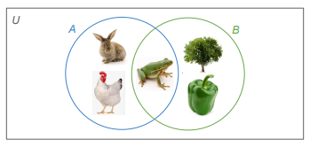
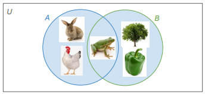
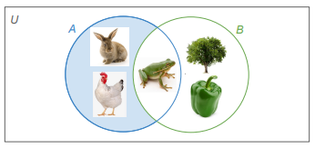

class: middle, center

# Review

---

# Review

Last week we talked about defining the meaning of words by **sense**
and by **reference**:

- A word's **sense** is the mental concept of the word's meaning or a dictionary definition of the word's meaning.

- A word's **reference** is the set of entities (**referents**) that the word refers to.

For example, consider the word *university*

- **Sense**: an institution of higher education

- **Reference**: Rutgers, NYU, CUNY, Harvard, MIT, Penn,
Penn State, Maryland, Johns Hopkins, UVA, Virginia Tech…

--

In this class, we're going to focus on defining words by reference

As we saw last week, reference helps us define relationships
between words such as:

- synonyms

- hyponyms

- hypernyms

All of which have an impact on a sentence's truth values and
entailment.

---

class: center, middle

# Set theory

---

# Set theory

Each word has a given set of referents.

In order to talk precisely about sets of items, we're going to use a
field of mathematics called set theory.

With set theory, we can more precisely:

- Define which elements are in a set (what referents a word has)

- Compare two sets to look for common elements (whether two words have referents in common)

- Perform operations on sets to combine and manipulate them (which will help us define the meaning of sentences)

---

# Set theory: sets and elements

First we need to define a **set** and what it contains.

A **set** is a collection of items:

- {Mon, Tue, Wed, Thu, Fri, Sat, Sun} is the **set** of days of the week

The individual items in a set are called **members** or **elements**:

- Thursday is a **member** or **element** of the set of days of the week

The symbols ∈ and ∉ are used to specify whether an element is a member of a given set:

- Mon ∈ {Mon, Tue, Wed, Thu, Fri, Sat, Sun}

- Oct ∉ {Mon, Tue, Wed, Thu, Fri, Sat, Sun}

---

# Set theory: sets and elements 

As in other branches of mathematics, we can use variables to stand in for values:

.pull-left[

- A = {Mon, Tue, Wed, Thu, Fri, Sat, Sun} 

]

.pull-right[
defines variable A as the set of days
]

By convention, we use capital letters *(A, B, C)* for **sets** and lowercase letters *(x, y, z)* for **elements**.

We can first assign various elements to variables and then define sets based on them:

- *a* = Tom, *b* = Olivia, *c* = Tania, *d* = Jin

- *F = {Tom, Olivia, Tania}*

- *G = {Olivia, Tania, Jin}*

--

We can also define sets in terms of their natural language meaning.

.pull-left[
- D = [[days of the week]]
]

.pull-right[
[[Monday]] ∈ D
]

- We put [[ ]] around **natural language expressions** to show we're talking about their *meaning*, not their structure, morphology, or sounds. We don't need [[ ]] around set theory expressions.

---

# Set theory: properties of sets

Some important **properties** of sets are:

- Order of elements doesn't matter:

  - {a, e, i, o, u} = {u, o, i, e, a}

- Repeating doesn't matter – an element is either in the set or not, it can't be in it twice:

  - {a, e, i, o, u} = {a, a, a, e, e, i, o, o, o, o, u, u}

- Sets can be finite or infinite:

  - infinite: set of positive integers = {1, 2, 3…}

  - finite: set of days of the week = {Mon, Tue, Wed, Thu, Fri, Sat, Sun}

- Members don't have to be relevant to each other – though in Semantics, they usually will be:

  - {u, 3, Wed, blue} is a legitimate set

---

# Set theory: specifying a set

**List notation:**  we can specify a set by listing its members between curly brackets:

- *C = {red, orange, yellow, green, blue, violet}*

- *F = {tulip, rose, violet, carnation, peony}*

--

**Venn diagram:** we can specify a set by placing its members in a circle

.pull-left[

```{r, out.height="100%", out.width="100%", echo=FALSE}
knitr::include_graphics("./images/flowers.png")
```
]


.pull-right[
- Venn diagrams are especially
useful for illustrating where sets
overlap (what members they
have in common):

- *violet ∈ C* <u>and</u> *violet ∈ F*
]

---

# Set theory: specifying a set

Sometimes we can't list all the members (we don't know them, there are too many)

Can you list all the stars in the universe? *Sun, Polaris, Proxima Centauri, Betelgeuse, Rigel...*

We can use **predicate notation** to define such a set:

- Set of all stars: *S* = { *x | x * is a star }

  - *x* is a variable standing in for the sets members 
  
  - | reads as "such that"
  
  - *x* is a star} is the condition that elements have to fulfill in order to be members 

--

We read this out loud as: *S equals the set of elements x, such that x is a star*

This is more or less the same as saying *the set of all stars or the set of all referents of the word* "star"

---

# Set theory: cardinality 

**Cardinality** refers to the number of elements in a set (think cardinal numbers).

We use vertical bars |*A*| to indicate cardinality. (Same symbol as absolute value, but in set theory it means cardinality, not absolute value. |A| is pronounced: *cardinality of A*, **NOT** absolute value of A)

- Suppose *C* = { red, orange, yellow, green, blue, violet }.

- What is |C|?

A set with only one element (cardinality = 1) is called a **singleton set**

- Examples: {red}, {Wednesday}, {Neptune}, {3}, {Snoopy}

A set with *no elements* (cardinality = 0) is called the **null set** or the **empty set**:

- We can write this as either {} or Ø.

- We don't write a null set as {Ø}. **[Q.]** Why not?

---

# Words and sets

Now that we know how to define a set, we can use it to define the meaning of a word.

Recall that we're trying to define words in terms of their reference: the set of things they refer to.

We can define the reference of a word by:

.pull-left[

- list notation 

- predicate notation
]

.pull-right[

[[bird]] = {goose, duck, sparrow, eagle…}

[[bird]] = {x | x is a bird}
]

Remember that we put natural language expressions like words in [[ ]]:

- This shows we're talking about the *meaning* of the word, not its structure.

---

class: center, middle

# Set relations

---

# Set relations


The reference of words can overlap in various ways.


.pull-left[
In order to compare two sets, we need set relations:

- equality (identity)

- subset

- proper subset
]


.pull-right[

```{r, out.height="100%", out.width="100%", echo=FALSE}
knitr::include_graphics("./images/animal-dog.png")
```
]

---

# Set relations: equality/identity

**Equality/Identity symbol:** *A = B* (not equal/identical symbol: A ≠ B)

- Two sets are **equal** or **identical** if they have exactly the same elements:

  - { a, e, i, o, u } = { i, e, a, u, o }

  - { *x* | *x* is a bird } = { *x* | *x* is a winged, feathered animal that lays eggs }

- Formally: *A = B* iff for every *x: x ∈ A* iff *x ∈ B*

```{r, out.height="50%", out.width="50%", echo=FALSE}
knitr::include_graphics("./images/birds.png")
```

---

# Set relations: subset

**Subset symbol**: *A ⊆ B* (not a subset symbol: *A ⊈ B*)

- *A* is a subset of *B* if every element of *A* is also an element of *B*:

  - { a, o, u } ⊆ { a, e, i, o, u }

  - Formally: *A ⊆ B* iff for every *x:* if *x ∈ A* then *x ∈ B*

.pull-left[
- If *A* contains anything that's not in *B*, it's not a subset of *B*:

  - { a, o, y } ⊈ { a, e, i, o, u }

- <u>Note</u>: If *A* and *B* are identical, *A* is technically still a subset of *B*, because every element in *A* is also in *B*:

  - { a, e, i, o, u } ⊆ { a, e, i, o, u }
]

.pull-right[
```{r, out.height="70%", out.width="70%", echo=FALSE}
knitr::include_graphics("./images/vowels.png")
```
]


---

# Set relations: proper subset

**Proper subset symbol:** *A ⊂ B* (not a proper subset symbol: *A ⊄ B*)

- *A* is a proper subset of *B* if *A* is a subset of *B* and they are not identical:

  - { a, o, u } ⊂ { a, e, i, o, u}

  - { a, e, i, o, u } ⊄ { a, e, i, o, u}

.pull-left[
- Formally: *A ⊂ B* iff *A ⊆ B* and *A ≠ B*

In natural language, we typically use subsets (⊆) rather than proper subsets (⊂) because they're more flexible.

]

.pull-right[
```{r, out.height="70%", out.width="70%", echo=FALSE}
knitr::include_graphics("./images/vowels.png")
```
]

---

class: center, middle

# Practice!

---

# Practice

**Are the following statements true or false?**

.pull-left[

1. B ⊂ A

2. B = C

3. B ⊆ C

4. B ⊂ C

5. B ⊆ D

]

.pull-right[

A = {Mary, Peter, Ivan, Josefina, Antonio}

B = {Peter, Ivan, Antonio}

C = {Antonio, Peter, Ivan}

D = {Peter, Mary, Ivan, Josefina}

]


---

class: center, middle

# Back to **language**!!! 

## Set relations in natural language

---

# Set relations in natural language 

Now that we know how to talk about **set relations** (equality, subset), we can return to our discussion
of **synonyms**, **hyponyms**, and **hypernyms**.


**[Q.]** Are the following pairs of words synonyms or hypernyms/hyponyms? 

**[Q.]** What is the set relation between them? 

**[Q.]** How would you write that out using set theory notation (=, ⊆)

- <u>For example</u>: cats vs. felines [[cats]] = [[felines]]

- drink vs. beverage

- squirrel vs. mammal

- sparrow vs. bird

- soft drink vs. soda

- beverage vs. juice

---

# Set relations in natural language

**Synonyms**

- Have the same set of referents: *drink* and *beverage* refer to the same set of things

- So the reference of **synonyms** is **equal/identical**: [[cat]] = [[feline]], [[drink]] = [[beverage]]

- So the reference of a **hyponym** is a **proper subset** of the reference of its **hypernym**

For a given **hypernym** and **hyponym** pair:

- Every referent of the hyponym will also be a referent of the hypernym:

  - [[Snoopy]] is a member of [[dog]] and also [[animal]]

- But not every referent of the hypernym will also be a referent of the hyponym:

  - [[Big Bird]] is a member of [[animal]] but not [[dog]]

Note that the "regular" **subset** includes both relationships, synonymy and hypo/hypernymy

---

class: center, middle

# Semantic compositionality 

---

# Principle of semantic compositionality 

Recall that we can talk about two levels of semantic meaning:

- **Lexical semantics:** the meaning of words

- **Compositional semantics:** the meaning of sentences

We can do the same with set theory:

- We've seen how to use set theory to define words

- But what about sentences?


**Principle of Semantic Compositionality** states that the meaning of sentences derives from the meaning of their words *plus* the meaning of their structures

- This means we need to find a way to use set theory to show a sentence's structure

---

# Declarative sentences 

So how can we describe a **sentence** in set theory?

First, we have to talk about what a sentence is.

Declarative sentences are sentences that state some proposition:

- *Snoopy is a dog. Birds are animals.*

- A **proposition** is a statement that can be true or false.


Declarative statements contrast with **interrogative** (questions) and **imperative** (commands) sentences, neither of which states a proposition.

- We'll ignore these for now and only focus on declarative sentences.

---

# Declarative sentences

**Declarative sentences** typically state propositions in two steps:

- First, they introduce some **topic** in the subject of the sentence:

  - *<u>Snoopy</u> is a dog. <u>Birds</u> are animals.*

- Then, they make some **comment** about that topic in the predicate:
  
  - *Snoopy <u>is a dog</u>. Birds <u>are animals</u>.*

So to translate into a sentence into set theory, we need to figure out how to:

- Identify a sentence's **topic** and state it in set theory

- Identify a sentence's **comment** and state it in set theory

---

# Compositional semantics: Proper noun subjects

Let's start by examining sentences with a **proper noun** (i.e. **name**) as a subject, and with the structure **Name is NOUN**: 

- *Snoopy is a dog.*

What is the subject (topic) of this sentence? 

What is the predicate (comment) of this sentence? 

What is it saying about the topic?

Is there anything in this sentence that could be represented as a set or element?

---

# Compositional semantics: proper noun subjects

In a sentence with the structure **Name is NOUN** like *Snoopy is a dog*:

- The subject is a proper noun – that is, an **element**, not a set

- The predicate: 

  - Introduces some noun referring to a set: [[dog]] = set of all dogs

  - Makes a claim about the relationship between the subject and this set: Snoopy is a member of the set of all dogs.

- What symbol does set theory use to indicate that an element is a member of a set?

- We can write this sentence in set theory as: [[Snoopy]] ∈ [[dog]]

In general, sentences of the structure **Name is NOUN** can be written as **[[name]] ∈ [[NOUN]]**

---

# Compositional semantics: NAME is ADJ

We can use a similar analysis to talk about sentences with other types of predicates.

Consider the sentence *Snoopy is happy.*

- This sentence has the form **NAME is ADJ**.

- So far we've only been using set theory to define nouns: 

  - [[bird]] = {x | x is a bird}

- But we can use set theory to define adjectives, too:

  - *happy* refers to the set of all happy things in the world, so [[happy]] = {x | x is happy}

- So what does the sentence *Snoopy is happy* do? It mentions an individual *Snoopy* and a set [[happy]], and it makes the claim that *Snoopy* is a member of [[happy]].

- The meaning of *Snoopy is happy* can be written in set theory as [[Snoopy]] ∈ [[happy]]

Sentences of the form **NAME is ADJ** can be encoded in set theory as: **[[name]] ∈ [[ADJ]]**

---

# Compositional semantics: NAME VERBs

Consider the sentence *Snoopy runs.*

- Here the sentence has the form *NAME VERBs* – the predicate is a verb.

- Suppose we define the verb *run* as referring to the set of all things in the world that run:

  - [[run]] = {x | x runs}

- Then we can see that *Snoopy runs* introduces an element *Snoopy*, introduces a set [[run]], and again makes the claim that the element is a member of the set: 

  - [[Snoopy]] ∈ [[run]]

- Sentences of the type **NAME VERBs** can be encoded: 

  - **[[name]] ∈ [[VERB]]**

--

That's three different sentence types (*NAME is NOUN, NAME is ADJ, NAME VERBs*) that can all be encoded in set theory in similar ways – through **set membership**:

- [[name]] ∈ [[NOUN]] 

- [[name]] ∈ [[ADJ]] 

- [[name]] ∈ [[VERB]]

---

# Compositional semantics: common noun subjects

But what if the subject is a **common noun** (a noun that's not a name)? 

- *Cats are animals.*

- Now the subject doesn't refer to an individual, it refers to a set of things: 

  - [[cat]]

- Note that this sentence type *NOUNs are NOUNs* still has a predicate that:

  - introduces another set [[animal]]

  - and makes a claim about the relationship between the subject [[cat]] and [[animal]]

- But we can no longer use membership (x ∈ A), because [[cat]] is a set, not an element.

- What symbol do we use to state that all members of [[cat]] are also members of [[animal]]?

  - **Subset:** [[cat]] **⊆** [[animal]]

Sentences of the type **NOUNs are NOUNs** can be encoded: 

- **[[NOUN]] ⊆ [[NOUN]]**

---

# Compositional semantics: common noun subjects

We can use a similar formulation for sentences like *Cats are fuzzy* and *Cats meow.*

*Cats are fuzzy* has the form **NOUNs are ADJ**

- [[fuzzy]] = set of all fuzzy things = {x | x is fuzzy}

  - *Cats are fuzzy* = [[cat]] ⊆ [[fuzzy]]

--

*Cats meow* has the form **NOUNs VERB**

- [[meow]] = set of all things that meow = {x | x meows}

  - *Cats meow* = [[cat]] ⊆ [[meow]]

---

# Compositional semantics: Subset vs. proper subset

Note that we use **subset (⊆)** rather than **proper subset (⊂)**, because it works even when the sets in the subject and predicate are synonyms.

.pull-left[
- [[cat]] ⊆ [[meow]] 

- [[cat]] ⊆ [[meow]]
]

.pull-right[

still true even if nothing else in the universe meows besides cats

still true even if cats are just one of many beings that meow

]

So using subsets gives us more flexibility and helps us deal with ambiguity in language.

---

# Compositional semantics: recap

So according to the **Principle of Semantic Compositionality**, the meaning of sentences derives from both lexical meaning and syntactic structure

We've seen six simple syntactic structures and how their meaning can be described in set theory:

.pull-left[
- NAME is NOUN

- NAME is ADJ

- NAME VERBs

- NOUNs are NOUNs

- NOUNs are ADJ

- NOUNs VERB

]

.pull-right[
[[NAME]] ∈ [[NOUN]]

[[NAME]] ∈ [[ADJ]]

[[NAME]] ∈ [[VERB]]

[[NOUN]] ⊆ [[NOUN]]

[[NOUN]] ⊆ [[ADJ]]

[[NOUN]] ⊆ [[VERB]]
]

In each case, the full meaning depends on the sets/elements as well as the structure.

---

# Compositional semantics: truth values

As we've seen, **declarative sentences** state some **proposition**, which can be encoded in set theory.

But just because you state a proposition, that doesn't mean it's true – you can make a false claim!

- **You can lie**, you can be wrong, or you can say things without knowing if they're true.

--

So when we think of what a sentence means, we need to separate these two concepts:

--

- **What is its proposition?** (and how do we encode that proposition in set theory?)

- **Is the proposition true or false?** (that is, what is its truth value?)

Defining sentences in set theory and determining whether they're true are two separate processes:

.pull-left[
- *Snoopy is a cat.*

- *Cats bark.*

- *Cats are mammals.*
]

.pull-center[

[[Snoopy]] ∈ [[cat]] ...FALSE!

[[cat]] ⊆ [[bark]] ...FALSE!

[[cat]] ⊆ [[mammal]] ...TRUE!

]


---

class: center, middle

# Set operations

---

# Compositional semantics: NPs

Suppose I wanted to use an NP like *yellow birds.*

- Maybe: *What kind of birds do you like? Yellow birds!*

Notice that by using this NP, I'm not making a claim – I didn't say *birds are yellow* – I'm just trying to refer to all elements that are simultaneously in both [[bird]] and [[yellow]].

To define this in set theory, we need **set operations.**

```{r, out.height="70%", out.width="70%", echo=FALSE}
knitr::include_graphics("./images/yellow-birds.png")
```

---

# Set operations

**Set operations** are ways of taking existing sets and creating a new set out of them.

- This is analogous to how addition and subtraction take two numbers and make a third number.

There are four set operations: **union, intersection, difference, complement**

```{r, out.height="70%", out.width="70%", echo=FALSE}

```

---

# Set operations

Let's imagine a universe, *U*. In that universe there are five elements divided into two sets:

- Let A = { x ∈ U | x is an animal } = { rabbit, chicken, frog }

- Let B = { x ∈ U | x is green } = { tree, frog, pepper } 

  - (Notice that *frog* is in both *A* and *B*.)

```{r, out.height="70%", out.width="70%", echo=FALSE}

```

---

# Set operations: Union

**Union** of *A* and *B* produces a new set, which contains all elements that belong to *A* <u>**or**</u> *B* (or both).

- *A* ∪ *B* = { rabbit, chicken, frog, tree, pepper }

- Tip: the symbol for union
(∪) looks like the letter U


```{r, out.height="70%", out.width="70%", echo=FALSE}

```

---

# Set operations: Intersection

Intersection of A and B produces a new set that contains all elements that belong to both A and B.

- A ∩ B = { frog }

Intersection is the part that overlaps between two sets in a Venn diagram.

```{r, out.height="70%", out.width="70%", echo=FALSE}
knitr::include_graphics("./images/green-intersection.png")
```


---

# Set operations: Difference

Difference of A and B produces a new set, which contains all elements that belong to A but not B

- A – B = { rabbit, chicken }

```{r, out.height="70%", out.width="70%", echo=FALSE}

```

---

# Set operations: Complement

Complement of A produces a new set, which contains all elements in the specified universe (U) that
are not in A

- A′ = { tree, pepper }

```{r, out.height="70%", out.width="70%", echo=FALSE}
knitr::include_graphics("./images/green-complement.png")
```


---

# Set operations: summary

```{r, out.height="100%", out.width="100%", echo=FALSE}
knitr::include_graphics("./images/operations-summary.png")
```

---

class: center, middle

# Practice

---

# Practice

**Calculate the following:**

.pull-left[
1. A ∪ B

2. A – B

3. B ∩ C

4. B ∩ D

5. C′

6. (A ∩ B)′

]

.pull-right[

A = {apple, pear, plum}

B = {orange, pear}

C = {plum, apricot, orange, nectarine}

D = {nectarine, apple}

<u>Universe of *fruit*</u>: apple, pear, plum, orange, apricot, nectarine
]

---

class: center, middle

# Back to **language**!!

--

## Set operations in natural language

---

# Set operations in natural language

Let's return to our NP *yellow birds*:

- [[yellow birds]] refers to all elements that are in both [[yellow]] and [[bird]]

- That is, we're talking about elements that are simultaneously in two sets: [[yellow]] and [[bird]]

What **set operation** do we use to specify elements that are simultaneously in two sets?

- **Intersection (∩)**: A ∩ B = all elements that are in both A and B at the same time

- [[yellow]] ∩ [[bird]] = all elements that are in both [[yellow]] and [[bird]] = [[yellow bird]]

Generally speaking, any NP of type **ADJ NOUN** can be specified in set theory via intersection:

- **[[ADJ]] ∩ [[NOUN]]**

---

# Set operations in natural language

Notice that we can then insert this NP [[yellow]] ∩ [[bird]] into structures we've already seen

--

| Sentence | Set notation | Template
|:----------|:--------|:--------|
| *Tweety is a bird.* | [[Tweety]] ∈ [[bird]] | NAME is NOUN |
| <div style="padding-right: 30px;">*Tweety is a yellow bird*</div> | <div style="padding-right: 30px;">[[Tweety]] ∈ [[yellow]] ∩ [[bird]]</div>  | NAME is ADJ NOUN |
| *Birds are pretty* | [[bird]] ⊆ [[pretty]] | NOUNs are ADJs |
| *Yellow birds are pretty.* | [[yellow]] ∩ [[bird]] ⊆ [[pretty]] | ADJ NOUNs are ADJs |

--

Note that set operators (∪, ∩, −, ′) take precedence over set relation symbols (∈, ⊆, =) –
compare this to arithmetic operators (+, –, ×, ÷) and (in)equality symbols (=, <, >) in algebra.

--

Again, this demonstrates the **Principle of Semantic Compositionality** – as we build ever more
complicated sentences, we need to think about the relationship between the different sets and how our sentence structure affects that relationship.

---

class: center, middle

# Quantifiers

---

# Set theory in semantics so far

We can define words by **reference** – the set of things they refer to.

We can use **set theory** to precisely define the reference of a natural language expression:

- Sets are collections of elements

- **Set relations:** equality/identity, subset, proper subset

  - Useful for describing the relationship between synonyms or hypo/hypernyms and for
specifying claims that are made in declarative sentences like *NOUN is ADJ.*

- **Set operations:** union, intersection, difference, complement

  - Useful for describing the reference of NPs like *ADJ NOUN.*

Now we're going to turn to **cardinality** and see how we can use it to define quantifiers.

---

# Semantics of Determiners

We previously defined **determiners** as a part of speech that consists of the following subcategories:

- articles – *the, a*

- demonstratives – *this, that, these, those*

- quantifiers – *every, some, many, most, no*

- possessive pronouns – *my, your, her, his, their, our*

- some question words – *which, what*

--

Determiners serve to specify *which member* of a set we're referring to in the world:

- *my dog* – a member of [[dog]] that belongs to me

- *this dog* – a member of [[dog]] that is near me

- *every dog* – the entire set of [[dog]]

- *the dog* – a member of [[dog]] that is relevant to our current conversation

- *a dog* – an unspecified member of [[dog]]

---

# Semantics of quantifiers

**Quantifiers** (including **numerals**) are a specific type of determiner that describes **how many members** of a set we're talking about.

How many members of the set [[cat]] are we talking about when we say the following?

.pull-left[
- *every cat*

- *some cats*

- *three cats*

- *many cats*

- *most cats*

- *no cats* ☹
]

--

.pull-right[
all members

more than zero members

exactly three members

some large number of members

more than half of members

zero members

]

---

# Semantics of Quantifiers

We saw that declarative sentences like NOUNs are NOUNs, NOUNs are ADJ, or NOUN VERBs
make some claim about the relationship between sets:

- Cats are animals.

.pull-left[
- <u>Claim</u>: [[cat]] ⊆ [[animal]] 

]

.pull-right[
the set of cats is a subset of the set of animals
]

--

Sentences with quantifiers like **QUANT NOUN VERBs** also make some claim about the relationship between sets – but now it involves some quantity.

- If I say *Four cats are meowing*, how many elements are in both [[cat]] and [[meow]]?

--

- Four!

--

- <U>Claim</U>: | [[cat]] ∩ [[meow]] | = 4

  - the cardinality of the intersection of [[cat]] and [[meow]] is four

  - In other words, there are exactly four elements that are both in [[cats]] and [[meow]]


---

# Semantics of quantifiers


Other declarative sentences with quantifiers will make similar claims:

```{r, out.height="100%", out.width="100%", echo=FALSE}
knitr::include_graphics("./images/quant-summary.png")
```


---

class: center, middle

# Summary 

---

# Summary 

Uses of set theory in semantics

We can define words by **reference** – the set of things they refer to – which means that set theory can be a useful way to precisely define the semantic meaning of an expression:

- Sets are collections of elements

- **Set relations:** equality/identity, subset, proper subset

  - Useful for describing the relationship between synonyms or hypo/hypernyms and for specifying claims that are made in declarative sentences like *NOUN is ADJ.*

- **Set operations:** union, intersection, difference, complement

  - Useful for describing the reference of NPs like *ADJ NOUN.*

- **Cardinality:** useful for describing expressions with quantifiers

---

# Limitations of set theory

So set theory is a useful way to be precise about the semantic meaning of language.

But it's not perfect: there are a few things that can't be described in set theory

An example is **non-intersective adjectives**:

- An adjective like *yellow* in *yellow bird* is called **intersective** because [[yellow bird]] can be described as the **intersection** between [[yellow]] and [[bird]].

- What about *biggest tree* or *matching shirts*? Can we describe these through intersection?

--

- No, because we need more information – for example to know which tree is *biggest*, we need to know the size of all other trees we need to compare them.

--

So set theory is useful, but it can't describe all aspects of semantics.

---

# Summary

Semantics is the study of meaning – specifically **literal meaning** – in language

We've focused on a type of semantics that defines meaning in terms of **reference** rather than **sense**

- We've used **set theory** to define, compare, and manipulate the reference of linguistic units

--

We've focused on two levels of semantic meaning:

- **Lexical semantics** – the meaning of words: reference, synonyms, hyper/hyponyms

- **Compositional semantics** – the meaning of sentences = words + structures

.pull-left[

  NOUN is NOUN 

  ADJ NOUN

  QUANT NOUN 
]

.pull-right[
[[NOUN]] ⊆ [[NOUN]]

[[ADJ]] ∩ [[NOUN]]

| [[NOUN]] | = [[QUANT]]
]

--

If you're interested in learning more, consider taking a semantics class!


---

# Coming up!

???fill-in


