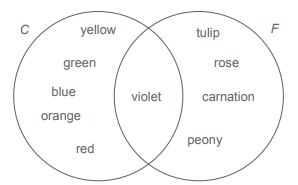
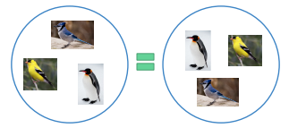
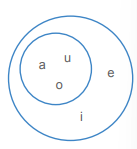

class: middle, center

# Review

---

# Review

Last week we talked about defining the meaning of words by **sense**
and by **reference**:

- A word's **sense** is the mental concept of the word's meaning or a dictionary definition of the word's meaning.

- A word's **reference** is the set of entities (**referents**) that the word refers to.

For example, consider the word *university*

- **Sense**: an institution of higher education

- **Reference**: Rutgers, NYU, CUNY, Harvard, MIT, Penn,
Penn State, Maryland, Johns Hopkins, UVA, Virginia Tech…

--

In this class, we're going to focus on defining words by reference

As we saw last week, reference helps us define relationships
between words such as:

- synonyms

- hyponyms

- hypernyms

All of which have an impact on a sentence's truth values and
entailment.

---

class: center, middle

# Set theory

---

# Set theory

Each word has a given set of referents.

In order to talk precisely about sets of items, we're going to use a
field of mathematics called set theory.

With set theory, we can more precisely:

- Define which elements are in a set (what referents a word has)

- Compare two sets to look for common elements (whether two words have referents in common)

- Perform operations on sets to combine and manipulate them (which will help us define the meaning of sentences)

---

# Set theory: sets and elements

First we need to define a **set** and what it contains.

A **set** is a collection of items:

- {Mon, Tue, Wed, Thu, Fri, Sat, Sun} is the **set** of days of the week

The individual items in a set are called **members** or **elements**:

- Thursday is a **member** or **element** of the set of days of the week

The symbols ∈ and ∉ are used to specify whether an element is a member of a given set:

- Mon ∈ {Mon, Tue, Wed, Thu, Fri, Sat, Sun}

- Oct ∉ {Mon, Tue, Wed, Thu, Fri, Sat, Sun}

---

# Set theory: sets and elements 

As in other branches of mathematics, we can use variables to stand in for values:

.pull-left[

- A = {Mon, Tue, Wed, Thu, Fri, Sat, Sun} 

]

.pull-right[
defines variable A as the set of days
]

By convention, we use capital letters *(A, B, C)* for **sets** and lowercase letters *(x, y, z)* for **elements**.

We can first assign various elements to variables and then define sets based on them:

- *a* = Tom, *b* = Olivia, *c* = Tania, *d* = Jin

- *F = {Tom, Olivia, Tania}*

- *G = {Olivia, Tania, Jin}*

--

We can also define sets in terms of their natural language meaning.

.pull-left[
- D = [[days of the week]]
]

.pull-right[
[[Monday]] ∈ D
]

- We put [[ ]] around **natural language expressions** to show we're talking about their *meaning*, not their structure, morphology, or sounds. We don't need [[ ]] around set theory expressions.

---

# Set theory: properties of sets

Some important **properties** of sets are:

- Order of elements doesn't matter:

  - {a, e, i, o, u} = {u, o, i, e, a}

- Repeating doesn't matter – an element is either in the set or not, it can't be in it twice:

  - {a, e, i, o, u} = {a, a, a, e, e, i, o, o, o, o, u, u}

- Sets can be finite or infinite:

  - infinite: set of positive integers = {1, 2, 3…}

  - finite: set of days of the week = {Mon, Tue, Wed, Thu, Fri, Sat, Sun}

- Members don't have to be relevant to each other – though in Semantics, they usually will be:

  - {u, 3, Wed, blue} is a legitimate set

---

# Set theory: specifying a set

**List notation:**  we can specify a set by listing its members between curly brackets:

- *C = {red, orange, yellow, green, blue, violet}*

- *F = {tulip, rose, violet, carnation, peony}*

--

**Venn diagram:** we can specify a set by placing its members in a circle

.pull-left[

```{r, out.height="100%", out.width="100%", echo=FALSE}

```
]


.pull-right[
- Venn diagrams are especially
useful for illustrating where sets
overlap (what members they
have in common):

- *violet ∈ C* <u>and</u> *violet ∈ F*
]

---

# Set theory: specifying a set

Sometimes we can't list all the members (we don't know them, there are too many)

Can you list all the stars in the universe? *Sun, Polaris, Proxima Centauri, Betelgeuse, Rigel...*

We can use **predicate notation** to define such a set:

- Set of all stars: *S* = { *x | x * is a star }

  - *x* is a variable standing in for the sets members 
  
  - | reads as "such that"
  
  - *x* is a star} is the condition that elements have to fulfill in order to be members 

--

We read this out loud as: *S equals the set of elements x, such that x is a star*

This is more or less the same as saying *the set of all stars or the set of all referents of the word* "star"

---

# Set theory: cardinality 

**Cardinality** refers to the number of elements in a set (think cardinal numbers).

We use vertical bars |*A*| to indicate cardinality. (Same symbol as absolute value, but in set theory it means cardinality, not absolute value. |A| is pronounced: *cardinality of A*, **NOT** absolute value of A)

- Suppose *C* = { red, orange, yellow, green, blue, violet }.

- What is |C|?

A set with only one element (cardinality = 1) is called a **singleton set**

- Examples: {red}, {Wednesday}, {Neptune}, {3}, {Snoopy}

A set with *no elements* (cardinality = 0) is called the **null set** or the **empty set**:

- We can write this as either {} or Ø.

- We don't write a null set as {Ø}. **[Q.]** Why not?

---

# Words and sets

Now that we know how to define a set, we can use it to define the meaning of a word.

Recall that we're trying to define words in terms of their reference: the set of things they refer to.

We can define the reference of a word by:

.pull-left[

- list notation 

- predicate notation
]

.pull-right[

[[bird]] = {goose, duck, sparrow, eagle…}

[[bird]] = {x | x is a bird}
]

Remember that we put natural language expressions like words in [[ ]]:

- This shows we're talking about the *meaning* of the word, not its structure.

---

class: center, middle

# Set relations

---

# Set relations


The reference of words can overlap in various ways.


.pull-left[
In order to compare two sets, we need set relations:

- equality (identity)

- subset

- proper subset
]


.pull-right[

```{r, out.height="100%", out.width="100%", echo=FALSE}
knitr::include_graphics("./images/animal-dog.png")
```
]

---

# Set relations: equality/identity

**Equality/Identity symbol:** *A = B* (not equal/identical symbol: A ≠ B)

- Two sets are **equal** or **identical** if they have exactly the same elements:

  - { a, e, i, o, u } = { i, e, a, u, o }

  - { *x* | *x* is a bird } = { *x* | *x* is a winged, feathered animal that lays eggs }

- Formally: *A = B* iff for every *x: x ∈ A* iff *x ∈ B*

```{r, out.height="50%", out.width="50%", echo=FALSE}

```

---

# Set relations: subset

**Subset symbol**: *A ⊆ B* (not a subset symbol: *A ⊈ B*)

- *A* is a subset of *B* if every element of *A* is also an element of *B*:

  - { a, o, u } ⊆ { a, e, i, o, u }

  - Formally: *A ⊆ B* iff for every *x:* if *x ∈ A* then *x ∈ B*

- If *A* contains anything that's not in *B*, it's not a subset of *B*:

  - { a, o, y } ⊈ { a, e, i, o, u }

.pull-left[
- <u>Note</u>: If *A* and *B* are identical, *A* is technically still a subset of *B*, because every element in *A* is also in *B*:

  - { a, e, i, o, u } ⊆ { a, e, i, o, u }
]

.pull-right[
```{r, out.height="70%", out.width="70%", echo=FALSE}

```
]


---

# Set relations: proper subset

**Proper subset symbol:** *A ⊂ B* (not a proper subset symbol: *A ⊄ B*)

- *A* is a proper subset of *B* if *A* is a subset of *B* and they are not identical:

  - { a, o, u } ⊂ { a, e, i, o, u}

  - { a, e, i, o, u } ⊄ { a, e, i, o, u}

.pull-left[
- Formally: *A ⊂ B* iff *A ⊆ B* and *A ≠ B*

In natural language, we typically use subsets (⊆) rather than proper subsets (⊂) because they're more flexible.

]

.pull-right[
```{r, out.height="70%", out.width="70%", echo=FALSE}

```
]

---

class: center, middle

# Practice!

---

# Practice

**Are the following statements true or false?**

.pull-left[

1. B ⊂ A

2. B = C

3. B ⊆ C

4. B ⊂ C

5. B ⊆ D

]

.pull-right[

A = {Mary, Peter, Ivan, Josefina, Antonio}

B = {Peter, Ivan, Antonio}

C = {Antonio, Peter, Ivan}

D = {Peter, Mary, Ivan, Josefina}

]


---

class: center, middle

# Back to **language**!!! 

## Set relations in natural language

---

# Set relations in natural language 

Now that we know how to talk about **set relations** (equality, subset), we can return to our discussion
of **synonyms**, **hyponyms**, and **hypernyms**.


**[Q.]** Are the following pairs of words synonyms or hypernyms/hyponyms? 

**[Q.]** What is the set relation between them? 

**[Q.]** How would you write that out using set theory notation (=, ⊆)

- <u>For example</u>: cats vs. felines [[cats]] = [[felines]]

- drink vs. beverage

- squirrel vs. mammal

- sparrow vs. bird

- soft drink vs. soda

- beverage vs. juice

---

# Set relations in natural language

**Synonyms**

- Have the same set of referents: *drink* and *beverage* refer to the same set of things

- So the reference of **synonyms** is **equal/identical**: [[cat]] = [[feline]], [[drink]] = [[beverage]]

- So the reference of a **hyponym** is a **proper subset** of the reference of its **hypernym**

For a given **hypernym** and **hyponym** pair:

- Every referent of the hyponym will also be a referent of the hypernym:

  - [[Snoopy]] is a member of [[dog]] and also [[animal]]

- But not every referent of the hypernym will also be a referent of the hyponym:

  - [[Big Bird]] is a member of [[animal]] but not [[dog]]

Note that the "regular" **subset** includes both relationships, synonymy and hypo/hypernymy

---

class: center, middle

# Semantic compositionality 

---

# Principle of semantic compositionality 

Recall that we can talk about two levels of semantic meaning:

- **Lexical semantics:** the meaning of words

- **Compositional semantics:** the meaning of sentences

We can do the same with set theory:

- We've seen how to use set theory to define words

- But what about sentences?


**Principle of Semantic Compositionality** states that the meaning of sentences derives from the meaning of their words *plus* the meaning of their structures

- This means we need to find a way to use set theory to show a sentence's structure

---

# Declarative sentences 

???slide 24 of week 8 slides


---

# Coming up!


