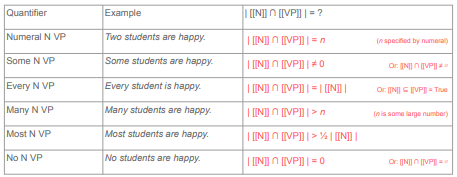
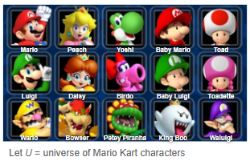

class: middle, center

# Set theory (formal review)

---


# Set theory (formal review)

## Set: a collection of items

- order doesn't matter 

- items can be repeated, but they don't "count" as separate items 
  
  - {a,e,i,o,u} = {a,a,e,e,i,o,o,u}

**Member**

- an item in a set is also called a member of that set

---

# Set theory (formal review)

## List vs. predicate notation

- **List notation:** specifies a set by listing its members between {brackets}

  - *R* = { Gouda, Soup, Falafel, Beef, Butter, Sesame }
  
  
- **Predicate notation:** defines what is in the set without listing everything 

  - *R* = { *x* | *x* is a rodent }

  - "*R* equals the set of elements *x*, such that *x* is a rodent" 
  
  - normal words: "the set of all rodents"
  
  - "such that" ( | )
  

---

# Set theory (formal review)

## Set relations

**subset (⊆):** 

- *A* is a subset of *B* if every element of *A* is also an element of *B*

**proper subset (⊂):** 

- *A* is a proper subset of *B* if *A* is a subset of *B* and they are not identical

**identity (=):** 

- two sets are identical/equal if they have exactly the same elements

---

# Set theory (formal review)

## Set operations

**union (∪)**

- produces a new set which contains all elements that belong to both sets (including elements in both sets)


**intersection (∩)**

- produces a new set that only contains all elements that belong to BOTH sets


---

# Set theory (formal review)

## Set operations

**difference (-)** 

- the difference of *A* and *B* is a new set which contains all elements that belong to *A*, but NOT *B*


**complement (')**

- produces a new set which contains all elements in the relevant universe that are NOT in the set


---

# Set theory (formal review)

## Cardinality: the number of elements in a set 

- **singleton set:** a set with cardinality = 1
  
- **null set/empty set:** a set with cardinality = 0 

  - {  } = Ø "empty set"
  

### Other notational things

- when talking about the  *meaning* of a word, and not its structure, use [[double brackets]]

---

class: center, middle

# Back to **language**!!

--

## Set operations in natural language

---

# Set operations in natural language

Let's return to our NP *yellow birds*

--

- [[yellow birds]] refers to all elements that are in both [[yellow]] and [[bird]]

- That is, we're talking about elements that are simultaneously in two sets: [[yellow]] and [[bird]]

What **set operation** do we use to specify elements that are simultaneously in two sets?

--

- **Intersection (∩)**: A ∩ B = all elements that are in both A and B at the same time

--

- [[yellow]] ∩ [[bird]] = all elements that are in both [[yellow]] and [[bird]] = [[yellow bird]]

--

Generally speaking, any NP of type **ADJ NOUN** can be specified in set theory via intersection:

- **[[ADJ]] ∩ [[NOUN]]**

---

# Set operations in natural language

Notice that we can then insert this NP [[yellow]] ∩ [[bird]] into structures we've already seen

--

| Sentence | Set notation | Template
|:----------|:--------|:--------|
| *Tweety is a bird.* | [[Tweety]] ∈ [[bird]] | NAME is NOUN |
| <div style="padding-right: 30px;">*Tweety is a yellow bird*</div> | <div style="padding-right: 30px;">[[Tweety]] ∈ [[yellow]] ∩ [[bird]]</div>  | NAME is ADJ NOUN |
| *Birds are pretty* | [[bird]] ⊆ [[pretty]] | NOUNs are ADJs |
| *Yellow birds are pretty.* | [[yellow]] ∩ [[bird]] ⊆ [[pretty]] | ADJ NOUNs are ADJs |

--

Note that **set operators (∪, ∩, −, ′) take precedence** over set relation symbols (∈, ⊆, =) - compare this to arithmetic operators (+, –, ×, ÷) and (in)equality symbols (=, <, >) in algebra.

--

Again, this demonstrates the **Principle of Semantic Compositionality** – as we build ever more complicated sentences, we need to think about the relationship between the different sets and how our sentence structure affects that relationship.

---

class: center, middle

# Quantifiers

---

# Set theory in semantics so far

We can define words by **reference** – the set of things they refer to.

We can use **set theory** to precisely define the reference of a natural language expression

--

- Sets are collections of elements

--

- **Set relations:** equality/identity, subset, proper subset

  - Useful for describing the relationship between synonyms or hypo/hypernyms and for specifying claims that are made in declarative sentences like *NOUN is ADJ.*

--

- **Set operations:** union, intersection, difference, complement

  - Useful for describing the reference of NPs like *ADJ NOUN.*

--

Now we're going to turn to **cardinality** and see how we can use it to define quantifiers.

---

# Semantics of Determiners

We previously defined **determiners** as a part of speech that consists of the following subcategories:

--

- articles – *the, a*

- demonstratives – *this, that, these, those*

- quantifiers – *every, some, many, most, no*

- possessive pronouns – *my, your, her, his, their, our*

- some question words – *which, what*

--

Determiners serve to specify *which member* of a set we're referring to in the world

--

- *my dog* – a member of [[dog]] that belongs to me

- *this dog* – a member of [[dog]] that is near me

- *every dog* – the entire set of [[dog]]

- *the dog* – a member of [[dog]] that is relevant to our current conversation

- *a dog* – an unspecified member of [[dog]]

---

# Semantics of quantifiers

**Quantifiers** (including **numerals**) are a specific type of determiner that describes **how many members** of a set we're talking about.

How many members of the set [[cat]] are we talking about when we say the following?

.pull-left[
- *every cat*

- *some cats*

- *three cats*

- *many cats*

- *most cats*

- *no cats* ☹
]

--

.pull-right[
all members

more than zero members

exactly three members

some large number of members

more than half of members

zero members

]

---

# Semantics of Quantifiers

We saw that declarative sentences like NOUNs are NOUNs, NOUNs are ADJ, or NOUN VERBs make some claim about the relationship between sets:

--

- *Cats are animals.*

.pull-left[
- <u>Claim</u>: [[cat]] ⊆ [[animal]] 

]

.pull-right[
the set of cats is a subset of the set of animals
]

--

Sentences with quantifiers like **QUANT NOUN VERBs** also make some claim about the relationship between sets – but now it involves some quantity.

- If I say *Four cats are meowing*, how many elements are in both [[cat]] and [[meow]]?

--

- <span style="color:green">Four!</span>

--

- <U>Claim</U>: | [[cat]] ∩ [[meow]] | = 4

--

  - the cardinality of the intersection of [[cat]] and [[meow]] is four

  - In other words, there are exactly four elements that are both in [[cats]] and [[meow]]


---

# Semantics of quantifiers


Other declarative sentences with quantifiers will make similar claims:

```{r, out.height="100%", out.width="100%", echo=FALSE}

```


---

class: center, middle

# Summary so far

---

# Summary so far

We can define words by **reference** – the set of things they refer to – which means that set theory can be a useful way to precisely define the semantic meaning of an expression

--

- Sets are collections of elements

- **Set relations:** equality/identity, subset, proper subset

--

  - Useful for describing the relationship between synonyms or hypo/hypernyms and for specifying claims that are made in declarative sentences like *NOUN is ADJ.*

--

- **Set operations:** union, intersection, difference, complement

  - Useful for describing the reference of NPs like *ADJ NOUN.*
  
  - note that set operations result in a *new set*

--

- **Cardinality:** useful for describing expressions with quantifiers


---

class: middle, center

# Set theory: back to language !

--

## Lexical semantics


---

# Set theory: back to language !

## How parts of speech are defined

**Proper Nouns**

- [[Gible]] (*Gible is an element*)

**Common Nouns**

- [[rodent]] = { *x* | *x* is a rodent}

**Adjectives**

- [[happy]] = { *x* | *x* is happy }

**Verbs**

- [[meow]] = { *x* | *x* meows }

---


# Set theory: back to language !

**Define the reference of nouns, adjectives, and verbs in terms of sets**


1. fast 

2. scream

3. baby 

4. write 

5. fluffy 

6. play 

7. loud

8. random


---

class: middle, center

# Set theory: back to language !

--

## Compositional semantics


---

# Set theory: back to language !

## Sentence types (Name subjects)

.pull-left[
**"name is NOUN"** 

- [[name]] ∈ [[NOUN]]

- "Gible is a Pokemon" 

  - = [[Gible]] ∈  [[Pokemon]] 

**"name is ADJ"** 

- [[name]] ∈ [[ADJ]]

- "Gible is fat" 

  - = [[Gible]]  ∈ [[fat]]
]


.pull-right[
**"name is VERB"**

- [[name]] ∈ [[VERB]]

- "Gible is running" 

  - = [[Gible]]  ∈ [[run]]
]

---

# Set theory: back to language !

## Sentence types (NOUN subjects)

.pull-left[
**"NOUNs are NOUNs"** 

- [[NOUN]] ⊆ [[NOUN]]

- "Hamsters are rodents" 

  - = [[hamster]] ⊆ [[rodent]]

**"NOUNs are ADJ"**

- [[NOUN]] ⊆ [[ADJ]]

- "Hamsters are small"

  - = [[hamster]] ⊆ [[small]]
]

.pull-right[
**"NOUNs are VERB"**

- [[NOUN]] ⊆ [[VERB]]

- "Rats squeak" 

  - = [[rat]] ⊆ [[squeak]]
]

---

# Set theory: back to language !

## Complex sentences

**"NAME is ADJ NOUN"**

- "Gible is a tabby cat."

- [[Gible]] ∈ [[tabby]] ∩ [[cat]]

**"ADJ NOUNs are ADJ"**

- "Small rodents are cute"

- [[small]] ∩ [[rodent]] ⊆ [[cute]]

---

# Set theory: back to language !

**Translate sentences into set theory expressions.** 


1. Butter is a fast rat. 

2. Fable and Gible are young cats.

3. Beef and Butter are curly-haired rats. 

4. Rats are ticklish. 

5. Linguistics is fun.

6. Keng is not Chinese. 

7. Fish swim. 

8. Big dogs are friendly.


---

class: middle, center

# More practice !!! 

--

## Mario universe

---

# Practice with sets 

### List and predicate notation

**Define the following sets using both list notation and predicate notation.**

.pull-left[
  a. *M*, the set of characters with mustaches
  
  b. *P*, the set of characters who are/wear pink
  
  c. *C*, the set of characters with crowns 
  
  d. *G*, the set of characters who are ghosts
]

.pull-right[
```{r, out.height="100%", out.width="100%", echo=FALSE}

```
]


---

# Practice with sets 

**True or False? Why?**

.pull-left[
a. Mario ∈ *M* 

b. Peach ∉ *C* 

c. | *C* | = 3 

d. {Daisy, Birdo, Luigi} = {Luigi, Daisy, Birdo} 

e. | { x | x has a name that starts with 'W' } | = {Wario, Waluigi}
] 

.pull-right[
```{r, out.height="100%", out.width="100%", echo=FALSE}

```
]


---

# Practice with sets 

Are any of the sets defined in question 1 singletons? Which one(s)? 

```{r, out.height="60%", out.width="60%", echo=FALSE}

```

---

class: center, middle

# Limitations of set theory

## ... it isn't perfect


---


# Limitations of set theory

So set theory is a useful way to be precise about the semantic meaning of language.

--

But it's not perfect: there are a few things that can't be described in set theory

An example is **non-intersective adjectives**:

--

- An adjective like *yellow* in *yellow bird* is called **intersective** because [[yellow bird]] can be described as the **intersection** between [[yellow]] and [[bird]].

--

- What about *biggest tree* or *matching shirts*? Can we describe these through intersection?

--

- **No,** because we need more information – for example to know which tree is *biggest*, we need to know the size of all other trees we need to compare them.

--

So set theory is useful, but it can't describe all aspects of semantics.

---

# Summary

Semantics is the study of meaning – specifically **literal meaning** – in language

--

We've focused on a type of semantics that defines meaning in terms of **reference** rather than **sense**

- We've used **set theory** to define, compare, and manipulate the reference of linguistic units

--

We've focused on two levels of semantic meaning:

- **Lexical semantics** – the meaning of words: reference, synonyms, hyper/hyponyms

--

- **Compositional semantics** – the meaning of sentences = words + structures

.pull-left[

  NOUN is NOUN 

  ADJ NOUN

  QUANT NOUN 
]

.pull-right[
[[NOUN]] ⊆ [[NOUN]]

[[ADJ]] ∩ [[NOUN]]

| [[NOUN]] | = [[QUANT]]
]

--

If you're interested in learning more, consider taking a semantics class!


*(Or ask me about stuff for fun!)*


---

class: middle, center

# Congrats! You lived through semantics!

```{r, out.height="60%", out.width="60%", echo=FALSE}

```


---

# Coming Up! **Pragmatics**

### Readings

- Read *Griffin & Cummins, Ch. 8*

### Homework

- **HW4** is due <u>March 15</u>

- HW5 will be posted by March 22 (and will be due March 29)

### Reminders

- I will be available for questions over email during the break


