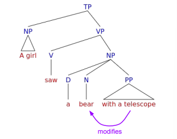
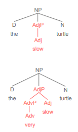
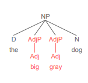
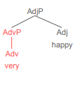
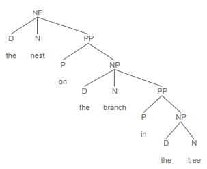

class: center, middle

# A girl saw a bear with a telescope.

This sentence has two possible interpretations. What are they? Who has the telescope?

---

# A girl saw a bear with a telescope

.pull-left[

**Interpretation 1**

*A girl used a telescope to see a bear*

```{r, out.width="120%", out.height="auto", echo=FALSE}
knitr::include_graphics("./images/saw_with_telescope.png")
```

]

.pull-right[
**Interpretation 2**

*A girl saw a bear that had a telescope*

```{r, out.width="120%", out.height="auto", echo=FALSE}

```

]

---

# A girl saw a bear with a telescope

This is an example of a **structurally ambiguous** sentence.

--

We can use syntax trees to visualize its two possible structures.

- In this case, these syntax trees show how there are two ways to interpret what [*with a telescope*] modifies.

--

This means that *the meaning of a sentence isn't just the sum of its words:*

- **Syntactic structure also contributes to meaning.**

--

So let's take some time to understand these structures and how to draw them as trees.

---

class: center, middle

# Types of phrases

---

# Types of phrases

**Syntax trees** show how words are combined into **constituents** and how constituents are related.

Another name for constituents is **phrases**, and we'll be talking about the following phrase types:

--

Each phrase type has a **head word** and is named after that head word's part of speech, and each phrase contains that head word *and all the words that modify that head word:*

--

- **NP – noun phrase** (*man, the man, the happy man, the man with the hat*)

--

- **PP – prepositional phrase** (*into the forest, by the author, for good luck*)

--

- **AdjP – adjective phrase** (*happy, extremely angry*)

--

- **AdvP – adverb phrase** (*quickly, very quickly*)

--

- **VP – verb phrase** (*eats, eats pizza, eats quickly, eats pizza quickly at noon*)

--

- **TP – tense phrase** or ***sentence*** (*John eats pizza quickly. I saw a dog by the tree.*)

---

class: center, middle

# Noun phrases (NP)

---

# NPs

A noun phrase consists of a noun and all the words that modify it.

--

The simplest NP is a single noun:

- *Harriet, dogs, soup, snow*

--

A NP can also include any of the following:

- A **determiner:** *<u>the</u> hat, <u>my</u> shoes, <u>this</u> idea, <u>which</u> tree*

--

- One or more **adjective phrases** (AdjP): *<u>blue</u> sky, a <u>great</u> time, <u>big</u> <u>red</u> trucks*

  - **Note:** an adjective will always go in a separate AdjP, for reasons we'll discuss later.

--

- One or more **prepositional phrases** (PP): *spaghetti <u>with</u> meatballs, trees <u>in</u> the yard, the tall bridge <u>over</u> the river*

---

# Phrase structure rules (NPs)

We use phrase structure rules (PSRs) to specify what elements a phrase can contain.

PSRs have the following format:

--

.pull-left[
- **X**P → **X** <span style="color:blue">Y Z</span>
]

.pull-right[
phrase **type X** is composed of elements **X**, <span style="color:blue">Y</span>, <span style="color:blue">Z</span>, in that order
]

--

We can write a PSR to account for each type of NP we've seen so far

.pull-left[

- *dog* (simple noun)

- *the dog* (determiner-noun)

- *friendly dog* (adjective-noun)

- *dog in the park* (noun-PP)

- *the friendly dog in the park* (determiner-adj-noun-PP)

]

.pull-right[

**N**P → **N**

**N**P → <span style="color:blue">D</span> **N**

**N**P → <span style="color:blue">AdjP</span> **N**

**N**P → **N** <span style="color:blue">PP</span>

**N**P → <span style="color:blue">D AdjP</span> **N** <span style="color:blue">PP</span>

]

---

# Phrase structure rules (NPs)

We can combine all of these NP rules into one rule:

- **N**P → <span style="color:blue">(D) (AdjP+)</span> **N** <span style="color:blue">(PP+)</span>

--

**Notes**

- order matters - elements always appear in the order given in the rule

- parentheses = optional 

- no parentheses = required 

- "+" = one or more allowed

--

So this rule means that an NP consists of:

- optional determiner, one or more optional adjective phrase(s), noun, one or more optional prepositional phrase(s) – *in that order*

---

.pull-left[

# Syntax trees 


- phrase structure rules can be used to draw **syntax trees!**

- to draw a syntax tree: 

  - write the words **at the bottom**
  
  - label their parts of speech 
  
  - figure out how they combine into phrases 
  
  - Write phrase type above and connect all its elements
with lines – some phrases contain other phrases.

  - Tree should reflect an existing PSR: phrase type on left of PSR at top elements on right of PSR at bottom

]

.pull-right[
```{r, out.width="70%", out.height="auto", echo=FALSE}
knitr::include_graphics("./images/syntax_trees.png")
```
]

---

# Adjective phrases (AdjP) and Adverb phrases (AdvP)

Consider the following sentence. Are *happy* and *quickly* constituents?

- The <span style="color:blue">happy</span> dog ran <span style="color:blue">quickly</span>.

--

Let's try some tests:

- *The dog who ran quickly was <span style="color:blue">happy.</span>* (movement)

- *How was the dog who ran quickly? <span style="color:blue">Happy</span>!* (stand alone)

- *How did the happy dog run? <span style="color:blue">Quickly</span>!* (stand alone)

- *The happy dog ran <span style="color:blue">like that</span>.* (replacement)

--

Adjectives and adverbs are their own constituents, so they need to be put into their own phrases:

- AdjP and AdvP

---

# Adjective phrase (AdjP)

.pull-left[
Most basic AdjP: one adjective (**AdjP → Adj**)

- We can insert it into an NP as shown.

**Modification Rule:** a phrase that modifies a word must be a sibling of that word.


By making the AdjP for *happy* a **sibling** of the N *turtle*, we're showing that *happy* modifies *turtle*.

We can verify they are siblings by checking they have the same **parent**: both the AdjP and the N *turtle* have NP as parent.

]

.pull-right[

```{r, out.width="65%", out.height="auto", echo=FALSE}

```
]

---

# Adjective phrase (AdjP)

.pull-left[

AdjPs can optionally contain an adverb phrase: *very slow*

- Let's modify our PSR: **AdjP → (AdvP) Adj**

Since the adverb modifies the adjective:

- The adverb needs to go in its own AdvP.

- That AdvP needs to be a sibling of the adjective.

- That is, they need to be children of the same AdjP.
]


.pull-right[

```{r, out.width="65%", out.height="auto", echo=FALSE}

```
]

---

# Adjective phrase (AdjP)

Suppose you had two adjectives in a row. Are those adjectives in separate AdjPs or the same one? Why or why not?

- *the big gray dog*

**Discuss!!!**

---

# Adjective phrase (AdjP)

.pull-left[

Suppose you had two adjectives in a row. Are those adjectives in separate AdjPs or the same one? Why or why not?

- *the big gray dog*

**Each phrase has its own head word** – for AdjP, that's an adjective:

- With a phrase [*big gray*], which is the head?

So, **each adjective needs its own phrase.**

- The same is true of nouns, verbs, adverbs –
each needs its own phrase.

And each AdjP describes *dog*, so they're both siblings of *dog*.

]

.pull-right[

```{r, out.width="65%", out.height="auto", echo=FALSE}

```

]

---

# Adverb phrase (AdvP)

.pull-left[

Most basic AdvP: one adverb (AdvP → Adv)

- It can be inserted into an AdjP as shown
]

.pull-right[
```{r, out.width="40%", out.height="auto", echo=FALSE}

```

]

--

.pull-left[

If you have two adverbs in a row, they will be in nested like this, to show that the first adverb modifies the second.

- General rule for English AdvP: **AdvP → (AdvP) Adv**

]

.pull-right[

```{r, out.width="40%", out.height="auto", echo=FALSE}
knitr::include_graphics("./images/very_quickly.png")
```
]

---

# Prepositional phrase (PP)

.pull-left[

All PPs consist of a preposition (P) and an NP:

- **PP → P NP**

Other examples of PP (note it's always P + NP):

- *<u>in</u> the park*

- *<u>by</u> the tree*

- *<u>with</u> your friends*

- *<u>under</u> the sky*

- *<u>for</u> my mom*

- *<u>at</u> the beach*

]

.pull-right[

```{r, out.width="50%", out.height="auto", echo=FALSE}
knitr::include_graphics("./images/at_the_show.png")
```
]

---

# Prepositional phrase (PP)

.pull-left[

Every PP contains an NP.

But recall an NP can contain a PP...

- which would contain another NP...

- which could contain a PP...

- which would contain an NP...

- and so on theoretically to infinity

- though in practice there's a cognitive limit

This is an example of **recursion**, an important feature of language.

]

.pull-right[

```{r, out.width="120%", out.height="auto", echo=FALSE}

```
]

---

# Prepositional phrase (PP)

These phrases both contain two PPs, but have different syntactic structures. **Why?**

```{r, out.width="100%", out.height="auto", echo=FALSE}
knitr::include_graphics("./images/tolkein_trees.png")
```

---

# Prepositional phrase (PP)

Recall the **modification rule** – a phrase that modifies a word must be its sibling


Remember to follow this rule as you draw syntax trees!

```{r, out.width="100%", out.height="auto", echo=FALSE}
knitr::include_graphics("./images/tolkein_constituents.png")
```

---

# PSR summary

So far we’ve seen four types of phrase, and a PSR to generate each one:

- **NP → (D) (AdjP+) N (PP+)**

- **AdjP → (AdvP) Adj**

- **AdvP → (AdvP) Adv**

- **PP → P NP**

---

class: center, middle

# Practice! (as a class)

### *that tall girl in a long blue dress*


---

class: center, middle

# Practice! (in groups)

---

# Practice drawing trees

**Draw tree structures for the following phrases.**

.pull-left[

1. my cat

2. my clingy cat

3. my very clingy cat

4. the very clingy cat in the window

5. that really funny rat in the pink hammock


```{r, out.width="75%", out.height="auto", echo=FALSE}
knitr::include_graphics("./images/gible.jpg")
```

]

.pull-right[

```{r, out.width="75%", out.height="auto", echo=FALSE}
knitr::include_graphics("./images/butter.jpg")
```

]


---


class: center, middle

# Verb phrases and Tense phrases

---

# Verb phrase (VP)

A **verb phrase (VP)** contains a verb and everything that modifies it – generally, everything in a sentence **except** the subject (the entity that performs the action indicated by the verb).

--

- The most basic VP is a single verb:

.pull-left[

- *Peter <u>ate</u>.*

- *Sonia <u>left</u>.*
]

.pull-right[

VP → V

VP → V
]

---

# Verb phrase - Objects

Besides the verb, VPs also contain any objects of the verb.

--

- **Direct object (DO)** – person or entity affected by the action indicated by the verb. Direct objects are NPs:

  - Peter baked **[a cake]**.
  
--

- <span style="color:blue">Indirect object (IO)</span> – person or entity that receives something or benefits from the action. 

- Indirect objects can be PPs or NPs:

  - Peter baked **[a cake]** <span style="color:blue">[for his mother]</span>

  - Peter baked <span style="color:blue">[his mother]</span> **[a cake]**

--

To account for objects, let's update our VP rule:

- **VP → V (NP) (NP/PP)**

---

# Verb phrase - adjuncts

In addition to objects, a VP can contain adjuncts – optional elements that describe the action and therefore modify the verb.

--

- **Adjuncts** may be **PPs** or **AdvPs**:

.pull-left[

  - The train arrived **[at 3pm]**
  
  - The train arrived **[quickly]**
]

.pull-right[

VP → V **PP**

VP → V **AdvP**
]

---

# Verb phrase - adjuncts 

.pull-left[

A sentence can have multiple adjuncts:

- The train arrived **[quickly] [at 3:00]** 

And AdvP adjuncts can go in many places in the VP:

- Before the verb: Dave **[quickly]** jumped into his car

- Before a PP: Dave jumped **[quickly]** into his car

- At end of VP: Dave jumped into his car **[quickly]**. 

]

.pull-right[

.

VP → V **AdvP PP**

.

VP → **AdvP** V PP

VP → V **AdvP** PP

VP → V PP **AdvP**

]

--

So we have to revise our rule to allow adjuncts:

- **VP → (AdvP+) V (NP) (NP) (AdvP+) (PP+) (AdvP+)**

---

# General PSR for VPs

This general rule for a VP looks messy because they can contain so many things:

- **VP → (AdvP+) V (NP) (NP) (AdvP+) (PP+) (AdvP+)**

--

But just remember a few things:

- A **VP always has a verb head**

--

- A VP can contain many optional things like NP, PP, and AdvP arguments and adjuncts, **BUT:**

--

  - VPs do not contain the subject of the verb.

--

  - VPs will not directly contain an AdjP (since AdjPs describe nouns, not verbs).

--

  - Any NPs or PPs will always go after the verb.

--

  - Objects (NP/PP) and adjuncts (PP/AdvP) will always be siblings of the verb.


---

class: center, middle

# Practice! (as a class)

### *writing my schedule in my planner with a brown pen*


---

class: center, middle

# Practice! (in groups)


---

# Practice (VPs)

**Draw tree structures for the following phrases.**

1. loves rice

2. studies linguistics in ABW 

3. learns about France in school

4. watching my sister in school in Paris

5. ate Korean BBQ with my partner


---

class: center, middle

# Sentences (TPs)


---

# Tense phrases (TP) - sentences

**Sentences** are also known as **tense phrases** (**TP**, or occasionally S). 

--

They consist of:

- **NP** – a required subject

--

- **(T)** – an optional slot called "tense" that can be filled by:

--

  - modal verbs (*can, might, should...*)

--

  - auxiliary verbs (*is, are, has, will...*)

--

  - the infinitive marker *to* as in *to go, to see*

--

- **VP** – a required verb phrase (sometimes called the **predicate**)

--

General PSR for sentences: **TP → NP (T) VP**

---

# Reminders for drawing trees

- Write the sentence at the bottom of the page – leave yourself plenty of room

--

- Label the part of speech of each word.

--

- Sentences have a subject NP and predicate VP – try to identify these first, and draw the subject.

--

- Trees should follow PSRs, so try to identify elements that can be part of rules for different phrases.

--

- Every noun, adj, adv, prep has its own corresponding NP, AdjP, AdvP, PP – identify these smaller trees first, then figure out how they connect to the rest of the tree.

--

- VPs can have lots of elements, so figure them out last.

--

- Pay attention to what modifies what – any phrase that modifies a word should be its sibling.

--

- Because of the way English is structured, it can often be easier to start at the end and work backwards.

---

class: center, middle

# **Practice!** (as a whole class)

### *Keng quickly ate a big bowl of hot pho for dinner.*


---

class: center, middle

# Practice (in groups)

---

# Practice

**Draw tree structures for the following sentences.**

1. Rats are very fun pets.

2. Quartz often studies in ABW. 

3. I will babysit my sister in Paris for Spring Break

  - *(treat Spring Break as one N)*

4. My dad has fluffy sheep.

5. Gible likes hoarding trash under the couch.


---


# Key takeaways

- Syntactic structure contributes to the meaning of sentences.

--

- It explains how the words in a sentence relate to each other.

--

- We use phrase structure rules to account for what types of phrases a language allows, what elements are allowed in those phrases, and in what order they occur.

--

- We use syntax trees to visualize sentence structure.

--

- Syntax trees are drawn based on phrase structure rules, so the two are connected.


---

# Coming up: **More syntax!**

### Reading 

- read **Chapter 3** from the Carnie textbook, if you haven't already!

### Homework

- **HW3** is due on Sunday

### Reminders

- my office hour is in person and on Zoom, Mondays 2-3pm!

  - in-person in Room 3 in the Linguistics Department basement

  - the Zoom link is on Canvas


