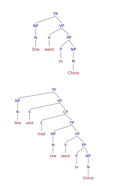
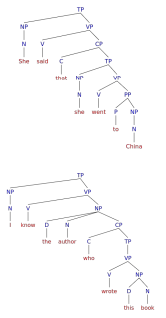
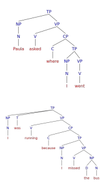

class: center, middle

# Review

---

# Review


***summarize however far we got on Tuesday???***


---

class: center, middle

# [Continue what we didn't get to on Tuesday???]


---

class: center, middle

# Complex sentences

---

# Simple and complex sentences

.pull-left[

So far we've been studying **simple sentences:** sentences with one subject NP and one predicate VP.

Now we're going to talk about **complex sentences:** sentences that have another sentence (clause) embedded inside of them.

- She said [that **she went to China**].

- I bought an umbrella [because **it was raining**].

- That's the movie [**I saw**].

- The book [that **I read**] was very interesting.

]

.pull-right[

```{r, out.width="auto", out.height="auto", echo=FALSE}

```
]

---

# Complex sentences 

.pull-left[

We can distinguish two parts of a complex sentence, though the terminology varies widely between textbooks.

- **Dependent clause** (aka subordinate clause, embedded clause, embedded sentence) – the sentence that has been inserted into the larger sentence

  - She said [that **she went to China**].
  
- *Main clause* (aka independent clause, main sentence) – the full sentence, technically including the dependent clause, since the dependent clause is inside of the main clause

  - *She said [that she went to China].*

]


.pull-right[
```{r, out.width="auto", out.height="auto", echo=FALSE}

```
]

---

# Complementizers 

Dependent clauses are usually linked to main clauses with a special type of word called a **complementizer** or **subordinating conjunction** (relative pronouns are a subtype):

- *that, which, because, if, so, since, which, who, although, where...*

- She said [**that** she went to China].

- I bought an umbrella [**because** it was raining].

- Please tell me [**if** you're going to the store].

Sometimes the complementizer is omitted (often in English, *that* can be variably omitted):

- She said [**(that)** she went to China].

- The book [**(that)** I read] is about dinosaurs.

- Ben thought [**(that)** he was going to be late].

---

# Structure of dependent clauses 

.pull-left[

Since dependent clauses are **embedded sentences** with their own subject NP and predicate VP, we will consider them **TP**: TP → NP (T) VP

Dependent clause TPs are then inserted into a larger constituent called the **complementizer phrase** or **CP**: CP → (C) TP

- C for the complementizer, which is optional (we'll include a CP level even if there's no explicit complementizer for structural reasons)

And the CP is then inserted into the **main clause**.

Note that some dependent clauses don't have an explicit subject NP. You can simply omit the subject slot when writing these:

- I know the author [who **Ø wrote this book**].

- He wants [**Ø to go to Machu Picchu**].

]

.pull-right[
```{r, out.width="auto", out.height="auto", echo=FALSE}

```
]

---

# CPs inside VPs

.pull-left[

There are three roles CPs can play in a sentence.

A CP can take the role of an NP, often acting as the object of a verb (sometimes called a noun clause):

- Paula [asked [a question]NP]VP. → Paula [asked [where I went]CP]VP.

A CP can take the role of AdvP, often acting as an adjunct to a verb (sometimes called an adverbial clause):

- I was [running]VP. → I was [running [because I missed the bus]CP]VP.

Let's modify our VP rule to account for these two cases:

- VP → (AdvP+) V (NP) (NP/CP) (AdvP+) (PP+) (AdvP+) (CP+)

]

.pull-right[
```{r, out.width="auto", out.height="auto", echo=FALSE}

```
]

---

# CPs inside NPs

.pull-left[

A CP can act as an AdjP, modifying a noun and going inside an NP (sometimes called an adjectival clause or relative clause):

- [The girl]NP studies linguistics → [The girl [that I met]CP]NP studies linguistics

These can go inside an NP anywhere in the sentence:

- [The book [I read]] is about geology.

- She bought [the book [I read]].

Since these CPs go inside NPs, let's modify our NP rule:

- NP → (D) (AdjP+) N (PP+) (CP+)

]

.pull-right[
```{r, out.width="auto", out.height="auto", echo=FALSE}
knitr::include_graphics("./images/CP_in_NP.png")
```
]


---

class: center, middle

# Practice (in groups)

---

# Practice

***???***


---

# Reminders for drawing complex sentences

If a sentence has two main verbs joined by a complementizer, it's complex.

- Note that this doesn't include sentences with two main verbs joined by a coordinating conjunction like and, or, but: I read a book and I took a walk.

Identify which of these verbs is in the main clause, and which is in the subordinate clause.

- The subordinate clause is the one that starts with a complementizer.

- But be aware that the complementizer that is sometimes omitted.

Draw the tree for the subordinate clause first.

Draw the tree for the main clause without the subordinate clause.

- Then figure out how the two are connected.

- Does the subordinate clause modify a noun, or is it part of the main clause's VP?


---

# Coming Up!
